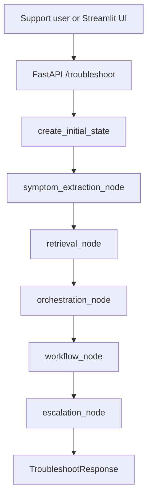
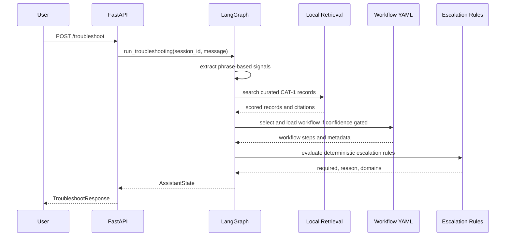

# Optisweep AI Support Assistant

This repository contains the Phase 0 implementation of the Optisweep AI Support
Assistant: a support workflow system for diagnosing a narrow class of Optisweep
operational incidents using curated evidence, deterministic routing, and
role-aware troubleshooting workflows.

The current implementation is not a general autonomous agent and it does not
query live production systems. It is a bounded FastAPI and LangGraph runtime
backed by local Phase 0 datasets, YAML workflow definitions, deterministic
escalation rules, and supporting ingestion utilities for turning case material
into reviewable evidence, procedure, workflow, and retrieval records.

## Project Purpose

Optisweep support incidents can involve AGVs, RMS alarms, WCS or Ignition
services, tippers, hospital tote flow, screenshots, field notes, chat history,
and escalation context. Traditional support workflows break down when the
evidence is scattered across case files, chat transcripts, screenshots, and
tribal knowledge:

- Symptoms are often described inconsistently across incidents.
- Support engineers must remember which signals matter for a specific failure
signature.
- Correct recovery steps depend on role boundaries and site safety state.
- Candidate procedures can look similar even when the supporting evidence is
weak.
- Escalation decisions must be conservative and traceable, not improvised.

This repository addresses those problems by separating evidence from runtime
decision making. Curated records provide retrieval evidence and citations.
YAML workflows provide operational authority. Deterministic graph nodes route
from symptoms to evidence to workflow selection to escalation. Human review is
required before candidate ingestion output becomes runtime-authoritative.

## System Philosophy

### Evidence First

The runtime should only ground itself in records that have been approved for
retrieval or workflow execution. Candidate records from ingestion remain
non-runtime until reviewed. Similar wording is not enough to promote a
procedure or workflow.

### Deterministic Orchestration

The live troubleshooting path is intentionally fixed:

1. Extract known support signals.
2. Retrieve curated CAT-1 records.
3. Select a workflow only if required signals and confidence thresholds match.
4. Load workflow steps from YAML.
5. Apply deterministic escalation rules.
6. Return a structured response with citations.

This keeps support behavior inspectable and testable. The system does not let
an LLM invent recovery actions at runtime.

### Confidence Gated Workflows

Workflows are selected only when all required signals are present and retrieval
confidence meets the workflow threshold. If no workflow matches, the runtime
returns citations and asks for escalation or review instead of forcing a runbook.

### Evidence Versus Inference

The repository stores canonical incident summaries, timelines, raw evidence,
source artifacts, workflow candidates, procedure candidates, reusable drafts,
and review queues separately. This allows future systems to distinguish:

- What was observed.
- What was inferred.
- What was manually reviewed.
- What is approved for retrieval.
- What is approved for workflow execution.

### Support Safe Boundaries

Workflow steps declare the required role and whether the step is support safe.
Support can perform observation and validation steps. Engineer-only or unsafe
actions must be escalated or performed by the correct role.

### Structured Escalation

Escalation is rule-based. Safety risks, engineer-only actions, remote access
failures, OT hardware alarms, low confidence, missing workflows, failed recovery,
and explicit user escalation requests are converted into deterministic domains
such as application, controls, infrastructure, and OT networking.

### Config Driven Workflows

Troubleshooting workflows live in `data/workflows/*.yaml`. Runtime code loads
these files rather than embedding operational instructions in Python. This lets
workflow authors update behavior through reviewable configuration while keeping
the graph stable.

### No Live Source Querying In Phase 0

The current runtime does not reach into RMS, WCS, Ignition, PLCs, ticketing
systems, chat systems, blob stores, Cosmos DB, or Azure AI Search during the
FastAPI troubleshooting path. The shipped runtime path uses local files. Azure
repository, storage, and search modules exist for seeding, indexing, and future
deployment support, but they are not the default live troubleshooting dependency.

## Full Repository Structure

### `backend/`

Python backend package for runtime orchestration, schemas, services,
repositories, search indexing, seed utilities, and cloud integration helpers.

Important boundaries:

- `backend/app/main.py` defines the FastAPI application and health endpoint.
- `backend/app/api/` owns HTTP route adapters.
- `backend/app/graph/` owns LangGraph state and node ordering.
- `backend/app/graph/nodes/` owns individual runtime and offline graph nodes.
- `backend/app/services/` owns local service logic such as signal extraction,
retrieval, workflow loading, workflow routing, escalation, candidate merging,
and Azure OpenAI configuration stubs.
- `backend/app/schemas/` owns Pydantic API and workflow schemas.
- `backend/app/models/` owns Pydantic knowledge-store document models.
- `backend/app/repositories/` owns Cosmos DB container repositories.
- `backend/app/search/` owns Azure AI Search index schema and document mapping.
- `backend/app/storage/` owns Blob Storage artifact helpers.
- `backend/app/seed/` owns local and cloud seeding/mapping utilities.
- `backend/app/scripts/` owns operational setup and sync scripts.

### `data/`

Local Phase 0 datasets and generated graph documentation.

Current major datasets:

- `data/curated/cat1_records.json`: approved and candidate CAT-1 retrieval
records used by local retrieval after status filtering.
- `data/workflows/heartbeat_timeout_no_rms_alarm_v1.yaml`: currently validated
runtime workflow for the flagship CAT-1 heartbeat timeout signature.
- `data/workflows/workflow_candidates.json`: candidate workflow records from
ingestion and normalization.
- `data/workflows/workflow_definitions.json`: reusable workflow drafts produced
by the workflow procedure agent.
- `data/workflows/graphs/`: generated Markdown graph views of workflow records.
- `data/procedures/procedure_candidates.json`: candidate procedure records.
- `data/procedures/reusable_procedures.json`: merged reusable procedure drafts.
- `data/procedures/graphs/`: generated Markdown graph views of procedures.
- `data/incidents/canonical_incidents.json`: normalized incident-level records.
- `data/timelines/timeline_events.json`: normalized event sequence records.
- `data/evidence/raw_evidence_chunks.json`: text evidence chunks.
- `data/evidence/source_artifacts.json`: references to screenshots, documents,
exported images, or other supporting artifacts.
- `data/context/context_reference.json`: operational context references.
- `data/review/sme_review_queue.json`: items requiring SME review.
- `data/review/merge_audit_log.json`: candidate merge audit reports.
- `data/taxonomy/issue_taxonomy_v0.yaml`: supported category and signal taxonomy.

The `data/*.docx` files are source case documents or raw evidence inputs. They
are not runtime code.

### `docs/`

Existing design notes and focused architecture documents.

Key files:

- `docs/architecture.md`: concise Phase 0 runtime graph.
- `docs/data_schema.md`: state and knowledge-record overview.
- `docs/phase0_scope.md`: supported Phase 0 scope and exclusions.
- `docs/workflow_authoring.md`: YAML workflow authoring rules.
- `docs/ocr_setup.md`: OCR setup notes.
- `docs/Phase0 Procedure Refinement Agent.md`: procedure refinement context.

The root README is the primary repository reference. Files under `docs/` remain
supporting detail and should stay synchronized when architecture changes.

### `ingestion/`

Manual ingestion entrypoints. `ingestion/manual_ingestion.py` copies curated
seed records and can export a bundle into the local normalized dataset layout.
It intentionally does not run the workflow procedure agent, Azure sync, search
sync, or blob upload as hidden side effects.

### `scripts/`

Experiment and extraction scripts for Phase 0 case processing. The main script
is `scripts/phase0_ingestion_agent.py`, which extracts structured information
from case documents, OCR output, embedded artifacts, and configured LLM context
into a Phase 0 seed bundle. Case-specific scripts such as
`scripts/phase0_case_229716.py` and `scripts/phase0_case_229716_v2.py` are
experimental or historical extraction utilities, not the live runtime path.

### `ui/`

`ui/streamlit_app.py` is a small local Streamlit interface that posts a symptom
message to the FastAPI `/troubleshoot` endpoint and displays the response,
workflow state, citations, and escalation fields.

### `tests/`

Focused pytest coverage for graph routing, workflow loading, escalation rules,
runtime status filters, manual ingestion, local dataset mapping, procedure
merging, and workflow procedure agent behavior. Tests are the best executable
description of current Phase 0 behavior.

### `output/`

Generated Phase 0 run artifacts. These files are outputs from extraction or
ingestion experiments and should not be treated as source authority unless
explicitly promoted into reviewed datasets.

### `prompts/`

Prompt material and ingestion instructions used by Phase 0 extraction workflows.
Prompt files are source material for offline ingestion, not runtime support
instructions.

### Future Or Conceptual Areas

The repository contains Azure integration helpers and graph exports that point
toward future production architecture, but there is no complete production
deployment stack, no live enterprise connector layer, no production auth layer,
no full ML training pipeline, and no deployed knowledge graph service in this
Phase 0 repo.

## Runtime Architecture

The implemented live runtime is a FastAPI application with one troubleshooting
endpoint:

- `GET /health`: returns `{"status": "ok"}`.
- `POST /troubleshoot`: accepts a `session_id` and `user_message`, invokes the
LangGraph troubleshooting graph, and returns a structured
`TroubleshootResponse`.

### Runtime Flow




### Graph Node Order

The graph is built in `backend/app/graph/graph.py` using `StateGraph`.

1. `symptom_extraction`
  - Implemented in `backend/app/graph/nodes/symptom_extraction.py`.
  - Calls `AzureOpenAIClient.extract_signals`.
  - Current extraction is deterministic phrase matching, despite the class
  name carrying Azure OpenAI configuration fields.
  - Sets `issue_category` to `CAT-1` if known CAT-1 issue signals are present.
2. `retrieval`
  - Implemented in `backend/app/graph/nodes/retrieval.py`.
  - Uses `LocalCat1RetrievalClient`.
  - Loads `data/curated/cat1_records.json`.
  - Filters out candidate, rejected, deprecated, or unapproved records.
  - Scores records from signal overlap, query term hits, and source authority.
  - Stores retrieval results, max confidence, and citations.
3. `orchestration`
  - Implemented in `backend/app/graph/nodes/orchestration.py`.
  - Uses `WorkflowLoader.select_workflow`.
  - Selects a workflow only if required signals are active and retrieval
  confidence meets `minimum_confidence`.
  - Skips draft workflows unless explicitly allowed or `DEMO_MODE` enables
  draft routing.
4. `workflow`
  - Implemented in `backend/app/graph/nodes/workflow.py`.
  - Loads the selected YAML workflow.
  - Places workflow metadata, current step, available steps, and related
  incidents in `workflow_state`.
  - Does not execute external actions. It prepares the workflow for guided
  support usage.
5. `escalation`
  - Implemented in `backend/app/graph/nodes/escalation.py`.
  - Calls `EscalationRules.evaluate`.
  - Adds escalation domains and appends the escalation reason to the final
  response when escalation is required.

### Runtime State

`backend/app/graph/state.py` defines `AssistantState` with:

- `session_id`
- `user_message`
- `extracted_signals`
- `issue_category`
- `retrieval_results`
- `retrieval_confidence`
- `selected_workflow_id`
- `workflow_state`
- `escalation_required`
- `escalation_reason`
- `final_response`
- `citations`

The current implementation is stateless across requests. The `session_id` is
passed through the graph and response but there is no persistent session store,
conversation memory, or resumable workflow checkpointing in the runtime.

### Runtime Sequence




## Ingestion Architecture

Ingestion is separate from live troubleshooting. Its purpose is to convert case
material into normalized, reviewable datasets and candidate procedures or
workflows without automatically granting runtime authority.

### Manual Phase 0 Ingestion

`ingestion/manual_ingestion.py` supports:

- Copying a curated seed record file to a destination.
- Optionally exporting a bundle into the local `data/` dataset layout.
- Optionally generating Markdown graph files.
- Reporting candidate records that are not runtime approved.

Guardrails in the tests confirm manual ingestion does not implicitly run:

- Workflow procedure merging.
- Azure Cosmos DB sync.
- Azure AI Search sync.
- Blob Storage uploads.

Manual ingestion is idempotent for the same input bundle.

### Phase 0 Ingestion Agent

`scripts/phase0_ingestion_agent.py` is an offline extraction pipeline for case
documents. It includes support for:

- Reading DOCX structure.
- Extracting embedded media and source artifacts.
- Using OCR output.
- Building semantic regions.
- Producing canonical incident, timeline, evidence, artifact, procedure,
workflow, and escalation records.
- Optionally using Azure OpenAI configuration from
`config/azure_openai.local.json`.
- Optionally persisting to the knowledge store, syncing search, or uploading
artifacts when explicitly requested.

This is an experimental/offline ingestion path, not the FastAPI runtime.

### Normalization Outputs

The local dataset mapper in `backend/app/seed/local_dataset_mapper.py` maps
seed bundles into:

- Context references.
- Canonical incidents.
- Timeline events.
- Raw evidence chunks.
- Source artifacts.
- Procedure candidates.
- Workflow candidates.
- Reusable procedures.
- Workflow definitions.
- SME review queue records.
- Merge audit log records.
- Curated CAT-1 records.

Candidate records are normally marked with statuses such as `candidate`,
`candidate_extracted`, `merged_candidate`, `needs_sme_review`, `proposed`, or
`draft`. These statuses are intentionally excluded from runtime retrieval and
workflow routing unless demo/draft behavior is explicitly enabled.

## Dataset Definitions

### Context Reference

Path: `data/context/context_reference.json`

Purpose: Stores stable operational context such as terminology, equipment
relationships, role definitions, or environment references. Current runtime use
is limited; future retrieval and graph systems can use it for grounding and
disambiguation.

### Canonical Incidents

Path: `data/incidents/canonical_incidents.json`

Purpose: One normalized record per incident. Captures source case ID, category,
site, priority, symptom summary, components, observed signals, diagnostic
signals, actions, recovery validation, escalation domains, candidate causes,
resolution status, and validation metadata.

Current runtime use: not directly loaded by `/troubleshoot`.

Future use: incident retrieval, analytics, training examples, graph incident
nodes, and SME review workflows.

### Timeline Events

Path: `data/timelines/timeline_events.json`

Purpose: Ordered incident events. Captures what happened, when it happened,
actor role, observed signals, actions, outcomes, and evidence references.

Current runtime use: not directly loaded by `/troubleshoot`.

Future use: sequence modeling, causal review, workflow extraction, graph
relationships, and audit trails.

### Raw Evidence Chunks

Path: `data/evidence/raw_evidence_chunks.json`

Purpose: Preserves source text evidence with provenance. Evidence chunks are
the foundation for traceability and candidate promotion.

Current runtime use: not directly loaded by `/troubleshoot`.

Future use: retrieval, citation expansion, evidence overlap checks, vector
indexing, and knowledge graph evidence nodes.

### Source Artifacts

Path: `data/evidence/source_artifacts.json`

Purpose: References screenshots, DOCX media, OCR images, exported regions, and
other non-text supporting material. Blob helper code can produce references and
upload artifacts when configured.

Current runtime use: not directly loaded by `/troubleshoot`.

Future use: screenshot grounding, video/frame traceability, visual procedure
validation, and artifact citation.

### Procedure Candidates

Path: `data/procedures/procedure_candidates.json`

Purpose: Candidate reusable procedures extracted from incident evidence. These
are not approved procedures.

Promotion rules: `ProcedureMergeService` only merges candidates when overlap is
evidence-backed across multiple incidents and includes supporting evidence
sources. Similar wording alone is insufficient.

### Reusable Procedures

Path: `data/procedures/reusable_procedures.json`

Purpose: Draft reusable procedures produced from candidate merges. The merge
service marks them `needs_sme_review`; it does not mark them approved
automatically.

Current runtime use: not directly executed by `/troubleshoot`.

Future use: procedure dictionary, workflow step references, Azure Search
indexing, and SME approval.

### Workflow Candidates

Path: `data/workflows/workflow_candidates.json`

Purpose: Candidate workflow records extracted from incidents. These are not
runtime workflows.

Current indexing behavior: candidate workflow records are excluded from search
index mapping by `record_status.py`.

### Workflow Definitions

Path: `data/workflows/workflow_definitions.json`

Purpose: Draft reusable workflow definitions generated from candidates.

Current runtime use: not loaded by the YAML `WorkflowLoader`. Runtime workflows
are loaded from `data/workflows/*.yaml`.

Future use: workflow approval pipeline, search indexing after approval, and
possible YAML generation after SME review.

### Curated CAT-1 Records

Path: `data/curated/cat1_records.json`

Purpose: Local retrieval evidence used by `LocalCat1RetrievalClient`.

Runtime rules:

- Records with blocked statuses are ignored.
- Records must have approved retrieval statuses such as
`approved_for_retrieval`, `sme_reviewed`, or `approved`.
- Candidate extracted records are not runtime retrieval records.

### SME Review Queue

Path: `data/review/sme_review_queue.json`

Purpose: Tracks procedure and workflow drafts that require human review.

Current runtime use: none.

### Merge Audit Log

Path: `data/review/merge_audit_log.json`

Purpose: Records why candidate procedures were merged into reusable drafts.

Current runtime use: none.

### Taxonomy

Path: `data/taxonomy/issue_taxonomy_v0.yaml`

Purpose: Defines supported categories and known signals. Current Phase 0
supports `CAT-1: WCS / Service Failure` signals.

Current runtime use: runtime signal names are duplicated in code and schema
constants. Full taxonomy-driven routing is planned, not implemented.

## Workflow Engine

Runtime workflows are YAML files loaded by `WorkflowLoader` from
`data/workflows`.

### YAML Structure

Each workflow includes:

- `workflow_id`
- `name`
- `version`
- `issue_category`
- `status`
- `entry_conditions`
- `required_signals`
- `minimum_confidence`
- `related_incidents`
- `procedure_refs`
- `escalation_conditions`
- `citations`
- `steps`

Each step includes:

- `step_id`
- `role_required`
- `instruction`
- `expected_outcome`
- `validation_check`
- `escalation_condition`
- `support_safe`
- `stop_condition`
- `evidence_refs`

### Current Validated Workflow

The currently validated runtime workflow is:

`data/workflows/heartbeat_timeout_no_rms_alarm_v1.yaml`

It handles the signature:

- AGVs stopped.
- No active RMS alarms.
- Tipper heartbeat timeout.
- Hospital tote removal hangs or the system appears frozen.

It requires the signals:

- `agvs_stopped`
- `no_rms_alarm`
- `tipper_heartbeat_timeout`

It requires retrieval confidence of at least `0.65`.

### Workflow Routing

Workflow routing is implemented in `backend/app/services/workflow_loader.py` and
`backend/app/services/workflow_routing.py`.

Routable workflow statuses:

- `approved_for_workflow`
- `sme_reviewed`
- `approved`

Draft statuses:

- `proposed`
- `draft`

Draft workflows route only when explicitly allowed or when demo mode enables
draft routing. This protects runtime behavior from unreviewed procedures.

### Branching Status

The current workflow engine does not implement dynamic branching, user-driven
step completion, checkpoint persistence, or external action execution. It
returns available steps and stop/escalation conditions for the caller or UI to
present.

Branching and stateful workflow progression are planned future capabilities.

## Retrieval Architecture

### Current Local Retrieval

`LocalCat1RetrievalClient` implements current runtime retrieval.

Inputs:

- User query.
- Extracted signal map.
- Local JSON records from `data/curated/cat1_records.json`.

Filtering:

- Rejected and deprecated records are blocked.
- Candidate records are ignored.
- Runtime retrieval requires approved statuses.

Scoring:

- Signal overlap contributes most of the score.
- Query term hits contribute up to `0.35`.
- Source authority contributes up to `0.1`.
- Confidence is capped at `1.0`.

Outputs:

- Retrieval results.
- Matched signals.
- Confidence.
- Citation title, source ID, source case, and excerpt.

### Azure AI Search Strategy

Azure AI Search support is partial. The repository includes:

- `backend/app/search/index_schema.py`: index schema with searchable text,
filterable metadata, facetable fields, and vector field configuration.
- `backend/app/search/index_documents.py`: maps approved Cosmos-style records
into search documents.
- `backend/app/scripts/create_search_index.py`: creates or previews the index.
- `backend/app/scripts/sync_cosmos_to_search.py`: syncs indexable Cosmos
records into Azure AI Search.

Not currently implemented in the FastAPI runtime:

- Live Azure Search retrieval.
- Hybrid ranking.
- Vector embedding generation.
- Metadata-filtered live query execution.
- Chunk-level citation expansion.

The class `AzureSearchRetrievalClient` currently subclasses
`LocalCat1RetrievalClient` without adding Azure Search behavior.

## Escalation Architecture

Escalation is implemented in `backend/app/services/escalation_rules.py`.

Current triggers:

- Safety risk present.
- Engineer-only action required.
- Service restart required.
- Remote access unavailable.
- Heartbeat does not recover after restart.
- OT hardware alarms present.
- Retrieval confidence below `0.65`.
- No matching workflow.
- User explicitly requests escalation.

Current domains:

- `application`
- `controls`
- `infrastructure`
- `OT networking`

Escalation is rule-based because support handoff must be predictable,
explainable, and conservative. This is not a task for a generative model in the
current phase.

## Video Training Ingestion

The repository contains a prompt path named
`prompts/Optisweep Video Training Ingestion Agent`, but there is no complete
implemented video ingestion pipeline in the current codebase.

Current related implementation:

- DOCX extraction and embedded media extraction exist in
`scripts/phase0_ingestion_agent.py`.
- OCR support exists in the ingestion script and `docs/ocr_setup.md`.
- Source artifact records can preserve references to extracted images or media.
- Timestamp-like and sequence-like evidence can be represented through timeline
events and source artifact metadata.

Designed but not fully implemented:

- Transcript alignment to video timestamps.
- Frame extraction from video files.
- OCR over extracted frames as a standard pipeline.
- Procedure extraction from aligned transcript and visual evidence.
- Timestamp-preserving source artifact indexing.
- ML-ready labeled video segments.

Future value:

- Video frames can become source artifacts.
- Transcript segments can become raw evidence chunks.
- Demonstrated actions can become procedure candidates.
- Timestamp relationships can become graph edges between procedures, evidence,
artifacts, and incidents.

## Current Phase 0 Scope

Implemented Phase 0 scope:

- CAT-1 WCS / Service Failure signal extraction.
- Local curated CAT-1 retrieval.
- Confidence-gated workflow selection.
- YAML workflow loading.
- Deterministic escalation.
- FastAPI troubleshooting endpoint.
- Streamlit demo UI.
- Manual ingestion to local datasets.
- Candidate procedure and workflow merge services.
- Azure Cosmos, Blob, and Search setup/mapping helpers.
- Focused pytest coverage for core Phase 0 behavior.

Intentionally deferred:

- Production deployment.
- Enterprise authentication.
- Live system connectors.
- Live Azure AI Search retrieval in the API path.
- Live RMS/WCS/Ignition queries.
- Automated ingestion from enterprise systems.
- Multi-category troubleshooting beyond CAT-1.
- Stateful workflow execution.
- Dynamic branching runtime.
- Full knowledge graph service.
- ML classifiers.
- Production observability.

Stubbed or partial:

- `AzureOpenAIClient` has Azure configuration fields, but signal extraction is
deterministic phrase matching.
- `AzureSearchRetrievalClient` currently behaves like local retrieval.
- Azure repository and storage layers are available but not part of default
local runtime.
- Vector index fields exist, but embedding creation and vector retrieval are not
implemented in the runtime.

## Phase Roadmap

### Phase 0: Bounded CAT-1 Runtime And Dataset Foundation

Status: current.

Goals:

- Validate symptom-driven workflow selection.
- Validate local retrieval over curated CAT-1 records.
- Validate YAML-based role-aware troubleshooting.
- Validate deterministic escalation.
- Build manual ingestion and reviewable dataset structures.

### Phase 1: Reviewed Knowledge Store And Search Integration

Status: planned.

Likely goals:

- Promote reviewed records into Azure Cosmos DB.
- Create and maintain Azure AI Search indexes.
- Add live search retrieval behind the runtime.
- Add better metadata filtering.
- Add citation expansion from evidence chunks.
- Add workflow and procedure approval tooling.
- Add operational logging and trace persistence.

### Phase 2: Multi-Category, Graph, And ML Assistance

Status: conceptual future architecture.

Possible goals:

- Add additional issue categories.
- Add graph-backed relationship traversal.
- Add supervised signal classifiers.
- Add video and transcript training ingestion.
- Add workflow analytics and success metrics.
- Add enterprise auth and role-aware UI behavior.
- Add stateful workflow sessions.

## Design Decisions And Tradeoffs

### LangGraph Instead Of An Autonomous Agent

LangGraph provides explicit node ordering and state transitions. This matches
the need for bounded, testable support behavior. Autonomous planning would make
it harder to prove which evidence and rules produced a recommendation.

### YAML Workflows Instead Of Generated Runtime Steps

Operational steps must be reviewed and traceable. YAML keeps workflow authority
in versioned configuration. Runtime code loads and returns those steps; it does
not generate new recovery actions.

### Local Retrieval First

Local retrieval keeps Phase 0 reproducible and testable without cloud
dependencies. Azure Search is present as a future or optional integration, but
the default runtime can run from the repository data files.

### Manual Curation Before Automation

The data model intentionally favors manual review and status gates. This avoids
turning one noisy case extraction into runtime advice.

### Rule-Based Escalation

Escalation is conservative. The system should escalate when safety, access,
role, hardware, or confidence conditions require it. Rules make those handoff
boundaries inspectable.

### No Live Source Querying

Phase 0 avoids live RMS, WCS, Ignition, or ticketing queries. This reduces
security risk and makes behavior deterministic while the evidence model and
workflow boundaries are still being validated.

## Requirements

### Runtime Requirements

Inferred from code and dependencies:

- Python 3.10 or newer is recommended because the code uses modern type syntax
such as `str | None`.
- `pip`
- Local filesystem access to the repository.
- Dependencies listed in `requirements.txt`.

Install:

```powershell
python -m venv .venv
.\.venv\Scripts\Activate.ps1
python -m pip install --upgrade pip
python -m pip install -r requirements.txt
```

### Python Dependencies

Declared in `requirements.txt`:

- `fastapi`
- `uvicorn[standard]`
- `langgraph`
- `pydantic`
- `PyYAML`
- `azure-search-documents`
- `openai`
- `streamlit`
- `pytest`
- `httpx`

Potential dependency gap:

- Some Azure helper modules import `azure-cosmos`, `azure-storage-blob`, and
`azure-identity`, but those packages are not listed in `requirements.txt`.
Local runtime and tests do not need them, but cloud seeding or storage scripts
do.

### Environment Variables

General app settings:

- `APP_ENV`: defaults to `local`.
- `DEMO_MODE`: defaults to `true` in `backend/app/config.py`; enables draft
workflow routing through `workflow_routing.demo_mode_enabled` when truthy.
- `LOCAL_DATA_ROOT`: defaults to `data`.
- `WORKFLOW_CONFIDENCE_THRESHOLD`: defaults to `0.65`; currently config exists
but workflow YAML thresholds drive runtime selection.

Azure OpenAI settings:

- `AZURE_OPENAI_ENDPOINT`
- `AZURE_OPENAI_API_KEY`
- `AZURE_OPENAI_DEPLOYMENT`
- `AZURE_OPENAI_API_VERSION`, default `2024-10-21`

Current runtime note: these variables are read by `AzureOpenAIClient`, but
current signal extraction does not call Azure OpenAI.

Azure knowledge settings:

- `AZURE_COSMOS_ENDPOINT`
- `AZURE_COSMOS_KEY`
- `AZURE_COSMOS_DATABASE_NAME`, default `optisweep_knowledge_phase0`
- `AZURE_SEARCH_ENDPOINT`
- `AZURE_SEARCH_KEY`
- `AZURE_SEARCH_INDEX_NAME`, default `idx-optisweep-phase0-knowledge`
- `AZURE_STORAGE_ACCOUNT_URL`
- `AZURE_STORAGE_CONNECTION_STRING`
- `AZURE_RAW_ARTIFACTS_CONTAINER`, default `raw-source-artifacts`
- `AZURE_PROCESSED_ARTIFACTS_CONTAINER`, default `processed-source-artifacts`
- `AZURE_SEARCH_VECTOR_DIMENSIONS`, default `1536`

Azure settings are required only for cloud setup, seeding, storage, and search
sync scripts.

### Storage Expectations

Local runtime expects:

- `data/curated/cat1_records.json`
- `data/workflows/*.yaml`

Cloud utilities expect:

- Cosmos DB containers defined in `backend/app/repositories/container_config.py`.
- Azure AI Search index defined in `backend/app/search/index_schema.py`.
- Blob containers for raw and processed artifacts.

### Hardware

The local runtime has no special hardware requirements. OCR and future video
processing may require additional native dependencies or accelerated hardware
depending on the OCR/video stack used.

## Development Workflow

### Run The API

```powershell
uvicorn backend.app.main:app --reload
```

Then call:

```powershell
Invoke-RestMethod `
  -Method Post `
  -Uri http://127.0.0.1:8000/troubleshoot `
  -ContentType "application/json" `
  -Body '{"session_id":"demo-session","user_message":"AGVs stopped, no RMS alarms, all tippers heartbeat timeout, hospital tote removal hangs, system active but frozen"}'
```

### Run The Streamlit UI

```powershell
streamlit run ui/streamlit_app.py
```

The UI defaults to `http://127.0.0.1:8000/troubleshoot`.

### Run Tests

```powershell
pytest
```

Focused tests to understand current behavior:

- `tests/test_graph_routing.py`
- `tests/test_workflow_loader.py`
- `tests/test_escalation_rules.py`
- `tests/test_runtime_status_filters.py`
- `tests/test_manual_ingestion_pipeline.py`
- `tests/test_workflow_procedure_agent.py`

### Run Manual Ingestion

Copy a seed bundle without exporting local datasets:

```powershell
python -m ingestion.manual_ingestion path\to\seed_records.json --destination output\seed_records.json
```

Export a bundle into local datasets:

```powershell
python -m ingestion.manual_ingestion path\to\seed_records.json --auto-export --data-root data
```

Export and generate graph Markdown:

```powershell
python -m ingestion.manual_ingestion path\to\seed_records.json --auto-export --generate-graphs --data-root data
```

### Export A Phase 0 Bundle To Local Datasets

```powershell
python -m backend.app.seed.export_phase0_bundle_to_local path\to\Bundle.json --data-root data --generate-graphs
```

### Seed Azure Cosmos DB

Preview containers:

```powershell
python -m backend.app.scripts.create_cosmos_containers --dry-run
```

Create containers:

```powershell
python -m backend.app.scripts.create_cosmos_containers
```

Seed a mapped bundle:

```powershell
python -m backend.app.seed.seed_phase0_bundle path\to\seed_records.json --dry-run
```

Seed local datasets:

```powershell
python -m backend.app.seed.seed_local_datasets --data-root data --dry-run
```

### Create Or Sync Azure AI Search

Preview index:

```powershell
python -m backend.app.scripts.create_search_index --dry-run
```

Create index:

```powershell
python -m backend.app.scripts.create_search_index
```

Preview sync from Cosmos to Search:

```powershell
python -m backend.app.scripts.sync_cosmos_to_search --dry-run
```

### Add A Runtime Workflow

1. Add a YAML file under `data/workflows/`.
2. Use observable symptoms in the workflow name.
3. Set `required_signals` to known signal names.
4. Set `minimum_confidence` conservatively.
5. Mark `status` as `draft` until reviewed.
6. Include evidence references for workflow and step authority.
7. Add or update tests for routing and status filtering.
8. Update this README if runtime behavior, maturity, or scope changes.

### Add Retrieval Evidence

1. Add candidate records through ingestion or manual curation.
2. Preserve evidence references and source notes.
3. Keep candidate statuses until SME review is complete.
4. Promote only reviewed records to `approved_for_retrieval`, `sme_reviewed`,
  or `approved`.
5. Test local retrieval behavior with expected signal and query inputs.

### Debug Orchestration

Start from:

- `backend/app/graph/graph.py` for node order.
- `backend/app/graph/state.py` for state shape.
- `backend/app/graph/nodes/*.py` for node effects.
- `backend/app/services/azure_openai_client.py` for signal extraction.
- `backend/app/services/azure_search_client.py` for local retrieval.
- `backend/app/services/workflow_loader.py` for workflow selection.
- `backend/app/services/escalation_rules.py` for escalation decisions.

## Logging And Observability

Current implemented observability:

- API responses include extracted signals, retrieval results, selected workflow,
workflow state, citations, escalation flag, and escalation reason.
- Ingestion scripts write run trace and validation artifacts under `output/`
for extraction experiments.
- Merge services produce audit records in `data/review/merge_audit_log.json`.
- Tests validate routing, filtering, and ingestion guardrails.

Not implemented:

- Structured application logging in the FastAPI runtime.
- Persistent request traces.
- OpenTelemetry instrumentation.
- Metrics dashboards.
- Production alerting.
- Audit log persistence for every `/troubleshoot` request.

Recommended future observability:

- Persist graph state transitions per request.
- Store retrieval scores and selected citations.
- Store workflow selection reasons and rejected workflow reasons.
- Track escalation triggers and domains.
- Track workflow completion outcomes once stateful workflow execution exists.

## Security And Data Handling

Current security posture:

- Local runtime reads local repository data.
- There is no implemented authentication or authorization layer.
- There are no live source system connectors in the runtime path.
- Azure scripts require explicit credentials through environment variables.
- Candidate ingestion outputs require manual review before runtime use.

Data handling expectations:

- Treat source case documents, screenshots, transcripts, and output artifacts as
potentially sensitive operational data.
- Do not promote unreviewed extraction output into runtime retrieval.
- Do not add secrets to the repository.
- Keep Azure keys and local OpenAI config files out of version control.
- Preserve source references so recommendations can be audited.

Future enterprise concerns:

- Entra ID authentication.
- Role-based access control.
- Per-tenant data isolation.
- Data retention policy.
- PII and sensitive incident redaction.
- Signed audit trails for runtime recommendations and operator actions.

## Future ML And Knowledge Graph Architecture

Future ML is planned as an assistant to curation and routing, not as a
replacement for evidence and review boundaries.

Potential ML uses:

- Signal extraction from free text.
- Issue category classification.
- Procedure candidate clustering.
- Duplicate incident detection.
- Retrieval reranking.
- Video and screenshot classification.
- Confidence calibration.

Potential graph nodes:

- Incident.
- Timeline event.
- Evidence chunk.
- Source artifact.
- Procedure candidate.
- Reusable procedure.
- Workflow candidate.
- Workflow definition.
- Escalation summary.
- Context reference.
- Signal.
- Site or component.

Potential graph relationships:

- Incident has timeline event.
- Timeline event supported by evidence chunk.
- Evidence chunk derived from source artifact.
- Procedure candidate supported by evidence.
- Workflow candidate references procedure.
- Workflow definition requires signal.
- Incident escalated to domain.
- Artifact illustrates procedure step.

Current implementation status:

- Local graph Markdown exports exist.
- Structured relationship models exist.
- Cosmos containers include `knowledge_relationships`.
- A deployed graph database or graph query service is not implemented.

Training data philosophy:

- Keep raw evidence, normalized labels, and reviewed approvals separate.
- Preserve source provenance.
- Do not train on unreviewed or rejected records as positive examples.
- Use SME review status as a first-class label.

## Current Implementation Status

Implemented:

- FastAPI app and `/troubleshoot` route.
- LangGraph fixed node sequence.
- Assistant state schema.
- Deterministic phrase-based signal extraction.
- Local CAT-1 retrieval over curated JSON.
- Runtime filtering of unapproved records.
- YAML workflow loading.
- Confidence-gated workflow routing.
- Deterministic escalation rules.
- Streamlit demo UI.
- Manual local ingestion.
- Local dataset mapper.
- Markdown graph export support.
- Procedure candidate merge service.
- Workflow candidate merge service.
- SME review queue generation.
- Azure Cosmos container definitions and repositories.
- Azure AI Search index schema and document mapping.
- Blob artifact reference and upload helper.
- Focused pytest coverage.

Partial:

- Azure OpenAI integration configuration.
- Azure AI Search integration.
- Azure Cosmos seeding.
- Blob artifact handling.
- Ingestion from DOCX, OCR, and embedded media.
- Reusable workflow and procedure promotion.
- Review workflows.
- Runtime use of taxonomy.

Experimental:

- `scripts/phase0_ingestion_agent.py`.
- Case-specific extraction scripts.
- Generated output artifacts under `output/`.
- Candidate workflow and procedure graphs.
- Video training ingestion prompt material.

Planned:

- Live Azure Search retrieval.
- Hybrid ranking and metadata filtering.
- Stateful workflow sessions.
- Additional issue categories.
- Production auth and deployment.
- Runtime observability and audit logs.
- Human approval tooling.
- Knowledge graph traversal.
- ML-assisted classifiers.

Deferred:

- Live RMS/WCS/Ignition connectors.
- Automated enterprise ingestion.
- Multi-category production support.
- Dynamic workflow branching.
- Production UI.
- Full vector embedding pipeline.

Stubbed:

- `AzureSearchRetrievalClient`.
- Azure OpenAI-backed runtime extraction.
- Vector search runtime behavior.

Deprecated or historical:

- Older case-specific scripts may represent historical extraction approaches.
Treat them as experimental unless current tests or docs reference them as the
supported path.

Blocked or dependent:

- Cloud scripts require Azure resources and missing optional SDK dependencies.
- Production deployment requires auth, observability, and data governance work.
- Runtime expansion requires reviewed datasets and workflows.

## Active Development Focus

Inferred current priorities:

- Phase 0 CAT-1 support assistant behavior.
- Improving manual ingestion and normalized datasets.
- Preserving evidence and source artifact traceability.
- Extracting and merging procedure and workflow candidates.
- Keeping runtime retrieval restricted to approved records.
- Refining YAML workflows and role-aware support boundaries.
- Preparing Azure Cosmos/Search/Blob infrastructure for later phases.

## Execution Roadmap Status

Phase 0 goals:

- CAT-1 runtime: implemented for one validated flagship workflow.
- Local retrieval: implemented.
- Deterministic escalation: implemented.
- Manual ingestion: implemented.
- Candidate merge and review queue: implemented.
- Azure infrastructure helpers: partial.
- Documentation synchronization: active work.

Current blockers and dependencies:

- More reviewed CAT-1 records are needed for broader routing confidence.
- Additional workflows require SME review before runtime approval.
- Azure runtime search needs live query implementation and dependency updates.
- Stateful workflow execution needs persistence and UI changes.
- Production use needs auth, auditing, deployment, and data governance.

Deferred items:

- Automated connectors.
- Multi-category taxonomy-driven routing.
- Knowledge graph service.
- ML training pipeline.
- Video ingestion pipeline.

## Architecture Maturity Tracking

Implemented in code:

- FastAPI runtime.
- LangGraph orchestration.
- Local retrieval.
- YAML workflow loading.
- Status-gated runtime filtering.
- Deterministic escalation.
- Manual ingestion.
- Candidate merge services.
- Azure setup and mapping helpers.

Designed but not implemented:

- Live Azure Search retrieval in runtime.
- Stateful workflow progression.
- Transcript and video ingestion pipeline.
- Graph query layer.
- Production observability.
- Role-aware enterprise UI.

Planned future architecture:

- Multi-category support.
- ML-assisted extraction and routing.
- Knowledge graph reasoning over incidents, evidence, workflows, and artifacts.
- Enterprise auth and deployment.
- CI-enforced documentation synchronization.

## Runtime Capability Matrix

Runtime supports:

- One request at a time through stateless FastAPI invocation.
- CAT-1 issue category detection from known phrases.
- Local retrieval from curated records.
- Confidence-gated routing to YAML workflows.
- Returning workflow steps and citations.
- Deterministic escalation.

Runtime does not support:

- Live system queries.
- Persistent sessions.
- Workflow step completion.
- Dynamic branching.
- Live Azure Search retrieval.
- Multi-category workflows.
- Runtime procedure generation.

Retrieval supports:

- Local JSON records.
- Status filtering.
- Signal matching.
- Simple query term scoring.
- Source authority weighting.
- Citations.

Retrieval does not support:

- Embeddings in runtime.
- Hybrid search in runtime.
- Semantic reranking.
- Chunk expansion.
- Query-time metadata filters beyond status filtering.

Workflow supports:

- YAML-defined steps.
- Role requirements.
- Support-safe flags.
- Stop conditions.
- Escalation conditions.
- Evidence references.

Workflow does not support:

- Stateful execution.
- Branch transitions.
- External action calls.
- Automatic procedure promotion.

Operational categories:

- Supported now: `CAT-1: WCS / Service Failure`.
- Not supported now: all other categories.

Validated workflows:

- `heartbeat_timeout_no_rms_alarm_v1`.

Escalation domains:

- `application`
- `controls`
- `infrastructure`
- `OT networking`

Ingestion sources:

- Implemented or partial: manual seed records, DOCX, OCR outputs, embedded
artifacts.
- Planned or conceptual: video transcripts, extracted frames, live enterprise
connectors.

## Known Gaps And Technical Debt

- Signal extraction is phrase-based and duplicated against taxonomy concepts.
- `AzureOpenAIClient` naming implies behavior that is not currently active.
- `AzureSearchRetrievalClient` is a stub subclass of local retrieval.
- `requirements.txt` does not include every Azure SDK imported by optional cloud
helper modules.
- Runtime does not persist sessions or graph traces.
- Runtime workflow selection returns the first matching workflow by sorted file
order; richer tie-breaking is not implemented.
- Workflow definitions in JSON and runtime YAML are separate representations.
- Taxonomy is not the single source of truth for signal extraction.
- Generated output artifacts may be large and should not be treated as reviewed
knowledge without promotion.
- No production logging, metrics, auth, or deployment manifests are present.
- Video ingestion is conceptual/experimental, not implemented end to end.
- Azure vector search schema exists without runtime embedding generation.
- Candidate review is file-based and does not include a full approval UI.

## README Update Rules

This README is a living engineering reference. Update it in the same change set
when making large changes to:

- Runtime graph nodes or node order.
- FastAPI routes or response schemas.
- Assistant state shape.
- Signal extraction logic.
- Retrieval filtering, scoring, indexing, or citations.
- Workflow YAML schema or routing rules.
- Escalation triggers or domains.
- Dataset schemas, paths, validation statuses, or promotion rules.
- Ingestion pipelines, source formats, or artifact handling.
- Azure Cosmos, Search, Blob, or other infrastructure expectations.
- Phase scope, roadmap, maturity status, or implementation status.
- Security, auth, data handling, logging, or observability behavior.

Update checklist:

- Describe what changed.
- State whether it is implemented, partial, experimental, planned, deferred,
stubbed, blocked, or deprecated.
- Update runtime flow diagrams if orchestration changed.
- Update dataset definitions if schemas or paths changed.
- Update requirements and environment variables if dependencies changed.
- Update capability and maturity sections if support boundaries changed.
- Add or update tests when behavior changes.
- Keep future architecture clearly labeled as future, not current.

Architecture change requirements:

- Do not present planned architecture as implemented.
- Do not hide runtime behavior changes in code-only updates.
- Preserve the evidence-first and review-gated philosophy unless the project
explicitly changes direction.
- Document migration requirements for dataset or workflow schema changes.

## Documentation Synchronization

Recommended future documentation enforcement:

- CI check that `README.md` changes when core architecture files change.
- README linting for broken links and stale command references.
- Auto-generated schema documentation from Pydantic models.
- Auto-generated workflow documentation from `data/workflows/*.yaml`.
- Architecture diff checks for LangGraph node order.
- Changelog generation from merged PRs.
- Roadmap sync checks between README status sections and focused docs under
`docs/`.

Until those checks exist, the Cursor project rule in `.cursor/rules/` requires
future AI-agent work to evaluate whether README updates are needed for major
changes.