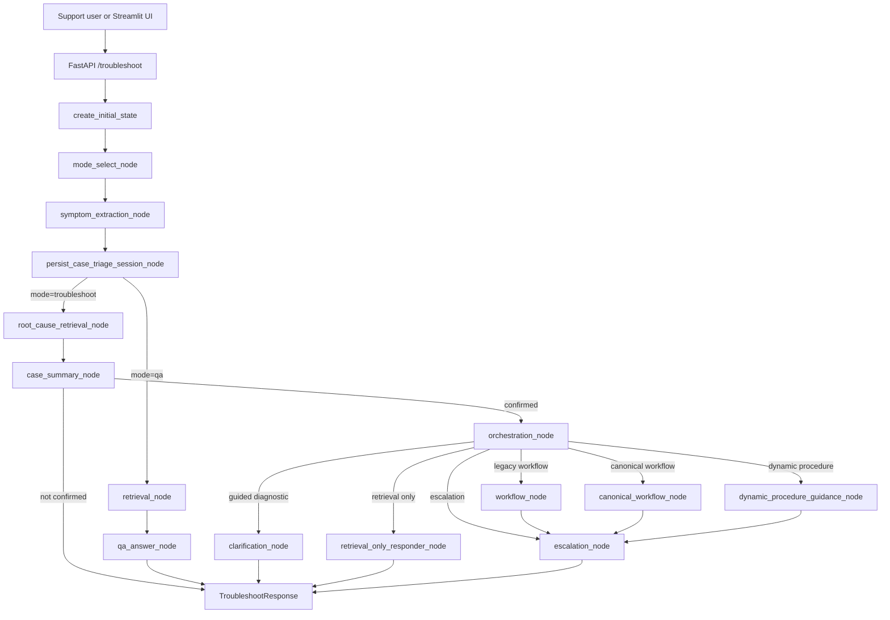
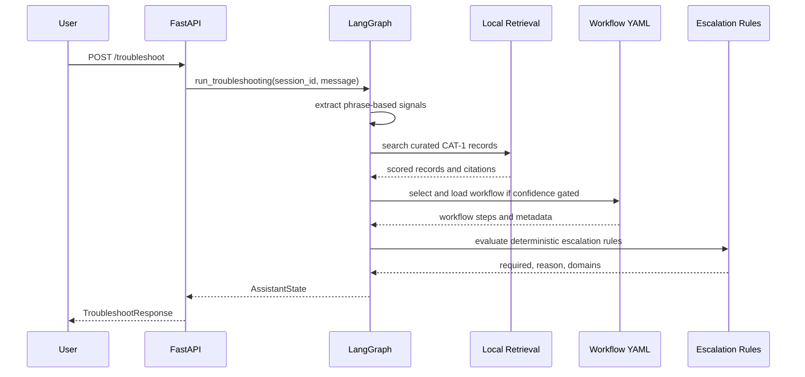

# Optisweep AI Support Assistant

> **Playbook runtime (implemented):** Cosmos-backed playbook orchestration + retrieval chatbot.  
> Start here: [`docs/PLAYBOOK_RUNTIME.md`](docs/PLAYBOOK_RUNTIME.md) · UI: `streamlit run ui/Home.py` · API: `uvicorn backend.app.main:app`

This repository is the **Optisweep AI Support Assistant** runtime: a bounded FastAPI + LangGraph app for guided incident troubleshooting and corpus search.

**Implemented (July 2026):** Cosmos-backed **playbook orchestration** (`POST /troubleshoot`) and **retrieval chatbot** (`POST /retrieve`). Corpus comes from ingestion Stage 11 publish.

The runtime does **not** query live RMS/WCS/Ignition. It reads published playbooks, runbooks, and embeddings from Cosmos.

## Quick start

```powershell
uvicorn backend.app.main:app --reload
streamlit run ui/Home.py
```

Full architecture: [`docs/PLAYBOOK_RUNTIME.md`](docs/PLAYBOOK_RUNTIME.md)

## How it works today

1. **Turn 1** — keyword symptom extraction (+ optional LLM overlay when `ENABLE_LLM_SYMPTOM_EXTRACTION=true`); retrieval runs only after at least one affirmative observed signal.
2. **Orchestrator** — single control-plane agent that routes the turn (ask symptoms / pin / candidates / user pin). Pins only when hybrid rank ≥ `PLAYBOOK_MATCH_THRESHOLD` **and** entry-phrase `coverage` ≥ `PLAYBOOK_PIN_COVERAGE_THRESHOLD`, or the user picks a candidate. **Always** sets `retrieval_confidence_reason` (numbers from retrieval/pin tools). With `ENABLE_LLM_ORCHESTRATOR=true`, wording is rewritten via `prompts/agents/orchestrator/orchestrate_turn.md` from a compact briefing (no recompute of pin math).
3. **Hybrid score** — `0.7×cosine + 0.3×jaccard`, then `max` with lexical boosts: playbook symptom overlap, and for runbooks/context a **title/id/head coverage** boost (with light service↔software query expansion). Query embeddings must match Cosmos (`text-embedding-3-small`); do **not** set `LOCAL_EMBEDDINGS_MODEL` against Azure-published vectors. Trace shows `cosine` / `jaccard` / `symptom` / `coverage` / `combined` separately.
4. **Signals** — API returns only affirmative observed signals (not a padded False CAT-1 dictionary).
5. **Turn 2+** — load playbook node + linked runbook by ID (no vector search). Free-text branch replies are classified as **match** (advance), **retriage** (clear pin and re-run retrieval), or **probe** (ask one clarifying question).
6. **Images** — embedded in runbook steps via `screens_or_images` only (no case-wide dump).
7. **`/retrieve`** — multi-turn search chat with LangChain memory (`InMemoryChatMessageHistory` + `trim_messages`, sticky intent slots). Searches published Cosmos embeddings including operational-context `rag_record` vectors. Composes cited chatbot answers without dumping full prior transcripts into the prompt.

### Agent architecture (lean)

Most named “agents” are **deterministic tools** with traces. Optional LLM slots stay feature-flagged and narrow.

| Agent | Reasoning | Job |
|-------|-----------|-----|
| **orchestrator_agent** | Rules + optional LLM rewrite | Owns routing + **why** confidence looks like that (`ENABLE_LLM_ORCHESTRATOR`) |
| session / symptom / embed / retrieval / pin / execute / image | Scripts/tools | I/O, scoring, render |
| branch_agent | Optional LLM | Classify free text → match label / retriage / probe |
| synthesize_agent | Optional LLM | `/retrieve` answer only |

**Lean multi-agent policy:** one orchestrator + tools; pass structured state not chat transcripts; avoid LLM-to-LLM fan-out (token/latency/inconsistency tax). Full walkthrough: [`docs/PLAYBOOK_RUNTIME.md`](docs/PLAYBOOK_RUNTIME.md) · [`backend/app/agents/README.md`](backend/app/agents/README.md).

Current publish target: `PUBLISH_VERSION_ID=publish_20260714_172351_09e54f8f` with query embeddings from `text-embedding-3-small` (must match Cosmos `embedding_model` + dims). Scoring notes: [`docs/app_agent_scoring_handoff.md`](docs/app_agent_scoring_handoff.md).

## Configuration

| Mode | Env |
|------|-----|
| Live Cosmos | `RETRIEVAL_BACKEND=cosmos`, `SESSION_BACKEND=cosmos`, `INTERACTION_LOG_BACKEND=cosmos`, `AUTO_PUBLISH_VERSION=true` |
| Local memory only | `SESSION_BACKEND=memory`, `INTERACTION_LOG_BACKEND=memory`; corpus still comes from Cosmos |
| LLM agents | `ENABLE_LLM_ORCHESTRATOR=true`, `ENABLE_LLM_BRANCH_MATCH=true`, `ENABLE_LLM_SYMPTOM_EXTRACTION=true`, `ENABLE_LLM_RETRIEVE_SYNTHESIS=true`, `AZURE_OPENAI_*` (default on) |
| Images | `COSMOS_CONTAINER_CANONICAL_IMAGES=publish_canonical_images` (PK `/publish_version_id`) + Blob; `/images/{id}` redirects to `storage_uri` |

Copy container names from ingestion `publish_manifest.json`. If `PUBLISH_VERSION_ID` is stale, `AUTO_PUBLISH_VERSION=true` picks the latest publish in Cosmos.

## Azure Container Apps Docker deployment

This repo deploys to Azure Container Apps from GitHub Actions using a root `Dockerfile`. That avoids the Oryx Python builder default (`gunicorn application:app`), which fails because this app has no `application` module.

Deployment workflow:

- Workflow: `.github/workflows/deploy-container-app.yml`
- Trigger: push to `main` or manual `workflow_dispatch`
- Container App: `optisweepai-troubleshooting-app`
- Resource group: `optisweepai`
- Container Apps environment: `managedEnvironment-optisweepai-a18c`
- Region: `eastus`
- Image build: `Dockerfile` → `CMD ["python", "scripts/start_azure_container_app.py"]`
- Revision template: `deploy/container-app.yaml` (single app container, no bootstrap sidecar)

Runtime shape:

- FastAPI starts internally at `127.0.0.1:8000`.
- Streamlit starts externally at `0.0.0.0:8501`.
- `API_BASE_URL` defaults to `http://127.0.0.1:8000`.
- `PYTHONPATH` is set to `/app` in the image and startup script.
- Azure ingress target port must be `8501`.

Recommended Container App settings:

```text
Ingress: External
Target port: 8501
Revision mode: Single
CPU: 1
Memory: 2Gi
Minimum replicas during demos: 1
Maximum replicas for first demo: 1
Containers: only optisweepai-troubleshooting-app (remove bootstrap-container-pre-deployment)
```

Runtime environment variables supplied by Azure Container Apps:

```text
APP_ENV=demo
LOG_LEVEL=INFO
API_BASE_URL=http://127.0.0.1:8000
RETRIEVAL_BACKEND=cosmos
SESSION_BACKEND=cosmos
INTERACTION_LOG_BACKEND=cosmos
AUTO_PUBLISH_VERSION=true
COSMOS_DATABASE=optisweep_knowledge_phase0
AZURE_OPENAI_API_VERSION=2024-10-21
AZURE_EMBEDDINGS_DEPLOYMENT=text-embedding-3-small
AZURE_EMBEDDING_DIMENSIONS=1536
AZURE_CANONICAL_IMAGES_CONTAINER=canonical-images
```

Use Key Vault-backed Container App secret references for keys, tokens, and policy-sensitive endpoints:

```text
COSMOS_ENDPOINT
COSMOS_KEY
AZURE_OPENAI_ENDPOINT
AZURE_OPENAI_API_KEY
AZURE_OPENAI_DEPLOYMENT
```

Only these Cosmos knowledge container variables should be configured for the runtime:

```text
COSMOS_CONTAINER_RUNBOOKS=runbooks
COSMOS_CONTAINER_PLAYBOOKS_A=playbooks_prompt_a
COSMOS_CONTAINER_PLAYBOOKS_B=playbooks_prompt_b
COSMOS_CONTAINER_OPERATIONAL_CONTEXT=operational_context
COSMOS_CONTAINER_RELATIONSHIP_LINKS=relationship_links
COSMOS_CONTAINER_SOURCE_ARTIFACTS=source_artifacts
COSMOS_CONTAINER_CANONICAL_IMAGES=publish_canonical_images
```

Runtime memory containers are fixed in code:

```text
SESSION_BACKEND=cosmos -> workflow_sessions, PK /session_id
INTERACTION_LOG_BACKEND=cosmos -> interaction_logs, PK /session_id
```

Preflight checks:

```powershell
python scripts/preflight_deployment.py
python -m backend.app.scripts.verify_cosmos_corpus
```

Post-deployment smoke:

- Streamlit URL opens over HTTPS.
- Search / Chat reports live Cosmos.
- Guided Troubleshoot persists pinned playbook and node state in `workflow_sessions`.
- Turns tab replays from `interaction_logs`.
- Search / Chat uses process-local chat memory and durable turn logs only through `interaction_logs`.
- No secrets appear in the workflow, UI, or logs.

## UI

| Page | Command |
|------|---------|
| Playbook runtime | `streamlit run ui/Home.py` |
| Legacy alias | `streamlit run ui/streamlit_app.py` (forwards to Home) |

Tabs on Guided Troubleshoot: **Conversation · Turns · Playbook/Runbook · Trace**. Conversation expands the active playbook with scannable node evidence criteria and the linked runbook (collapsed, with step images when available). Branch choices show a **short evidence strip** above thin color-coded healthy / unhealthy / inconclusive buttons (criteria from playbook outcomes / `expected_or_observed_result`). Exact button clicks are deterministic (no branch/orchestrator LLM); free-text retriage keeps `observed_signals` + `path_evidence` and may call orchestrator with a lean working-memory packet. The sidebar shows an Active playbook card (title, id, current node). Retrieval confidence uses matched Cosmos vector dims, query-token symptom coverage, and symptom cards.

---

## Removed: local `data/` folder (July 2026)

The repo no longer ships Phase 0 ingestion artifacts under `data/`. **All runtime corpus data comes from Cosmos**.

Removed with the folder:

- YAML workflow definitions and canonical workflow compilations
- CAT-1 / root-cause / timeline / evidence JSON sidecars
- Filesystem loaders (`WorkflowLoader`, `CanonicalWorkflowLoader`, hybrid router)
- One-shot seed CLIs that read local JSON/YAML (`seed_canonical_to_cosmos`, `phase1_runtime_seed`, etc.)

Escalation summaries for `POST /troubleshoot/escalation-summary` are built at runtime from session context and optional playbook `escalation_guidance` in Cosmos — not from `data/escalation/escalation_summaries.json`.

## Legacy Phase 0 documentation (archive)

The sections below describe the **removed** YAML workflow / CAT-1 / case-triage runtime. They are kept for historical reference only. Do not use them for current setup.

<details>
<summary>Archived Phase 0 intro (click to expand)</summary>

This repository contains the Phase 0 implementation of the Optisweep AI Support
Assistant: a support workflow system for diagnosing a narrow class of Optisweep
operational incidents using curated evidence, deterministic routing, and
role-aware troubleshooting workflows.

The current implementation is not a general autonomous agent and it does not
query live production systems. It is a bounded FastAPI and LangGraph runtime
backed by local Phase 0 datasets, YAML workflow definitions, deterministic
escalation rules, and Azure deployment seed utilities. Data ingestion pipelines
live in a separate repository.

## Project Purpose

Optisweep support incidents can involve AGVs, RMS alarms, WCS or Ignition
services, tippers, hospital tote flow, screenshots, field notes, chat history,
and escalation context. Traditional support workflows break down when the
evidence is scattered across case files, chat transcripts, screenshots, and
tribal knowledge:

- Symptoms are often described inconsistently across incidents.
- Support engineers must remember which signals matter for a specific failure
signature.
- Correct recovery steps depend on role boundaries and site safety state.
- Candidate procedures can look similar even when the supporting evidence is
weak.
- Escalation decisions must be conservative and traceable, not improvised.

This repository addresses those problems by separating evidence from runtime
decision making. Curated records provide retrieval evidence and citations.
YAML workflows provide operational authority. Deterministic graph nodes route
from symptoms to evidence to workflow selection to escalation. Human review is
required before candidate ingestion output becomes runtime-authoritative.

## System Philosophy

### Evidence First

The runtime should only ground itself in records that have been approved for
retrieval or workflow execution. Candidate records from ingestion remain
non-runtime until reviewed. Similar wording is not enough to promote a
procedure or workflow.

### Deterministic Orchestration

The live troubleshooting path is intentionally fixed:

1. Extract known support signals.
2. Retrieve curated CAT-1 records.
3. Select a workflow only if required signals and confidence thresholds match.
4. Load workflow steps from YAML.
5. Apply deterministic escalation rules.
6. Return a structured response with citations.

This keeps support behavior inspectable and testable. The system does not let
an LLM invent recovery actions at runtime.

### Confidence Gated Workflows

Workflows are selected only when all required signals are present and retrieval
confidence meets the workflow threshold. If no workflow matches, the runtime
returns citations and asks for escalation or review instead of forcing a runbook.

### Evidence Versus Inference

The repository stores canonical incident summaries, timelines, raw evidence,
source artifacts, workflow candidates, procedure candidates, reusable drafts,
and review queues separately. This allows future systems to distinguish:

- What was observed.
- What was inferred.
- What was manually reviewed.
- What is approved for retrieval.
- What is approved for workflow execution.

### Support Safe Boundaries

Workflow steps declare the required role and whether the step is support safe.
Support can perform observation and validation steps. Engineer-only or unsafe
actions must be escalated or performed by the correct role.

### Runtime Guidance Contract

Canonical workflows and procedures now carry node-centric guidance fields
(title, why this matters, how to check, expected states) plus structured role
requirements and screenshot usage metadata. Runtime payloads surface these
fields to produce guided troubleshooting output rather than a raw YAML dump.

Demo readiness is tracked separately from full execution readiness:

- `promoted_for_demo` records are allowed in demo runtime flows once they pass
  safety gates, role guardrails, and evidence/runtime screenshot separation.
- `execution_ready: true` records must pass the stricter prompt-compliance
  validator; failed gates are written to
  `data/workflows/canonical/workflow_validation_report.md`.

### Structured Escalation

Escalation is rule-based. Safety risks, engineer-only actions, remote access
failures, OT hardware alarms, low confidence, missing workflows, failed recovery,
and explicit user escalation requests are converted into deterministic domains
such as application, controls, infrastructure, and OT networking.

### Config Driven Workflows

Troubleshooting workflows live in `data/workflows/*.yaml`. Runtime code loads
these files rather than embedding operational instructions in Python. This lets
workflow authors update behavior through reviewable configuration while keeping
the graph stable.

### No Live Source Querying In Phase 0

The current runtime does not reach into RMS, WCS, Ignition, PLCs, ticketing
systems, chat systems, blob stores, Cosmos DB, or Azure AI Search during the
FastAPI troubleshooting path. The shipped runtime path uses local files. Azure
repository, storage, and search modules exist for seeding, indexing, and future
deployment support, but they are not the default live troubleshooting dependency.
When canonical images are stored in Blob Storage, the Streamlit UI can render
them using the `storage_uri` URLs populated by the migration script below.

## Full Repository Structure

### `backend/`

Python backend package for runtime orchestration, schemas, services,
repositories, search indexing, seed utilities, and cloud integration helpers.

Important boundaries:

- `backend/app/main.py` defines the FastAPI application and health endpoint.
- `backend/app/api/` owns HTTP route adapters.
- `backend/app/graph/` owns LangGraph state and node ordering.
- `backend/app/graph/nodes/` owns individual runtime and offline graph nodes.
- `backend/app/services/` owns local service logic such as signal extraction,
retrieval, workflow loading, workflow routing, escalation, candidate merging,
and Azure OpenAI configuration stubs. Phase 1 additions: the local BM25
retrieval agent (`local_bm25_index.py`, `retrieval_tools.py`,
`retrieval_agent.py`) that substitutes for Azure AI Search while
free-tier quota is exhausted; the Step 8 escalation-template
loader/renderer (`escalation_templates.py`) consumed by the
escalation node; the Step 9 runtime session service
(`session_service.py`) that exposes a `WorkflowSession` schema
matching the build prompt and ships `InMemorySessionStore` +
`CosmosSessionStore` backends keyed off `SESSION_BACKEND`; and the
Step 10 dynamic canonical workflow runtime
(`canonical_workflow_runtime.py`) that drives `CanonicalWorkflow`
YAMLs as executable graphs (deterministic branch evaluation,
multi-turn signal accumulation, terminal / escalation routing,
session persistence through `SessionService`).
- `backend/app/schemas/` owns Pydantic API and workflow schemas.
- `backend/app/schemas/canonical/` owns additive canonical models for the
Workflow + Procedure Architecture Refactor (procedure, subprocedure, step,
workflow node, workflow, workflow plan, signal, relationship edge, visual
evidence, provenance). These coexist with the existing schemas and do not
affect the runtime path.
- `backend/app/models/` owns Pydantic knowledge-store document models.
- `backend/app/repositories/` owns Cosmos DB container repositories.
- `backend/app/search/` owns Azure AI Search index schema and document mapping.
- `backend/app/storage/` owns Blob Storage artifact helpers.
- `backend/app/seed/` owns local and cloud seeding/mapping utilities.
- `backend/app/prompts/` owns runtime LLM prompt contracts (case triage, symptom
extraction, workflow reasoning).
- `backend/app/tools/` owns runtime workflow compilation and reasoning helpers,
including `workflow_graph_builder.py` (compiles committed workflow plan YAMLs into
canonical runtime workflow YAMLs) and `workflow_composition_mapping.yaml` (the
registry plus per-workflow composition entries for the committed canonical
workflows).
- `backend/app/scripts/` owns operational setup and sync scripts.

### `data/` (removed)

Local Phase 0 datasets were deleted in July 2026. See **Removed: local `data/` folder** above. Archived references below are historical only.

<details>
<summary>Archived `data/` layout (historical)</summary>

Local Phase 0 datasets and generated graph documentation.

Current major datasets:

- `data/curated/candidate_incident_records.json`: local candidate incident
records exported from manual ingestion. Category values are preserved from
source metadata or `docs/Optisweep Issue Categories.docx`; source-silent
records remain uncategorized.
- `data/workflows/heartbeat_timeout_no_rms_alarm_v1.yaml`: currently validated
runtime workflow for the flagship CAT-1 heartbeat timeout signature.
- `data/workflows/workflow_candidates.json`: local candidate workflow records
from ingestion. They are not runtime workflow definitions.
- `data/derived/root_cause_dataset.json`: derived root-cause summary records
per incident generated during bundle ingestion. Each record carries the
incident ID, symptom summary, inferred root-cause candidates, and linked
workflow/procedure IDs used by case triage. The enrichment step also adds
`linked_workflow_ids_canonical` based on workflow plan lineage so case triage
can route using canonical workflows first and fall back to signal overlap when
no canonical mapping exists.
- `data/workflows/generated_workflow_candidates.json`: review-only workflow
candidates generated by `ProcedureWorkflowCandidateAgent`; this sidecar keeps
existing ingestion candidates untouched.
- `data/workflows/workflow_definitions.json`: approved or explicitly seeded
runtime workflow definitions. Manual ingestion does not create these by default.
- `data/workflows/graphs/`: generated Markdown graph views of workflow records.
- `data/workflows/plans/`: intermediate Phase 5 workflow plan YAMLs (output of
the LLM Workflow Planner, input to the Phase 5 compiler). Currently contains
7 plans: the 2 SME-approved baseline (`heartbeat_timeout_no_rms_fault_v1_plan.yaml`,
`service_failure_with_customer_bridge_and_engineer_recovery_v1_plan.yaml`) plus
5 `promoted_for_demo` plans generated end-to-end by the LLM Composition
Synthesizer + LLM Workflow Planner (one per remaining CAT-1 incident:
223554, 228086, 229374, 229488, 229716/229777).
- `data/workflows/proposed_compositions.yaml`: review-only output of
`LLMCompositionSynthesizer`. Each run regenerates this file from the live
unmapped-candidate set; it carries `validation_status: needs_review` until
`scripts/synthesize_compositions.py --apply` promotes selected entries into
the live `backend/app/tools/workflow_composition_mapping.yaml`.
- `data/workflows/canonical/`: compiled canonical runtime workflow YAMLs.
Currently contains 7 workflows: 2 SME-approved (`approved_for_workflow`,
`execution_ready=true`) and 5 demo-promoted (`promoted_for_demo`,
`workflow_ready=true`, `execution_ready=false` pending SME review).
The legacy `WorkflowLoader` uses a non-recursive `data/workflows/*.yaml` glob,
so plan files in this subdirectory are not picked up by the runtime.
- `data/workflows/canonical/`: Phase 5 compiled canonical runtime workflow
YAMLs and the per-run `workflow_compilation_audit.json`. Currently contains
`heartbeat_timeout_no_rms_fault_v1.yaml` and
`service_failure_with_customer_bridge_and_engineer_recovery_v1.yaml`
(both `validation_status: needs_review`). Same non-recursive-glob protection
applies; the legacy runtime keeps using
`data/workflows/heartbeat_timeout_no_rms_alarm_v1.yaml`.
- `data/procedures/procedure_candidates.json`: candidate procedure records.
- `data/procedures/generated_procedure_candidates.json`: review-only procedure
candidates generated by `ProcedureWorkflowCandidateAgent`; this sidecar keeps
existing ingestion candidates untouched.
- `data/procedures/reusable_procedures.json`: reusable procedure records.
Manual ingestion does not create these by default.
- `data/procedures/graphs/`: generated Markdown graph views of procedures.
- `data/review/workflow_procedure_links.json`: review-only mappings from
candidate workflow steps to candidate procedures.
- `data/review/review_notes.json`: review notes for weak evidence, missing
screenshots, unsafe actions, and overlapping candidates.
- `data/incidents/canonical_incidents.json`: normalized incident-level records.
- `data/timelines/timeline_events.json`: normalized event sequence records.
- `data/evidence/raw_evidence_chunks.json`: text evidence chunks.
- `data/evidence/source_artifacts.json`: references to screenshots, documents,
exported images, or other supporting artifacts.
- `data/context/context_reference.json`: operational context references.
- `data/escalation/escalation_summaries.json`: Dataset 5 escalation
summary templates seeded by Phase 1 Step 8. Two workflow-scoped
records using the build-prompt 15-field schema
(`escalation_summary_id`, `workflow_id`, `issue_category`,
`escalation_domain`, `priority`, `trigger_reason`, `symptoms`,
`observed_signals`, `steps_attempted`, `steps_not_attempted`,
`evidence_refs`, `logs_collected`, `source_artifacts`,
`recommended_owner`, `handoff_summary_template`). Loaded and
rendered at runtime by
`backend/app/services/escalation_templates.py` and surfaced on
`TroubleshootResponse.escalation_summary`.
- `data/review/sme_review_queue.json`: items requiring SME review.
- `data/review/merge_audit_log.json`: candidate merge audit reports.
- `data/taxonomy/issue_taxonomy_v0.yaml`: supported category and signal taxonomy.
- `data/normalized/canonical_procedure_dictionary.json`: deterministically
normalized seed canonical procedure dictionary produced by
`backend/app/tools/procedure_normalizer.py`. Each record carries
`relationship_tracking`, `visual_evidence`, source variants, evidence refs,
source artifacts, and provenance. Every record is `validation_status: "needs_review"` and is not consumed by the runtime.
- `data/normalized/discovered_canonical_procedures.json`: deterministically
discovered canonical procedures produced by the Phase 4.5 discovery pass of
`backend/app/tools/procedure_normalizer.py`. Each record carries
`status: "discovered_candidate"`, `validation_status: "needs_review"`,
`graph_readiness.execution_ready: false`, populated `discovery_cluster_size`
and `source_systems`, and the same schema as a seed canonical procedure.
Not consumed by the runtime.
- `data/normalized/normalization_audit.json`: per-canonical merge log produced
alongside the canonical dictionary. Records merged sources, discarded sources
with reason, incident coverage, unmapped source candidates, the full
`source_candidate_resolutions` list (every source candidate exactly once with
its resolution and 5-tuple cluster_key for discovered entries), an
`audit_conflicts` array for Pass 2A `id_match_type_conflict` entries, and
`resolution_counts` summing to the input candidate count.

The `data/*.docx` files are source case documents or raw evidence inputs. They
are not runtime code.

</details>

### `docs/`

Existing design notes and focused architecture documents.

Key files:

- `docs/architecture.md`: concise Phase 0 runtime graph.
- `docs/data_schema.md`: state and knowledge-record overview.
- `docs/phase0_scope.md`: supported Phase 0 scope and exclusions.
- `docs/workflow_authoring.md`: YAML workflow authoring rules.
- `docs/ocr_setup.md`: OCR setup notes.
- `docs/Phase0 Procedure Refinement Agent.md`: procedure refinement context.
- `docs/phase0_status_review.md`: dated Phase 0 status review reconciling
the `docs/Phase 0 Execution Tracker.docx` and
`docs/Optisweep AI Support Assistant Phase 0 Plan.docx` against the live
repo (runtime graph, datasets, validation, tests). Companion to the README;
not a runtime contract.
- `docs/phase0_status_review_kpis.md`: paste-back-into-`.docx` refresh of the
tracker's KPI / infrastructure / dataset / workflow tables with verified
values and evidence pointers.
- `docs/phase0_scope_changes_README.md`: consolidated tracker of every
Phase 0 deliverable that diverges from the original Phase 0 scope
(workflow renames, dataset gaps, KPI deltas, Phase 1 deferrals). Pair
with the status review for narrative, with this file for the row-level
delta list.
- `docs/prompts/phase1_azure_runtime_demo_build_prompt.md`: source-of-truth
build prompt for the Phase 1 Azure runtime demo (14 steps).
- `docs/phase1_azure_runtime_demo_progress.md`: running progress log for
the Phase 1 build (one entry per step, with changed files, test
results, blockers, and acceptance verification).
- `docs/future_phase_considerations.md`: forward-looking planning notes
covering session persistence, Entra ID auth, deployment architecture,
retrieval evolution, and operational intelligence directions intentionally
deferred beyond Phase 0 / current runtime validation. Planning only; nothing
in that document is implemented or scheduled.

The root README is the primary repository reference. Files under `docs/` remain
supporting detail and should stay synchronized when architecture changes.

### `scripts/`

Runtime and deployment helper scripts (Azure seeding, search sync, image blob
migration, workflow validation). Data-ingestion experiment scripts were moved to
the separate ingestion repository.

### `ui/`

`ui/streamlit_app.py` is a local Streamlit interface that posts a symptom
message to the FastAPI `/troubleshoot` endpoint and displays the response,
workflow state, citations, escalation fields, and a structured Trace tab. The
Trace tab renders the full session timeline from persisted interaction logs when
available, falling back to the live Streamlit chat history during local demos.
Workflow and dynamic-procedure turns show a recommended next step plus the best
available confidence value; support-safe, high-confidence turns can expose an
`Accept recommendation` button that submits the affirmative workflow answer.
Procedure guidance resolves linked screenshot artifacts from
`data/evidence/source_artifacts.json` and renders available local images inline.
When images are migrated to Blob Storage, the UI uses the `storage_uri` URLs in
the canonical image records instead of local paths.

### `tests/`

Focused pytest coverage for graph routing, workflow loading, escalation rules,
runtime status filters, manual ingestion, local dataset mapping, procedure
merging, candidate generation, and workflow procedure agent behavior. Tests are
the best executable description of current Phase 0 behavior.

### `output/`

Generated Phase 0 run artifacts. These files are outputs from extraction or
ingestion experiments and should not be treated as source authority unless
explicitly promoted into reviewed datasets.

### `prompts/`

Runtime prompt contracts live under `backend/app/prompts/` (case triage, symptom
extraction, workflow reasoning). Ingestion and normalization prompt material was
moved to the separate ingestion repository.

### Future Or Conceptual Areas

The repository contains Azure integration helpers and graph exports that point
toward future production architecture, but there is no complete production
deployment stack, no live enterprise connector layer, no production auth layer,
no full ML training pipeline, and no deployed knowledge graph service in this
Phase 0 repo.

## Runtime Architecture

The implemented live runtime is a FastAPI application with case-triage-first
troubleshooting endpoints:

- `GET /health`: returns `{"status": "ok"}`.
- `POST /troubleshoot`: accepts a `session_id` and `user_message`, runs the
case triage LangGraph runtime (root-cause matching + optional QA), and returns a
structured `TroubleshootResponse`.
- `POST /case-triage`: accepts a `session_id` and `user_message`, runs the same
case triage runtime but returns a `CaseTriageResponse` until a match is
confirmed. Confirmed matches return the `TroubleshootResponse` payload instead.
- `GET /case-triage/sessions/{session_id}/interactions`: returns ordered
  persisted interaction logs for case-triage sessions (used by the Streamlit
  Trace tab when the UI targets `/case-triage`).
- `GET /troubleshoot/sessions/{session_id}/interactions`: returns ordered
persisted interaction logs for replaying the full conversation and per-turn
runtime trace in the Streamlit Trace tab. The default memory backend keeps this
process-local; the Cosmos backend stores the same additive fields in
`interaction_logs`.

Both `/troubleshoot` and `/case-triage` accept an optional `operator_role` to
enforce role-required steps in runtime guidance.

Case triage uses a LangGraph flow with explicit mode selection (Troubleshoot vs
Q&A) driven by UI buttons. The Troubleshoot mode surfaces top matching cases
and asks for confirmation before routing into workflow guidance. If a confirmed
case includes linked workflows, the runtime routes into that workflow; otherwise
it falls back to dynamic procedure guidance when enabled.
When a workflow session is already active for the `session_id`, the case triage
endpoint resumes that workflow automatically so follow-up answers do not reset
to the initial case-retrieval step.
Manual confirmation bypasses the canonical workflow confidence gate, so a
confirmed match always activates the linked workflow. Case triage now persists
signals each turn to `workflow_sessions` and stops re-running root-cause
retrieval after a workflow is identified. When the canonical workflow cannot
advance without repeating the same question, the runtime flags a standstill and
surfaces actions to switch into dynamic procedure guidance or escalation.

Embeddings are stored in Cosmos (container `retrieval_vectors`) via
`backend/app/scripts/seed_vectors_to_cosmos.py`. The vector runtime reads from
that container and requires the Cosmos vector index to be enabled. The embedding
client prefers `AZURE_EMBEDDINGS_*` env vars and falls back to `AZURE_OPENAI_*`
if needed.
Local embeddings are supported by setting `LOCAL_EMBEDDINGS_MODEL` to a
SentenceTransformers model name (for example `BAAI/bge-small-en-v1.5`).

### Runtime Flow


```mermaid
flowchart TD
  User[Support user or Streamlit UI] --> API[FastAPI /troubleshoot]
  API --> Init[create_initial_state]
  Init --> Mode[mode_select_node]
  Mode --> Extract[symptom_extraction_node]
  Extract --> Persist[persist_case_triage_session_node]
  Persist -->|mode=qa| Retrieve[retrieval_node]
  Retrieve --> QA[qa_answer_node]
  Persist -->|mode=troubleshoot| RootCause[root_cause_retrieval_node]
  RootCause --> Summary[case_summary_node]
  Summary -->|confirmed| Route[orchestration_node]
  Summary -->|not confirmed| Response[TroubleshootResponse]
  Route -->|legacy workflow| Workflow[workflow_node]
  Route -->|canonical workflow| CWF[canonical_workflow_node]
  Route -->|guided diagnostic| Clarify[clarification_node]
  Route -->|dynamic procedure| DPG[dynamic_procedure_guidance_node]
  Route -->|retrieval only| RO[retrieval_only_responder_node]
  Route -->|escalation| Escalate[escalation_node]
  Workflow --> Escalate
  CWF --> Escalate
  DPG --> Escalate
  QA --> Response
  Clarify --> Response
  RO --> Response
  Escalate --> Response
```

Retrieval is vector-first when embeddings are configured: the Cosmos backend
queries the `retrieval_vectors` container using vector distance and falls back
to BM25 when embeddings are unavailable.


### Graph Node Order

The graph is built in `backend/app/graph/graph.py` using `StateGraph`.

1. `symptom_extraction`
  - Implemented in `backend/app/graph/nodes/symptom_extraction.py`.
  - Two extractors compose:
    - `KeywordSignalExtractor`
    (`backend/app/services/keyword_signal_extractor.py`) — always
    runs. Deterministic, negation-aware substring matcher driven by
    YAML phrase tables at
    `backend/app/services/symptom_extraction_phrases.yaml` and
    `backend/app/services/symptom_components_phrases.yaml`. A
    negation-window pre-pass (window=4 tokens, hard sentence
    boundary at `.;!?`) catches `"no rms alarm"` /
    `"never X"` / `"without Y"` so a phrase preceded by a
    negation cue is recorded as `False` rather than `True` and
    surfaced on `extracted_signal_metadata.negated_signals`.
    - `LLMSignalExtractor`
    (`backend/app/tools/llm_signal_extractor.py`) — optional,
    gated by `ENABLE_LLM_SYMPTOM_EXTRACTION=true` AND Azure
    OpenAI credentials. Mirrors `LLMWorkflowPlanner`: loads creds
    from `config/azure_openai.local.json` or
    `AZURE_OPENAI_*` env vars, loads the prompt at
    `backend/app/prompts/symptom_extraction_prompt.md`, calls
    Azure in JSON mode, validates the response against
    `LLMSignalExtractionResultPayload`, drops any signal /
    component outside the supplied vocabulary, clips
    confidences into `[0, 1]`, rejects rationale strings that
    contain CAT-N codes, and stamps the deployment name as the
    model. Failures are caught by the node so the keyword
    baseline is always written to state — a degraded LLM never
    blocks the runtime.
  - When `ENABLE_SEMANTIC_SIGNAL_PRIOR=true` (and the LLM
  extractor is enabled), a deterministic token-Jaccard scorer
  (`backend/app/services/semantic_signal_scorer.py`) shortlists
  the top-K canonical-vocabulary entries most similar to the
  operator message and feeds them into the LLM packet under
  `semantically_related_signals` so the LLM narrows its
  attention to relevant candidates.
  - Outputs `extracted_signals` (legacy bool dict, unchanged
  contract), `extracted_canonical_signals` (canonical-vocabulary
  signals emitted directly by the keyword extractor's canonical
  phrase YAML and the LLM extractor — only signals that fired are
  recorded so absence means "we don't know" rather than "operator
  said no"; merged into the router's coverage input alongside the
  legacy alias-translated set), `extracted_components` (canonical
  component vocabulary detected in the message — feeds the
  dynamic procedure selector's `component_overlap` weight), and
  `extracted_signal_metadata` (extractor used, negated signals,
  matched phrases, LLM rationale, `fresh_issue` flag).
  - Sets `issue_category` to `CAT-1` if known CAT-1 issue signals are present.
2. `retrieval`
  - Implemented in `backend/app/graph/nodes/retrieval.py`.
  - Phase 1 backend selector: reads `RETRIEVAL_BACKEND`
  (`local` by default; `cosmos` for Cosmos vector retrieval;
  `local_bm25_agent` for the LLM-orchestrated local BM25 retrieval
  agent; `azure_search` for the Azure AI Search runtime) via
  `build_runtime_retrieval_client` in
  `backend/app/services/azure_search_client.py`.
  - Local backend (`LocalCat1RetrievalClient`): loads
  `data/curated/cat1_records.json`, filters out candidate, rejected,
  deprecated, or unapproved records, and scores by signal overlap +
  query-term hits + source authority. This remains the default and
  keeps local-only demos unchanged.
  - Azure backend (`AzureSearchRetrievalClient`): queries the Phase 1
  runtime search index `optisweep-support-knowledge-dev` (see Step 5
  of `docs/prompts/phase1_azure_runtime_demo_build_prompt.md`) with
  an `issue_category eq 'CAT-1'` filter by default, maps hits into
  the same `RetrievalResult` + `Citation` shape, and returns an
  empty list on transport failure so the hot path can never crash a
  session. Live `--apply` is deferred until Azure AI Search free-tier
  quota is restored.
  - Local BM25 agent backend (`LocalBm25RetrievalAgent` in
  `backend/app/services/retrieval_agent.py`): in-process retrieval
  over `PhaseOneBM25Index`
  (`backend/app/services/local_bm25_index.py`), which indexes the
  303 Phase 1 search documents emitted by
  `backend/app/seed/phase1_search_documents.iter_phase1_search_documents`.
  When `AZURE_OPENAI_*` env vars (or
  `config/azure_openai.local.json`) are present, the agent runs a
  bounded LLM tool-calling loop over `search_knowledge_base`,
  `filter_by_signals`, and `expand_with_related_incidents` (defined
  in `backend/app/services/retrieval_tools.py`) and maps the
  selected record IDs back to `RetrievalResult + Citation` objects;
  when credentials are absent (or the LLM call raises), the agent
  falls back to a deterministic single-pass BM25 search. Returned
  results conform to the same `RetrievalClient.search` contract as
  the other two backends.
  - Cosmos vector backend (`CosmosVectorRetrievalClient` in
  `backend/app/services/cosmos_retrieval_client.py`): queries the
  `retrieval_vectors` container using vector distance, then falls back
  to the Cosmos BM25 index when embeddings are unavailable. It requires
  `AZURE_COSMOS_ENDPOINT`, `AZURE_COSMOS_KEY`, and
  `AZURE_COSMOS_DATABASE_NAME` plus a vector index on the
  `content_vector` field.
  - Stores retrieval results, max confidence, and citations in state.
3. `orchestration` (troubleshoot logic hub; opt-in canonical layer via `USE_CANONICAL_ROUTING=true`)
  - Implemented in `backend/app/graph/nodes/orchestration.py` (deterministic routing in `orchestration_logic.py`).
  - `canonical_routing_node` remains a backward-compatible alias for `orchestration_node`.
  - Short-circuits with `canonical_route_mode = "disabled"` when the flag
  is off, leaving every legacy state field untouched.
  - When the flag is on, the node first peeks at the session: if a
  prior turn already pinned a canonical workflow on
  `WorkflowSession.active_workflow_id` and the latest message is
  not a fresh issue, the router short-circuits with
  `canonical_route_mode = "approved"` and reuses the pinned
  workflow id — without this, follow-up answers like "yes" or
  "service restart completed" produce zero matched signals, the
  router escalates, and the pinned workflow is silently dropped.
  Fresh-issue detection consults the LLM extractor's `fresh_issue`
  flag, deterministic phrases like "different problem" / "new
  issue" / "unrelated", and any high-severity signal flip
  (`safety_risk_present`, `user_requests_escalation`).
  - When the session pin does not apply, the node translates
  `extracted_signals` via
  `backend/app/routing/signal_alias_map.yaml`, unions the result
  with `extracted_canonical_signals` (truthy LLM canonical
  observations override the translator's False padding; the
  translator wins on ties so the legacy contract is preserved),
  runs `HybridWorkflowRouter` over the subset of canonical
  workflows with `graph_readiness.execution_ready: true`, and
  writes the additive `canonical_*` fields. Coverage is computed
  against each workflow's `entry_signals` (operator-knowable
  routing subset) instead of the legacy `required_signals` union
  (entry + every branch condition signal), because synthesized
  workflows hoist mid-flow signals into `required_signals` and
  that pollutes the coverage denominator. The router also counts
  only truthy observations toward coverage so the translator's
  False-padding never inflates routing confidence.
  - Conditional fan-out: `approved` -> `canonical_workflow`;
  `guided_diagnostic` -> `clarification` when
  `ENABLE_GUIDED_DIAGNOSTIC=true`, otherwise collapses to
  `escalation` to preserve the legacy contract;
  `escalation` -> `escalation`; everything else
  (`disabled`, `no_execution_ready_workflows`, `fallback_legacy`)
  -> `legacy_workflow` (legacy YAML path).
  - **Experimental:** when `ENABLE_LLM_WORKFLOW_REASONING=true`, the node may call
  `run_workflow_reasoning` (prompt + `workflow_reasoning_tools` + optional Azure
  tool-calling loop). Validated agent output can overlay `canonical_route_mode`;
  otherwise the deterministic `HybridWorkflowRouter` / branch walker baseline wins.
  - When `ENABLE_DYNAMIC_PROCEDURE_GUIDANCE=true` (experimental;
  default `false`), two additional decisions sit between
  `approved` and the legacy fan-out: if `ApprovedRoute.coverage`
  falls below `CANONICAL_WORKFLOW_HIGH_CONFIDENCE_THRESHOLD`
  (default `0.75`), the node consults `DynamicProcedureSelector`
  and routes to `dynamic_procedure_guidance` when the top
  procedure score clears
  `DYNAMIC_PROCEDURE_GUIDANCE_THRESHOLD` (default `0.55`),
  otherwise to `retrieval_only` (or `escalation` when the request
  carries an active-downtime / high-severity signal). When no
  workflow matches and entry symptoms exist (from the current
  custom input or prior session signals), the router stays in
  dynamic mode to either surface a lower-confidence procedure
  or ask a symptom follow-up question via `retrieval_only`.
  When the flag is off the new branches collapse to `escalation`
  and the legacy contract is preserved bit-for-bit.
  - Dynamic guidance expects the enrichment layer to materialize procedure
  entry symptoms and relationship tracking. Example (canonical procedure
  JSON, fields trimmed):
    ```
    {
      "procedure_id": "review_agv_states_v1",
      "canonical_title": "Review AGV states and resync",
      "entry_symptoms": ["AGVs stopped", "RMS shows no fault"],
      "entry_signals": ["agvs_stopped", "no_rms_alarm"],
      "exclusion_signals": ["safety_risk_present"],
      "relationship_tracking": {
        "parent_workflow_nodes": ["review_agv_states"],
        "parent_procedure_ids": ["verify_rms_connection_v1"],
        "depends_on_procedures": ["restart_optisweep_services_v1"],
        "requires_signals": ["agvs_stopped"],
        "produces_signals": ["agv_states_resynced"],
        "affects_components": ["agv", "rms"]
      }
    }
    ```
4. `legacy_workflow`
  - Implemented in `backend/app/graph/nodes/legacy_workflow.py`.
  - Uses `WorkflowLoader.select_workflow`.
  - Selects a workflow only if required signals are active and retrieval
  confidence meets `minimum_confidence`.
  - Skips draft workflows unless explicitly allowed or `DEMO_MODE` enables
  draft routing.
5. `workflow`
  - Implemented in `backend/app/graph/nodes/workflow.py`.
  - Loads the selected YAML workflow.
  - Places workflow metadata, current step, available steps, and related
  incidents in `workflow_state`.
  - Does not execute external actions. It prepares the workflow for guided
  support usage.
6. `canonical_workflow` (Phase 11; entered only on
  `canonical_route_mode == "approved"`)
  - Implemented in `backend/app/graph/nodes/canonical_workflow.py`.
  - Two execution modes coexist behind
  `ENABLE_CANONICAL_WORKFLOW_RUNTIME`:
    - **Display-only mode (default, flag off):** loads the routed
    canonical workflow via `CanonicalWorkflowLoader`, resolves the
    next `WorkflowNode`, and populates `workflow_state` with
    `workflow_id`, `current_node_id`, `node_type`, `procedure_ref`,
    `available_branches`, and an `instruction_summary` derived
    deterministically from the linked canonical procedure title plus
    the first subprocedure title (no LLM call). Multi-turn stays
    stateless. This preserves the Phase 0 contract bit-for-bit.
    - **Dynamic runtime mode (flag on; Phase 1 Step 10):** defers to
    `CanonicalWorkflowRuntime` in
    `backend/app/services/canonical_workflow_runtime.py`. Loads or
    creates a `WorkflowSession` keyed by the request's `session_id`
    through the configured `SessionService`, merges
    `extracted_signals` and the user's answer (interpreted into
    signals via `interpret_answer`) into the session's observed
    signals, evaluates branches across the full operator vocabulary
    (`equals` / `not_equals` / `present` / `absent` / `gte` / `lte`)
    and walks the workflow forward through every node that can be
    auto-resolved. Terminal and escalation nodes flip
    `session.status` to `resolved` / `escalated` and populate
    `session.escalation_state`. The build-prompt's Runtime Node
    Payload is emitted into `workflow_state["workflow_step"]` and
    `workflow_state["status"]` becomes one of
    `canonical_runtime_active` / `canonical_runtime_escalated` /
    `canonical_runtime_resolved`.
  - Does not execute external actions; the runtime is the deterministic
  layer that decides which node and which branch fires next based on
  the signals observed across turns.
7. `escalation`
  - Implemented in `backend/app/graph/nodes/escalation.py`.
  - Calls `EscalationRules.evaluate`.
  - Adds escalation domains and appends the escalation reason to the final
  response when escalation is required.
  - Phase 1 Step 8: when escalation fires and `selected_workflow_id`
  matches a record in `data/escalation/escalation_summaries.json`,
  the node renders the matching template via
  `backend/app/services/escalation_templates.render_handoff_summary`
  against a runtime context (`workflow_id`, `current_node_id`,
  `observed_signals`, `steps_attempted`, `retrieval_result_ids`,
  `retrieval_confidence`, `escalation_reason`, `escalation_domains`,
  `triggered_at`) and writes the result to
  `state["escalation_summary"]`. When no template matches the
  workflow, `escalation_summary` stays `None` and the existing
  generic escalation response is unchanged (template-missing
  fallback).
8. `clarification` (Phase 1, Step 7; entered only when
  `canonical_route_mode == "guided_diagnostic"` AND
   `ENABLE_GUIDED_DIAGNOSTIC=true`)
  - Implemented in `backend/app/graph/nodes/clarification.py`.
  - Loads the canonical workflow + next branching node, derives
  `allowed_answers` from the node's `branches`
  (`equals true/false` -> `yes`/`no`, `present`/`absent` mapped,
  defaults to `["yes", "no"]` for question/decision/diagnostic_check
  nodes when branches are empty), and writes the canonical
  `guided_question` payload
  (`response_type`, `workflow_id`, `current_node_id`, `question`,
  `allowed_answers`, `why_asked`, `citations`).
  - Never touches `escalation_required` / `escalation_reason`.
  - Terminates the graph (no escalation node runs after).
9. `dynamic_procedure_guidance` (experimental; entered only when
  `canonical_route_mode == "dynamic_procedure_guidance"` AND
   `ENABLE_DYNAMIC_PROCEDURE_GUIDANCE=true`)
  - Implemented in
  `backend/app/graph/nodes/dynamic_procedure_guidance.py`.
  - Engages when canonical workflow coverage falls below
  `CANONICAL_WORKFLOW_HIGH_CONFIDENCE_THRESHOLD` (default `0.75`)
  but the dynamic procedure selector finds at least one canonical
  procedure scoring above
  `DYNAMIC_PROCEDURE_GUIDANCE_THRESHOLD` (default `0.55`).
  - First turn: ranks canonical procedures via
  `DynamicProcedureSelector` (deterministic weighted scoring over
  signal / component / retrieval / incident overlap, source
  authority, and relationship strength), assembles a session-only
  `DynamicProcedurePath` (max 3 procedures / 8 active steps,
  engineer-only steps filtered, hard-coded
  `validation_status="runtime_generated_unapproved"`), and persists
  it on `WorkflowSession`.
  - Subsequent turns: merges the operator answer into the session's
  observed signals, advances the step index past steps whose
  `produces_signals`/`confirms_signals` are now satisfied, and
  emits the next support-safe question or instruction labeled
  *"procedure-guided troubleshooting, NOT an approved workflow"*.
  - Escalates instead of emitting an unsafe instruction whenever
  the next required step is engineer-only or no support-safe step
  remains.
  - The runtime-generated `DynamicProcedurePath` is **never written
  to `data/workflows/canonical/`**; it is purely session state.
10. `retrieval_only` (experimental; entered only when
   `canonical_route_mode == "retrieval_only"` AND
   `ENABLE_DYNAMIC_PROCEDURE_GUIDANCE=true`)
   - Implemented in
   `backend/app/graph/nodes/retrieval_only_responder.py`.
   - Engages when neither canonical workflow confidence nor procedure
   evidence is strong enough.
   - Emits a cited answer assembled from existing retrieval results
   and asks for the most discriminating missing legacy CAT-1 signal.
   - Never executes a procedure step; it is a "more evidence please"
   prompt by design.

### Runtime State

`backend/app/graph/state.py` defines `AssistantState` with:

- `session_id`
- `user_message`
- `extracted_signals`
- `issue_category`
- `retrieval_results`
- `retrieval_confidence`
- `selected_workflow_id`
- `workflow_state`
- `escalation_required`
- `escalation_reason`
- `final_response`
- `citations`

Plus six additive Phase 11 fields (all default `None`; populated only when
`USE_CANONICAL_ROUTING=true` and the canonical routing layer engages):

- `canonical_route_mode`: one of `disabled`,
`no_execution_ready_workflows`, `approved`, `guided_diagnostic`,
`escalation`, or `fallback_legacy`.
- `canonical_workflow_id`
- `canonical_next_node_id`
- `canonical_next_question_text`
- `canonical_coverage_ratio`
- `canonical_signal_translation`

Plus four experimental dynamic-procedure-guidance fields
(default `None`; populated only when
`ENABLE_DYNAMIC_PROCEDURE_GUIDANCE=true` and the new branches
engage):

- `mode`: one of `canonical_workflow`,
`dynamic_procedure_guidance`, `retrieval_only`, `escalation`.
Surfaced verbatim as `TroubleshootResponse.mode` so the UI can
banner *"procedure-guided troubleshooting, NOT an approved
workflow"* whenever the dynamic mode is active.
- `dynamic_procedure_state`: typed Pydantic shape that transitions
`None` -> `RuntimeRoutingPreview` (written by
`canonical_routing_node` when it picks dynamic mode) ->
`RuntimePathState` (written by `dynamic_procedure_guidance_node`
once it materialises the path). Both shapes share a `stage`
discriminator (`"routing_preview"` / `"path_active"` /
`"escalated"`) so consumers (API, tests, debugger) can tell
what they are looking at without sniffing keys. The path is
session-only (lives on `WorkflowSession` and never on disk)
and carries `validation_status="runtime_generated_unapproved"`
end-to-end.
- `dynamic_path_progress`: `{ procedures_completed,
procedures_total, step_index, max_active_steps }` so the
sidebar can render a deterministic progress label without
re-deriving it from the path.
- `dynamic_procedure_routing_diagnostics`: typed
`RuntimeRoutingDiagnostics` breadcrumb populated on every
dynamic-routing decision (approved, dynamic, retrieval-only,
escalation, fallback-legacy). Carries `decision`, `reason`,
`candidates_evaluated`, `top_score`, `threshold`,
`components_seen`, `canonical_signals_seen`, and
`excluded_procedure_ids` so operators / tests can see exactly
why the routing landed where it did. Never required for
runtime behaviour; purely observability.

Plus extraction-side observability fields (default `None` /
empty; populated by the symptom extraction node):

- `extracted_canonical_signals`: dict of canonical-vocabulary
signals emitted directly by the keyword extractor (via the
`canonical_signal_phrases.yaml` follow-up phrase table) and the
LLM extractor. Only signals that fired are recorded — there is
no False-padding — so absence means "we don't know" rather than
"operator said no". `canonical_routing_node` unions truthy
entries with the legacy alias-translated set before scoring so
canonical signals with no legacy alias path
(e.g. `master_estop_confirmed_off`,
`customer_bridge_established`,
`optisweep_service_restart_completed`) actually drive routing
coverage. `dynamic_procedure_guidance_node` similarly merges
these with `WorkflowSession.observed_canonical_signals` before
calling `DynamicProcedureSelector.score_all`.
- `extracted_components`: sorted list of canonical components
detected in the operator message
(`agv` / `tipper` / `hospital_tote` / `wcs` / `ignition` /
`rms` / etc.). Drives the `DynamicProcedureSelector`'s
`component_overlap` weight, which previously evaluated to a
hard zero. Persisted on `WorkflowSession.observed_components`
across turns so a single-word follow-up answer keeps the
component evidence the operator gave on turn 1.
- `extracted_signal_metadata`: dict carrying the extractor used
(`"keyword"` / `"keyword+llm"`), the keyword extractor's
negated-signals list, matched phrases, the LLM extractor's
rationale + confidences + canonical-signal output (when
enabled), and the LLM's `fresh_issue` flag (consulted by
`canonical_routing_node` to decide whether to release the
session pin).

Plus two Phase 1 additive fields (each default `None`):

- `guided_question` (populated by `clarification_node` when
`ENABLE_GUIDED_DIAGNOSTIC=true` and the canonical router returns a
`GuidedDiagnosticRoute`): dict with `response_type=guided_question`,
`workflow_id`, `current_node_id`, `question`, `allowed_answers`,
`why_asked`, `citations`, plus direct `procedure_refs`,
`evidence_refs`, `role_required`, `support_safe`, and minimal
`procedure_guidance` when linked procedure data can be resolved. Also
surfaced on the API contract via `TroubleshootResponse.guided_question`.
- `escalation_summary` (populated by `escalation_node` when
escalation fires and the active `selected_workflow_id` matches a
record in `data/escalation/escalation_summaries.json`): the full
escalation template merged with `handoff_summary` (rendered from
the template's `handoff_summary_template`) and a `runtime` dict
carrying the placeholder context. Surfaced via
`TroubleshootResponse.escalation_summary`.
- `workflow_state["workflow_step"]` (populated by
`canonical_workflow_node` when
`ENABLE_CANONICAL_WORKFLOW_RUNTIME=true`): the build-prompt Runtime
Node Payload emitted by `CanonicalWorkflowRuntime.advance`
(`workflow_id`, `workflow_title`, `current_node_id`, `node_type`
in `question|instruction|validation|escalation|terminal`,
`question`, `instruction`, `allowed_answers`, `role_required`,
`support_safe`, `procedure_refs`, `evidence_refs`,
minimal `procedure_guidance`, `escalation_conditions`,
`next_expected_input`, plus
`observed_signals`, `available_branches`, `status`,
`escalation_domain`). The accompanying `workflow_state["status"]`
resolves to `canonical_runtime_active` /
`canonical_runtime_escalated` / `canonical_runtime_resolved`,
and `workflow_state["transitions"]` records every branch fired
during the advance call.

Session persistence is wired by Phase 1 Step 9 through
`backend/app/services/session_service.py`. The default
`SESSION_BACKEND=memory` keeps a process-local store so legacy
demos see no change; `SESSION_BACKEND=cosmos` persists
`WorkflowSession` documents (matching the build-prompt schema) via
`WorkflowSessionRepository` to the `workflow_sessions` Cosmos
container. The dynamic canonical workflow runtime (Step 10) reads
and writes the session on every turn when
`ENABLE_CANONICAL_WORKFLOW_RUNTIME=true`; with the flag off the
runtime stays stateless across requests.

Phase 1 Step 11 wraps the runtime state in a structured
`/troubleshoot` response contract. `TroubleshootResponse` keeps every
pre-Step-11 field (additive change only) and adds five optional fields
that the Streamlit UI (Step 12) consumes:

- `response_type`: deterministic discriminator over
  `answer` / `guided_question` / `workflow_step` /
  `dynamic_procedure_step` / `escalation` / `terminal`. Priority
  order is terminal -> escalation -> guided_question ->
  dynamic_procedure_step -> workflow_step -> answer. Computed in
  `_build_troubleshoot_response` in
  `backend/app/api/troubleshoot.py`; no LLM.
- `workflow`: `WorkflowSummary` (workflow id, canonical title,
  current node id, free-form `progress_label` -- `"Step N of M"` when
  the canonical loader resolves the total node count, `"Step N"`
  otherwise). Emitted whenever any workflow is active (legacy or
  dynamic canonical runtime).
- `workflow_step`: shallow copy of `workflow_state["workflow_step"]`
  (the build-prompt Runtime Node Payload from Step 10), populated
  only when `response_type == "workflow_step"` so the five primary
  sub-objects (`guided_question`, `workflow_step`,
  `dynamic_procedure_step`, `escalation`, `terminal_state`) stay
  mutually exclusive. The raw payload remains accessible via
  `workflow_state["workflow_step"]` on every response regardless
  of `response_type`.
- `dynamic_procedure_step`: populated only when
  `response_type == "dynamic_procedure_step"`. Dict with
  `procedure_id`, `subprocedure_id`, `instruction`, `question`,
  `allowed_answers`, `role_required`, `support_safe`,
  `selection_rationale`, `evidence_refs`, `source_artifacts`,
  `produces_signals`, `confirms_signals`, `rules_out_signals`.
  Always carries citations alongside the sub-object so every
  surfaced action stays grounded in canonical procedure steps or
  cited retrieved source artifacts.
- `mode`: top-level `RuntimeMode` literal mirroring
  `state["mode"]` (`canonical_workflow`,
  `dynamic_procedure_guidance`, `retrieval_only`, `escalation`).
  Drives the UI's "procedure-guided troubleshooting" banner.
- `dynamic_path_progress`: top-level dict with
  `procedures_completed`, `procedures_total`, `step_index`,
  `max_active_steps`. Populated whenever a `DynamicProcedurePath`
  is active on the session.
- `escalation`: populated only when `response_type == "escalation"`;
  dict with `required`, `reason`, `escalation_domains`, and the full
  `escalation_summary` (when a workflow-specific template matched).
- `terminal_state`: populated only when
  `response_type == "terminal"`; dict with `workflow_id`,
  `current_node_id`, `instruction`, `observed_signals`, and the
  literal `status="resolved"`.
- `runtime_trace`: additive observability dict for debugging which
  optional runtime agents actually participated. It reports
  `symptom_extraction.extractor`, `symptom_extraction.llm_applied`,
  the LLM model/rationale/canonical signals when available,
  `retrieval.result_count`, `retrieval.top_confidence`,
  `retrieval.top_record_ids`, `workflow_reasoning.applied`,
  `workflow_reasoning.fallback_reason`, LLM reasoning
  action/confidence/rationale/model, and routing diagnostics such as
  `canonical_route_mode` and dynamic procedure-guidance scores.

`citations` are still emitted on every response (including the new
operational ones — `workflow_step`, `escalation`, `terminal`,
`guided_question`) so the UI can surface evidence everywhere.

### Runtime Sequence


```mermaid
sequenceDiagram
  participant U as User
  participant A as FastAPI
  participant G as LangGraph
  participant R as Local Retrieval
  participant W as Workflow YAML
  participant E as Escalation Rules

  U->>A: POST /troubleshoot
  A->>G: run_troubleshooting(session_id, message)
  G->>G: extract phrase-based signals
  G->>R: search curated CAT-1 records
  R-->>G: scored records and citations
  G->>W: select and load workflow if confidence gated
  W-->>G: workflow steps and metadata
  G->>E: evaluate deterministic escalation rules
  E-->>G: required, reason, domains
  G-->>A: AssistantState
  A-->>U: TroubleshootResponse
```


## Data Ingestion

Data ingestion pipelines (manual case ingestion, video training ingestion,
procedure normalization, workflow composition synthesis, promotion CLIs, and
related scripts/prompts) live in a **separate repository**. This runtime repo
keeps the committed data/ datasets and Azure seed/sync utilities that load
those datasets into Cosmos DB and Azure AI Search.

## Dataset Definitions

### Context Reference

Path: `data/context/context_reference.json`

Purpose: Stores stable operational context such as terminology, equipment
relationships, role definitions, or environment references. Current runtime use
is limited; future retrieval and graph systems can use it for grounding and
disambiguation.

### Canonical Incidents

Path: `data/incidents/canonical_incidents.json`

Purpose: One normalized record per incident. Captures source case ID, category,
site, priority, symptom summary, components, observed signals, diagnostic
signals, actions, recovery validation, escalation domains, candidate causes,
resolution status, validation metadata, and per-incident time KPIs
(`incident_kpis`).

Current runtime use: not directly loaded by `/troubleshoot`.

Future use: incident retrieval, analytics, training examples, graph incident
nodes, and SME review workflows.

#### `incident_kpis` field (implemented)

Each canonical incident carries an `incident_kpis` block with two time KPIs:

- `time_to_resolve_minutes` (MTTR): minutes between the first timeline event
that records a `case_opened`/`case_created` action signal and the last event
that records `case_closed`/`case_resolved`.
- `time_to_recover_minutes`: minutes between the first event with any
`observed_failure_signals` and the first subsequent event with any
`recovery_validation_signals`.

Each KPI carries:


| Field                    | Meaning                                                    |
| ------------------------ | ---------------------------------------------------------- |
| `value_minutes`          | Float (rounded to 2 decimals) or `null` when unavailable.  |
| `kpi_basis`              | One of `computed`, `extracted`, `inferred`, `unavailable`. |
| `source_event_ids`       | Timeline `event_id`s used to derive the value.             |
| `narrative_excerpt`      | Short verbatim duration phrase from the source (LLM only). |
| `confidence`             | Float confidence in the value.                             |
| `requires_manual_review` | Always `true` in Phase 0.                                  |


Computation pipeline (hybrid):

1. Ingestion pipelines in the separate repository may emit `incident_kpis` with
   `kpi_basis` of `extracted`, `inferred`, or `unavailable`.
2. The deterministic post-processor
   [backend/app/services/incident_kpi_calculator.py](backend/app/services/incident_kpi_calculator.py)
   reads `event_occurred_at` (preferred) or `event_documented_at` from
   timeline events and overrides with `kpi_basis = "computed"` where two
   matching endpoints exist.
3. Merge precedence: `computed > extracted > inferred > unavailable`.
per-incident prior, computed, merged values, override flags, and a
`basis_tally`. Current state of `data/incidents/canonical_incidents.json` (as
of 2026-05-27): MTTR computed for 5/6 incidents (1 `unavailable`),
time-to-recover computed for 6/6.

### Timeline Events

Path: `data/timelines/timeline_events.json`

Purpose: Ordered incident events. Captures what happened, when it happened,
actor role, observed signals, actions, outcomes, and evidence references.

Current runtime use: not directly loaded by `/troubleshoot`.

Future use: sequence modeling, causal review, workflow extraction, graph
relationships, and audit trails.

### Raw Evidence Chunks

Path: `data/evidence/raw_evidence_chunks.json`

Purpose: Preserves source text evidence with provenance. Evidence chunks are
the foundation for traceability and candidate promotion.

Current runtime use: not directly loaded by `/troubleshoot`.

Future use: retrieval, citation expansion, evidence overlap checks, vector
indexing, and knowledge graph evidence nodes.

### Source Artifacts

Path: `data/evidence/source_artifacts.json`

Purpose: References screenshots, DOCX media, OCR images, exported regions, and
other non-text supporting material. Blob helper code can produce references and
upload artifacts when configured.

Current runtime use: not directly loaded by `/troubleshoot`.

Future use: screenshot grounding, video/frame traceability, visual procedure
validation, and artifact citation.

### Procedure Candidates

Path: `data/procedures/procedure_candidates.json`

Purpose: Candidate reusable procedures extracted from incident evidence. These
are not approved procedures.

Fallback handling: Phase 0 fallback outputs are marked
`quality_tier: "fallback_review_only"` and are not exported into this normal
candidate dataset. They remain available in per-run agent outputs for manual
review/debugging only.

Promotion rules: `ProcedureMergeService` only merges candidates when overlap is
evidence-backed across multiple incidents and includes supporting evidence
sources. Similar wording alone is insufficient.

### Reusable Procedures

Path: `data/procedures/reusable_procedures.json`

Purpose: Draft reusable procedures produced from candidate merges. The merge
service marks them `needs_sme_review`; it does not mark them approved
automatically.

Current runtime use: not directly executed by `/troubleshoot`.

Future use: procedure dictionary, workflow step references, Azure Search
indexing, and SME approval.

### Workflow Candidates

Path: `data/workflows/workflow_candidates.json`

Purpose: Candidate workflow records extracted from incidents. These are not
runtime workflows.

Quality rules: normal workflow candidates must use symptom-driven names and
carry entry conditions, required signals, evidence refs, and procedure refs.
Case-number named workflow candidates are only valid as fallback review-only
records and are excluded from this dataset.

Candidate generation: `ProcedureWorkflowCandidateAgent` uses Azure OpenAI to
synthesize review-only procedure and workflow sidecars from normalized incidents,
timeline events, evidence chunks, source artifacts, taxonomy definitions, and
existing procedure/workflow candidates. It is category-agnostic: issue
categories are copied from input records and taxonomy/config evidence, not from
hardcoded category branches. Deterministic validation rejects missing evidence,
unknown source IDs, case-numbered workflow names, incompatible restart merges,
and non-review statuses. Generated workflow candidates remain `status: "draft"`
and `validation_status: "needs_review"`. The agent writes generated workflows to
`data/workflows/generated_workflow_candidates.json` so it does not overwrite
ingestion-exported `workflow_candidates.json`.

Current indexing behavior: candidate workflow records are excluded from search
index mapping by `record_status.py`.

### Workflow Procedure Links

Path: `data/review/workflow_procedure_links.json`

Purpose: Review-only linkage records that explain which generated workflow steps
reference which generated procedures, including source workflow/procedure
candidate IDs, related incident IDs, shared signals, related root-cause
hypotheses, evidence refs, screenshot refs, rationale, confidence, and
`validation_status: "needs_review"`.

### Review Notes

Path: `data/review/review_notes.json`

Purpose: Review-only notes produced during candidate generation for missing
screenshots, unsafe or role-restricted actions, weak evidence, duplicate
procedures, overlapping workflows, missing escalation boundaries, and
SME-review questions.

### Workflow Definitions

Path: `data/workflows/workflow_definitions.json`

Purpose: Draft reusable workflow definitions generated from candidates.

Current runtime use: not loaded by the YAML `WorkflowLoader`. Runtime workflows
are loaded from `data/workflows/*.yaml`.

Future use: workflow approval pipeline, search indexing after approval, and
possible YAML generation after SME review.

### Candidate Incident Records

Path: `data/curated/candidate_incident_records.json`

Purpose: local candidate incident packages exported from manual ingestion.
These are not runtime retrieval records.

Synthesis policy: candidate incident records are high-synthesis projections
derived from canonical incidents. Phase 0 bundle metadata records the dataset
`synthesis_policy`, while individual records carry `synthesis_level`,
`quality_tier`, and future-synthesis eligibility fields.

Category rules:

- Preserve categories from bundle metadata, explicit source rows, or
`docs/Optisweep Issue Categories.docx`.
- Do not infer categories from symptoms.
- Source-silent records remain uncategorized.

### Curated CAT-1 Runtime Records

Path: `data/curated/cat1_records.json`

Purpose: approved local retrieval evidence used by `LocalCat1RetrievalClient`.

Runtime rules:

- Records with blocked statuses are ignored.
- Records must have approved retrieval statuses such as
`approved_for_retrieval`, `sme_reviewed`, or `approved`.
- Candidate extracted records are not runtime retrieval records.

### SME Review Queue

Path: `data/review/sme_review_queue.json`

Purpose: Tracks procedure and workflow drafts that require human review.

Current runtime use: none.

### Merge Audit Log

Path: `data/review/merge_audit_log.json`

Purpose: Records why candidate procedures were merged into reusable drafts.

Current runtime use: none.

### Taxonomy

Path: `data/taxonomy/issue_taxonomy_v0.yaml`

Purpose: Defines supported categories and known signals. Current Phase 0
supports `CAT-1: WCS / Service Failure` signals.

Current runtime use: runtime signal names are duplicated in code and schema
constants. Full taxonomy-driven routing is planned, not implemented.

## Workflow Engine

Runtime workflows are YAML files loaded by `WorkflowLoader` from
`data/workflows`.

### YAML Structure

Each workflow includes:

- `workflow_id`
- `name`
- `version`
- `issue_category`
- `status`
- `entry_conditions`
- `required_signals`
- `minimum_confidence`
- `related_incidents`
- `procedure_refs`
- `escalation_conditions`
- `citations`
- `steps`

Each step includes:

- `step_id`
- `role_required`
- `instruction`
- `expected_outcome`
- `validation_check`
- `escalation_condition`
- `support_safe`
- `stop_condition`
- `evidence_refs`

### Current Validated Workflow

The currently validated runtime workflow is:

`data/workflows/heartbeat_timeout_no_rms_alarm_v1.yaml`

It handles the signature:

- AGVs stopped.
- No active RMS alarms.
- Tipper heartbeat timeout.
- Hospital tote removal hangs or the system appears frozen.

It requires the signals:

- `agvs_stopped`
- `no_rms_alarm`
- `tipper_heartbeat_timeout`

It requires retrieval confidence of at least `0.65`.

### Workflow Routing

Workflow routing is implemented in `backend/app/services/workflow_loader.py` and
`backend/app/services/workflow_routing.py`.

Routable workflow statuses:

- `approved_for_workflow`
- `sme_reviewed`
- `approved`

Draft statuses:

- `proposed`
- `draft`

Draft workflows route only when explicitly allowed or when demo mode enables
draft routing. This protects runtime behavior from unreviewed procedures.

### Branching Status

The current workflow engine does not implement dynamic branching, user-driven
step completion, checkpoint persistence, or external action execution. It
returns available steps and stop/escalation conditions for the caller or UI to
present.

Branching and stateful workflow progression are planned future capabilities.

## Retrieval Architecture

### Current Local Retrieval

`LocalCat1RetrievalClient` implements current runtime retrieval.

Inputs:

- User query.
- Extracted signal map.
- Local JSON records from `data/curated/cat1_records.json`.

Filtering:

- Rejected and deprecated records are blocked.
- Candidate records are ignored.
- Runtime retrieval requires approved statuses.

Scoring:

- Signal overlap contributes most of the score.
- Query term hits contribute up to `0.35`.
- Source authority contributes up to `0.1`.
- Confidence is capped at `1.0`.

Outputs:

- Retrieval results.
- Matched signals.
- Confidence.
- Citation title, source ID, source case, and excerpt.

### Azure AI Search Strategy

The repository ships two parallel Azure AI Search surfaces:

Phase 0 canonical-layer index (used by the existing canonical ingestion
audits):

- `backend/app/search/index_schema.py`: index schema with searchable
text, filterable metadata, facetable fields, and vector field
configuration. Default index name `idx-optisweep-phase0-knowledge`
(env `AZURE_SEARCH_INDEX_NAME`).
- `backend/app/search/index_documents.py`: maps approved Cosmos-style
records into search documents for the Phase 0 index.
- `backend/app/scripts/create_search_index.py` and
`backend/app/scripts/sync_canonical_to_search.py`: provision /
preview the Phase 0 index and sync the canonical layer.

Phase 1 runtime index (used by the `/troubleshoot` retrieval hot path
when `RETRIEVAL_BACKEND=azure_search`):

- `backend/app/search/phase1_index_schema.py`: dedicated runtime
schema (`optisweep-support-knowledge-dev`) with the 14 required
fields `id, container_id, record_type, incident_id, workflow_id, procedure_id, issue_category, component, site, source_type, source_refs, validation_status, retrieval_text, content_vector`
and a HNSW vector profile (`phase1-vector-profile`, dimensions from
`AZURE_SEARCH_VECTOR_DIMENSIONS`). The `content_vector` field is
defined but not populated in Phase 1; embedding generation lands in
a later step.
- `backend/app/seed/phase1_search_documents.py`: per-container mappers
that emit deterministic, sha-prefixed, globally-unique search
documents from the same Phase 0 datasets the Cosmos seed consumes.
Citations are preserved via `source_refs` (collected from
`source_ref`, `source_refs`, `source_file`,
`source_artifact_ids`, `source_artifact_paths`, `evidence_refs`).
Searchable text concatenates `retrieval_text`, `symptom_summary`,
`observed_signals` / `observed_failure_signals`,
`root_cause_summary` / `candidate_inferred_causes`,
`resolution_summary`, `resolution_steps`, `escalation_notes`, plus
`content`/`event_summary`/`title` fallbacks for non-incident
containers.
- `scripts/sync_phase1_search_index.py`: dry-run by default (writes
per-container manifests under `output/phase1_search_sync/` plus
`phase1_search_index_manifest.json`). `--apply` requires
`AZURE_SEARCH_ENDPOINT` + `AZURE_SEARCH_KEY`, calls
`create_or_update_index(build_phase1_search_index(...))`, then
batched `client.upload_documents`. Idempotent because document IDs
are deterministic.

Runtime retrieval clients live in
`backend/app/services/azure_search_client.py`:

- `LocalCat1RetrievalClient` continues to power
`RETRIEVAL_BACKEND=local` (the default).
- `AzureSearchRetrievalClient` powers `RETRIEVAL_BACKEND=azure_search`:
lazy-builds `SearchClient` against
`optisweep-support-knowledge-dev` (overridable), defaults to a
`issue_category eq 'CAT-1'` filter, normalizes `@search.score`
into a 0..1 confidence, maps hits into the same `RetrievalResult` +
`Citation` shape the rest of the graph consumes, and returns an
empty list on transport failures so the hot path can never crash a
session.
- `build_runtime_retrieval_client(settings)` picks the right client
from `AppSettings.retrieval_backend`; `retrieval_node` calls this
factory by default and accepts an optional `client=` injection seam
for tests.

Still deferred to later Phase 1 steps:

- Hybrid ranking (BM25 + vector).
- Vector embedding generation for `content_vector`.
- Chunk-level citation expansion.

## Escalation Architecture

Escalation is implemented in `backend/app/services/escalation_rules.py`.

Current triggers:

- Safety risk present.
- Engineer-only action required.
- Service restart required.
- Remote access unavailable.
- Heartbeat does not recover after restart.
- OT hardware alarms present.
- Retrieval confidence below `0.65`.
- No matching workflow.
- User explicitly requests escalation.

Current domains:

- `application`
- `controls`
- `infrastructure`
- `OT networking`

Escalation is rule-based because support handoff must be predictable,
explainable, and conservative. This is not a task for a generative model in the
current phase.

## Current Phase 0 Scope

Implemented Phase 0 scope:

- CAT-1 WCS / Service Failure signal extraction.
- Local curated CAT-1 retrieval.
- Confidence-gated workflow selection.
- YAML workflow loading.
- Deterministic escalation.
- FastAPI troubleshooting endpoint.
- Streamlit demo UI.
- Manual ingestion to local datasets.
- Candidate procedure and workflow merge services.
- Azure Cosmos, Blob, and Search setup/mapping helpers.
- Focused pytest coverage for core Phase 0 behavior.

Intentionally deferred:

- Production deployment.
- Enterprise authentication.
- Live system connectors.
- Live Azure AI Search retrieval in the API path.
- Live RMS/WCS/Ignition queries.
- Automated ingestion from enterprise systems.
- Multi-category troubleshooting beyond CAT-1.
- Stateful workflow execution.
- Dynamic branching runtime.
- Full knowledge graph service.
- ML classifiers.
- Production observability.

Stubbed or partial:

- `AzureOpenAIClient` has Azure configuration fields, but signal extraction is
deterministic phrase matching.
- `AzureSearchRetrievalClient` currently behaves like local retrieval.
- Azure repository and storage layers are available but not part of default
local runtime.
- Vector index fields exist, but embedding creation and vector retrieval are not
implemented in the runtime.

## Phase Roadmap

### Phase 0: Bounded CAT-1 Runtime And Dataset Foundation

Status: current.

Goals:

- Validate symptom-driven workflow selection.
- Validate local retrieval over curated CAT-1 records.
- Validate YAML-based role-aware troubleshooting.
- Validate deterministic escalation.
- Build manual ingestion and reviewable dataset structures.

### Phase 1: Reviewed Knowledge Store And Search Integration

Status: planned.

Likely goals:

- Promote reviewed records into Azure Cosmos DB.
- Create and maintain Azure AI Search indexes.
- Add live search retrieval behind the runtime.
- Add better metadata filtering.
- Add citation expansion from evidence chunks.
- Add workflow and procedure approval tooling.
- Add operational logging and trace persistence.

### Phase 2: Multi-Category, Graph, And ML Assistance

Status: conceptual future architecture.

Possible goals:

- Add additional issue categories.
- Add graph-backed relationship traversal.
- Add supervised signal classifiers.
- Add video and transcript training ingestion.
- Add workflow analytics and success metrics.
- Add enterprise auth and role-aware UI behavior.
- Add stateful workflow sessions.

## Design Decisions And Tradeoffs

### LangGraph Instead Of An Autonomous Agent

LangGraph provides explicit node ordering and state transitions. This matches
the need for bounded, testable support behavior. Autonomous planning would make
it harder to prove which evidence and rules produced a recommendation.

### YAML Workflows Instead Of Generated Runtime Steps

Operational steps must be reviewed and traceable. YAML keeps workflow authority
in versioned configuration. Runtime code loads and returns those steps; it does
not generate new recovery actions.

### Local Retrieval First

Local retrieval keeps Phase 0 reproducible and testable without cloud
dependencies. Azure Search is present as a future or optional integration, but
the default runtime can run from the repository data files.

### Manual Curation Before Automation

The data model intentionally favors manual review and status gates. This avoids
turning one noisy case extraction into runtime advice.

### Rule-Based Escalation

Escalation is conservative. The system should escalate when safety, access,
role, hardware, or confidence conditions require it. Rules make those handoff
boundaries inspectable.

### No Live Source Querying

Phase 0 avoids live RMS, WCS, Ignition, or ticketing queries. This reduces
security risk and makes behavior deterministic while the evidence model and
workflow boundaries are still being validated.

## Requirements

### Runtime Requirements

Inferred from code and dependencies:

- Python 3.10 or newer is recommended because the code uses modern type syntax
such as `str | None`.
- `pip`
- Local filesystem access to the repository.
- Dependencies listed in `requirements.txt`.

Install:

```powershell
python -m venv .venv
.\.venv\Scripts\Activate.ps1
python -m pip install --upgrade pip
python -m pip install -r requirements.txt
```

### Python Dependencies

Declared in `requirements.txt`:

- `fastapi`
- `uvicorn[standard]`
- `langgraph`
- `pydantic`
- `PyYAML`
- `azure-search-documents`
- `openai`
- `streamlit`
- `pytest`
- `httpx`

Potential dependency gap:

- Some Azure helper modules import `azure-cosmos`, `azure-storage-blob`, and
`azure-identity`, but those packages are not listed in `requirements.txt`.
Local runtime and tests do not need them, but cloud seeding or storage scripts
do.

### Environment Variables

General app settings:

- `APP_ENV`: defaults to `local`.
- `DEMO_MODE`: defaults to `true` in `backend/app/config/__init__.py`; enables
draft workflow routing through `workflow_routing.demo_mode_enabled` when
truthy.
- `LOCAL_DATA_ROOT`: defaults to `data`.
- `WORKFLOW_CONFIDENCE_THRESHOLD`: defaults to `0.65`; currently config exists
but workflow YAML thresholds drive runtime selection.
- `USE_CANONICAL_ROUTING`: defaults to `false`. When `true` the LangGraph
`/troubleshoot` path engages the Phase 11 canonical routing layer. When
`false` (Phase 0 default) the legacy graph runs byte-identically to the
pre-Phase 11 build.

Phase 1 runtime backend selectors (see
`docs/prompts/phase1_azure_runtime_demo_build_prompt.md` Step 2):

- `RETRIEVAL_BACKEND`: `local` (default), `azure_search`,
`local_bm25_agent`, or `cosmos`. Selects the retrieval client used by
`retrieval_node`. `azure_search` mode is validated at FastAPI
startup via `validate_runtime_mode`, which requires
`AZURE_SEARCH_ENDPOINT` + `AZURE_SEARCH_KEY` and refuses to start
otherwise. `local_bm25_agent` runs the LLM-orchestrated BM25 agent
defined in `backend/app/services/retrieval_agent.py` over the
in-process `PhaseOneBM25Index`; it requires no Azure credentials
(it falls back to deterministic BM25 when `AZURE_OPENAI_*` is
unset) and is the active substitute for the Azure AI Search path
while the free-tier quota is exhausted. `cosmos` builds the same
in-process BM25 index from Cosmos-sourced knowledge documents and
requires `AZURE_COSMOS_ENDPOINT` + `AZURE_COSMOS_KEY` at startup.
- `SESSION_BACKEND`: `memory` or `cosmos` (defaults to **cosmos** when Cosmos credentials are present, otherwise memory). Selects the
store used by `backend/app/services/session_service.py` (Phase 1
Step 9). `memory` keeps a process-local dict for tests and
single-process demos; `cosmos` persists `WorkflowSession`
documents through `WorkflowSessionRepository` (container
`workflow_sessions`, partition key `/session_id`) and requires
`AZURE_COSMOS_ENDPOINT` + `AZURE_COSMOS_KEY` at startup. The
session schema matches the build prompt:
`session_id`, `user_id`, `created_at`, `updated_at`,
`active_workflow_id`, `current_node_id`, `observed_signals`,
`answered_questions`, `retrieval_result_ids`, `steps_attempted`,
`workflow_history`, `escalation_state`, `status`. The session
is consumed by the dynamic canonical workflow runtime (Step 10).
Phase 1 Step 13 promotes the in-memory store to a process-wide
singleton so multi-turn `/troubleshoot` against the same
`session_id` actually accumulates signals on the memory backend
(`run_troubleshooting` rebuilds the graph per request, so the
factory must hand back the same store instance across calls).
- `INTERACTION_LOG_BACKEND`: `memory` (default), `cosmos`, or
`disabled`. Selects the store used by
`backend/app/services/interaction_log_service.py` (Phase 1
Step 13). The `/troubleshoot` endpoint records one
`InteractionLog` per POST after the response is built, capturing
`interaction_id`, `session_id`, `timestamp`, `user_message`,
`response_type`, `selected_workflow_id`, `current_node_id`,
`observed_signals`, `retrieval_result_ids`, and
`escalation_triggered`. `memory` keeps a process-local list
(useful for local demos and the Step 14 acceptance harness);
`cosmos` persists through `InteractionLogRepository` (container
`interaction_logs`, partition key `/session_id`) and requires
`AZURE_COSMOS_ENDPOINT` + `AZURE_COSMOS_KEY` at startup;
`disabled` is the explicit kill switch (no-op store). Per the
build-prompt acceptance criterion, logging failures NEVER crash
the runtime: the service swallows every backend exception and
the endpoint additionally wraps the call in a defence-in-depth
`try/except` so even a catastrophic failure inside
`InteractionLog.from_state` cannot kill the response.
- `ENABLE_GUIDED_DIAGNOSTIC`: defaults to `false`. When `true`, a
`guided_diagnostic` canonical routing decision is routed through
the new `clarification_node` and the API returns a structured
`guided_question` payload instead of collapsing to the generic
escalation response.
- `ENABLE_CANONICAL_WORKFLOW_RUNTIME`: defaults to `false`. When
`true`, the `canonical_workflow` node defers to
`backend/app/services/canonical_workflow_runtime.py`
(`CanonicalWorkflowRuntime`) instead of the Phase 0 display-only
behavior. The runtime loads / creates a `WorkflowSession` via the
configured `SessionService`, applies the latest user answer and
any extracted signals, evaluates the current node's branches
across the full operator vocabulary (`equals` / `not_equals` /
`present` / `absent` / `gte` / `lte`), walks forward through every
node that can be auto-resolved with the signals already observed,
and stops at the first question / instruction / escalation /
terminal node. The build-prompt's Runtime Node Payload
(`workflow_id`, `workflow_title`, `current_node_id`, `node_type`,
`question`, `instruction`, `allowed_answers`, `answer_options`, `role_required`,
`support_safe`, `procedure_refs`, `evidence_refs`,
`escalation_conditions`, `next_expected_input`) is emitted under
`workflow_state["workflow_step"]`; `workflow_state["status"]`
becomes one of `canonical_runtime_active` /
`canonical_runtime_escalated` / `canonical_runtime_resolved`.
When the flag is `false` (the default) the node keeps its
byte-identical display-only behavior so existing demos are
unaffected.
- `ENABLE_DYNAMIC_PROCEDURE_GUIDANCE`: defaults to `false`
(experimental). When `true`, the canonical routing layer adds
two new branches on top of the existing
`approved | guided_diagnostic | escalation | fallback_legacy`
behavior:
  - `dynamic_procedure_guidance`: reached when
  canonical workflow coverage falls below
  `CANONICAL_WORKFLOW_HIGH_CONFIDENCE_THRESHOLD` (default `0.75`)
  but the new `DynamicProcedureSelector` finds at least one
  canonical procedure scoring above
  `DYNAMIC_PROCEDURE_GUIDANCE_THRESHOLD` (default `0.55`). The
  graph routes to `dynamic_procedure_guidance_node`, which
  assembles a session-only `DynamicProcedurePath` (max 3
  procedures / 8 active steps, engineer-only steps filtered,
  hard-coded `validation_status="runtime_generated_unapproved"`)
  and emits one support-safe question/step per turn.
  - `retrieval_only`: reached when neither canonical workflow
  confidence nor procedure evidence clears its threshold and the
  request does not carry a high-severity / active-downtime
  signal. The graph routes to `retrieval_only_responder_node`,
  which returns a cited answer assembled from existing retrieval
  results plus a prompt for the most discriminating missing
  legacy CAT-1 signal.
  - When the flag is `false` (the default) both new branches
  collapse into the existing `escalation` node so legacy demos
  behave bit-for-bit identically.
  - **Guarantee:** runtime-generated procedure paths are NEVER
  written to `data/workflows/canonical/`. They live only on the
  active `WorkflowSession` (`session.dynamic_path`) and disappear
  with the session. The unit test
  `tests/test_dynamic_procedure_guidance.py::test_dynamic_path_never_writes_canonical_yaml`
  pins this contract.
- `CANONICAL_WORKFLOW_HIGH_CONFIDENCE_THRESHOLD`: defaults to
`0.75`. Floor for taking the canonical workflow path when
`ENABLE_DYNAMIC_PROCEDURE_GUIDANCE=true`. Below this floor the
runtime considers `dynamic_procedure_guidance` instead. The
per-workflow `minimum_confidence` declared in each
`data/workflows/canonical/*.yaml` still gates `ApprovedRoute`
eligibility — this env var only adds a higher global floor on
top of it.
- `DYNAMIC_PROCEDURE_GUIDANCE_THRESHOLD`: defaults to `0.55`.
Minimum score the top `DynamicProcedureSelector` candidate must
clear for the runtime to enter `dynamic_procedure_guidance`
mode. Below this threshold (and absent any canonical workflow
match) the runtime falls back to `retrieval_only` /
`escalation` per the severity heuristic.
- `ENABLE_LLM_SYMPTOM_EXTRACTION`: defaults to `false`. When
`true`, the symptom extraction node calls
`backend.app.tools.llm_signal_extractor.LLMSignalExtractor`
AFTER the deterministic keyword extractor and merges the LLM's
output into `extracted_signals` / `extracted_components` /
`extracted_signal_metadata`. The LLM extractor mirrors
`LLMWorkflowPlanner`: JSON-mode call, schema validation, post-
validator that drops vocabulary-violating keys / clips
confidences / rejects CAT-N rationale strings. Failures (no
credentials, network error, malformed JSON) are caught by the
node — the keyword baseline is always written, so a degraded
LLM never blocks the runtime.
- `ENABLE_SEMANTIC_SIGNAL_PRIOR`: defaults to `false`. When
`true` (and `ENABLE_LLM_SYMPTOM_EXTRACTION=true`), the LLM
extractor packet includes a `semantically_related_signals`
shortlist produced by
`backend.app.services.semantic_signal_scorer.SemanticSignalScorer`
(deterministic token-Jaccard over canonical signal
vocabulary). The shortlist focuses the LLM on the most
relevant signals without removing the full vocabulary; no
embedding service is required.

Azure OpenAI settings:

- `AZURE_OPENAI_ENDPOINT`
- `AZURE_OPENAI_API_KEY`
- `AZURE_OPENAI_DEPLOYMENT`
- `AZURE_OPENAI_API_VERSION`, default `2024-10-21`

Current runtime note: these variables are read by `AzureOpenAIClient`, but
current signal extraction does not call Azure OpenAI.

Azure knowledge settings:

- `AZURE_COSMOS_ENDPOINT`
- `AZURE_COSMOS_KEY`
- `AZURE_COSMOS_DATABASE_NAME`, default `optisweep_knowledge_phase0`
- `AZURE_SEARCH_ENDPOINT`
- `AZURE_SEARCH_KEY`
- `AZURE_SEARCH_INDEX_NAME`, default `idx-optisweep-phase0-knowledge`
- `AZURE_STORAGE_ACCOUNT_URL`
- `AZURE_STORAGE_CONNECTION_STRING`
- `AZURE_RAW_ARTIFACTS_CONTAINER`, default `raw-source-artifacts`
- `AZURE_PROCESSED_ARTIFACTS_CONTAINER`, default `processed-source-artifacts`
- `AZURE_SEARCH_VECTOR_DIMENSIONS`, default `1536`

Azure settings are required only for cloud setup, seeding, storage, and search
sync scripts.

### Storage Expectations

Local runtime expects:

- `data/curated/cat1_records.json`
- `data/workflows/*.yaml`

Manual ingestion exports candidate incident packages to
`data/curated/candidate_incident_records.json`; those records require explicit
promotion or approval before runtime retrieval.

Cloud utilities expect:

- Cosmos DB containers defined in `backend/app/repositories/container_config.py`.
- Blob Storage container for canonical images (`AZURE_CANONICAL_IMAGES_CONTAINER`,
  default `canonical-images`).

### Canonical images (Stage 11 Blob + Cosmos)

Ingestion Stage 11 uploads blobs under
`{AZURE_CANONICAL_IMAGES_CONTAINER}/{publish_version_id}/...` and writes
metadata to Cosmos `publish_canonical_images` (partition key
`/publish_version_id`) with live `storage_uri` (Blob SAS). The app reads that
container via `COSMOS_CONTAINER_CANONICAL_IMAGES` and redirects
`GET /images/{image_id}` to `storage_uri`.

Legacy Cosmos container `canonical_images` (PK `/category`) is incompatible
with corpus versioning — do not point runtime at it.

App env (match publish manifest):

```bash
PUBLISH_VERSION_ID=publish_...
COSMOS_CONTAINER_CANONICAL_IMAGES=publish_canonical_images
AZURE_CANONICAL_IMAGES_CONTAINER=canonical-images
AZURE_STORAGE_ACCOUNT_URL=https://<account>.blob.core.windows.net
# Optional for local republish / SAS refresh:
AZURE_STORAGE_CONNECTION_STRING=...
```

Smoke: `GET /images/artifact_fig_3_1_operator_station_panels_removed_for_clarity`
should 307 to a JPEG Blob URL.

- Azure AI Search index defined in `backend/app/search/index_schema.py`.
- Blob containers for raw and processed artifacts.

### Hardware

The local runtime has no special hardware requirements. OCR and future video
processing may require additional native dependencies or accelerated hardware
depending on the OCR/video stack used.

## Development Workflow

### Run The API

```powershell
uvicorn backend.app.main:app --reload
```

Then call:

```powershell
Invoke-RestMethod `
  -Method Post `
  -Uri http://127.0.0.1:8000/troubleshoot `
  -ContentType "application/json" `
  -Body '{"session_id":"demo-session","user_message":"AGVs stopped, no RMS alarms, all tippers heartbeat timeout, hospital tote removal hangs, system active but frozen"}'
```

### Run The Streamlit UI

```powershell
streamlit run ui/Home.py
```

`ui/streamlit_app.py` forwards to the same UI for backward compatibility.

The UI defaults to `http://127.0.0.1:8000/troubleshoot` (Guided Troubleshoot) and
`http://127.0.0.1:8000/retrieve` (Search Chat).

#### Playbook runtime demo (current)

1. Copy `.env.example` to `.env` and fill in Cosmos credentials / publish settings.

2. Run the backend and UI:

   ```powershell
   uvicorn backend.app.main:app --reload
   streamlit run ui/Home.py
   ```

3. On **Guided Troubleshoot**, try a turn-1 symptom such as *AGVs stopped, no RMS
   alarms*. Use the **Turns**, **Playbook/Runbook**, and **Trace** tabs to inspect
   runtime state.

4. Verify the live corpus with `python -m backend.app.scripts.verify_cosmos_corpus`.

<details>
<summary>Archived Phase 1 demo run (removed YAML runtime)</summary>

#### Phase 1 demo run (multi-turn guided troubleshooting)

Phase 1 Step 12 turned `ui/streamlit_app.py` into a multi-turn guided
troubleshooting interface that consumes the Step 11 structured response
contract (`response_type`, `workflow`, `workflow_step`, `escalation`,
`terminal_state`, `guided_question`). To exercise it end-to-end:

1. Copy the commented "Phase 1 demo preset" block from
   `.env.example` into your `.env` (recommended flag values):

   ```env
   RETRIEVAL_BACKEND=local_bm25_agent
   SESSION_BACKEND=memory
   INTERACTION_LOG_BACKEND=memory
   ENABLE_GUIDED_DIAGNOSTIC=true
   ENABLE_CANONICAL_WORKFLOW_RUNTIME=true
   USE_CANONICAL_ROUTING=true
   ```

   All six flags are local-only — no Azure credentials are required.
   `RETRIEVAL_BACKEND=local_bm25_agent` keeps the retrieval path
   offline; flip it to `azure_search` to point at a real index.
   `SESSION_BACKEND=cosmos` and `INTERACTION_LOG_BACKEND=cosmos`
   each require the matching `AZURE_COSMOS_*` env vars (memory is
   fine for the demo). `INTERACTION_LOG_BACKEND=cosmos` writes one
   `InteractionLog` per `/troubleshoot` POST to the
   `interaction_logs` container so the operator can replay every
   turn of the demo post-hoc; `INTERACTION_LOG_BACKEND=disabled`
   turns logging off entirely.

   FastAPI loads `.env` automatically at startup when `python-dotenv`
   is installed. Existing shell environment values still win, so you can
   override a single flag for one run without editing `.env`.

2. Run the backend and the UI as two processes:

   ```powershell
   uvicorn backend.app.main:app --reload
   ```

   ```powershell
   streamlit run ui/streamlit_app.py
   ```

3. The Streamlit sidebar exposes the auto-generated session id (UUID4
   per browser session), the FastAPI URL, an "Active playbook" card
   (playbook title/id, current node, progress label), Prompt A/B,
   and a "New troubleshoot session" reset button. Branch choice cards
   and answer buttons include the destination node title
   (`healthy → <next node>`). The main panel renders one of five renderers off of
   `response.response_type` (`guided_question`, `workflow_step`,
   `escalation`, `terminal`, `answer`). The latest guided prompt is the
   only turn with active controls: deterministic answer buttons from
   `branch_options` / `allowed_answers` when present, an added
   `I don't know / not sure` (`unknown`) button, a
   `How do I check?` button, and a prompt-local custom text box.
   Historical assistant turns render read-only. `How do I check?`
   still posts through `/troubleshoot`, but the backend treats it as a
   non-advancing help request and re-emits the same `current_node_id`
   with minimal linked procedure/evidence guidance. Custom text posts as
   the next `user_message`; when combined with a selected button the UI
   sends `Answer: <answer>. Additional context: <text>` so deterministic
   branching can still use the button answer.

</details>

#### LLM workflow reasoning local smoke test

The LLM workflow reasoning overlay is experimental and opt-in. It needs
the Phase 1 routing flags plus Azure OpenAI credentials from either
`config/azure_openai.local.json` or `AZURE_OPENAI_*` environment
variables:

```env
ENABLE_LLM_WORKFLOW_REASONING=true
USE_CANONICAL_ROUTING=true
ENABLE_CANONICAL_WORKFLOW_RUNTIME=true
ENABLE_GUIDED_DIAGNOSTIC=true
RETRIEVAL_BACKEND=local
DEMO_MODE=true
```

Run the local smoke script from the repository root:

```powershell
$env:PYTHONPATH = (Get-Location).Path
python scripts/_smoke_workflow_reasoning.py
```

The script runs the full troubleshooting graph so the reasoning validator
has retrieval citations available. A successful applied decision prints
`workflow_reasoning_applied: True`; if the model defers, the deterministic
router remains the baseline and the output explains the fallback reason.

#### Demo scenarios

The 5 build-prompt demo scenarios are executable as the Phase 1
Step 14 acceptance harness in
[`tests/test_phase1_demo_scenarios.py`](tests/test_phase1_demo_scenarios.py):

- **Scenario 1 (Guided Diagnostic Branch Resolution)** — same
  canonical workflow (`heartbeat_timeout_no_rms_fault_v1`), two
  different answer paths produce two different `current_node_id` /
  `response_type` payloads (branch A advances toward recovery
  validation; branch B routes to `escalate_controls`).
- **Scenario 2 (Runtime Signal Accumulation)** — multi-turn
  `/troubleshoot` against the same `session_id` accumulates
  `observed_signals` monotonically across turns.
- **Scenario 3 (Dynamic Escalation Branch)** — escalation derives
  from the canonical workflow's node-level `escalation_domain`,
  not from legacy `EscalationRules` keyword matching.
- **Scenario 4 (Terminal Success Path)** — drives the workflow
  end-to-end to `terminal_recovered`; the response carries
  `response_type == "terminal"` and `terminal_state.status == "resolved"`.
- **Scenario 5 (Retrieval-Only Mode)** — off-corpus query stays
  out of the canonical realm (no `selected_workflow_id`, no
  `workflow_step`, no `terminal_state`; `canonical_route_mode != "approved"`).

Run the harness directly:

```powershell
pytest tests/test_phase1_demo_scenarios.py -v
```

The harness exercises the full pipeline (`build_troubleshooting_graph`
for the initial routing turn, direct `canonical_workflow_node`
invocation for follow-up turns) and records one `InteractionLog`
per turn via the Step 13 in-memory backend, so each scenario also
pins the end-to-end logging contract.

### Run Tests

```powershell
pytest
```

Focused tests to understand current behavior:

- `tests/test_graph_routing.py`
- `tests/test_workflow_loader.py`
- `tests/test_escalation_rules.py`
- `tests/test_runtime_status_filters.py`
- `tests/test_manual_ingestion_pipeline.py`
- `tests/test_procedure_workflow_candidate_agent.py`
- `tests/test_workflow_procedure_agent.py`


### Seed Azure Cosmos DB

Preview containers:

```powershell
python -m backend.app.scripts.create_cosmos_containers --dry-run
```

Create containers:

```powershell
python -m backend.app.scripts.create_cosmos_containers
```

Seed a mapped bundle:

```powershell
python -m backend.app.seed.seed_phase0_bundle path\to\seed_records.json --dry-run
```

Seed local datasets:

```powershell
python -m backend.app.seed.seed_local_datasets --data-root data --dry-run
```

### Create Or Sync Azure AI Search

Preview index:

```powershell
python -m backend.app.scripts.create_search_index --dry-run
```

Create index:

```powershell
python -m backend.app.scripts.create_search_index
```

Preview sync from Cosmos to Search:

```powershell
python -m backend.app.scripts.sync_cosmos_to_search --dry-run
```

### Add A Runtime Workflow

1. Add a YAML file under `data/workflows/`.
2. Use observable symptoms in the workflow name.
3. Set `required_signals` to known signal names.
4. Set `minimum_confidence` conservatively.
5. Mark `status` as `draft` until reviewed.
6. Include evidence references for workflow and step authority.
7. Add or update tests for routing and status filtering.
8. Update this README if runtime behavior, maturity, or scope changes.

### Add Retrieval Evidence

1. Add candidate records through ingestion or manual curation.
2. Preserve evidence references and source notes.
3. Keep candidate statuses until SME review is complete.
4. Promote only reviewed records to `approved_for_retrieval`, `sme_reviewed`,
  or `approved`.
5. Test local retrieval behavior with expected signal and query inputs.

### Debug Orchestration

Start from:

- `backend/app/graph/graph.py` for node order.
- `backend/app/graph/state.py` for state shape.
- `backend/app/graph/nodes/*.py` for node effects.
- `backend/app/services/azure_openai_client.py` for signal extraction.
- `backend/app/services/azure_search_client.py` for local retrieval.
- `backend/app/services/workflow_loader.py` for workflow selection.
- `backend/app/services/escalation_rules.py` for escalation decisions.

## Logging And Observability

Current implemented observability:

- API responses include extracted signals, retrieval results, selected workflow,
workflow state, citations, escalation flag, and escalation reason.
- Ingestion scripts write run trace and validation artifacts under `output/`
for extraction experiments.
- Merge services produce audit records in `data/review/merge_audit_log.json`.
- Tests validate routing, filtering, and ingestion guardrails.

Not implemented:

- Structured application logging in the FastAPI runtime.
- Persistent request traces.
- OpenTelemetry instrumentation.
- Metrics dashboards.
- Production alerting.
- Audit log persistence for every `/troubleshoot` request.

Recommended future observability:

- Persist graph state transitions per request.
- Store retrieval scores and selected citations.
- Store workflow selection reasons and rejected workflow reasons.
- Track escalation triggers and domains.
- Track workflow completion outcomes once stateful workflow execution exists.

## Security And Data Handling

Current security posture:

- Local runtime reads local repository data.
- There is no implemented authentication or authorization layer.
- There are no live source system connectors in the runtime path.
- Azure scripts require explicit credentials through environment variables.
- Candidate ingestion outputs require manual review before runtime use.

Data handling expectations:

- Treat source case documents, screenshots, transcripts, and output artifacts as
potentially sensitive operational data.
- Do not promote unreviewed extraction output into runtime retrieval.
- Do not add secrets to the repository.
- Keep Azure keys and local OpenAI config files out of version control.
- Preserve source references so recommendations can be audited.

Future enterprise concerns:

- Entra ID authentication.
- Role-based access control.
- Per-tenant data isolation.
- Data retention policy.
- PII and sensitive incident redaction.
- Signed audit trails for runtime recommendations and operator actions.

## Future ML And Knowledge Graph Architecture

Future ML is planned as an assistant to curation and routing, not as a
replacement for evidence and review boundaries.

Potential ML uses:

- Signal extraction from free text.
- Issue category classification.
- Procedure candidate clustering.
- Duplicate incident detection.
- Retrieval reranking.
- Video and screenshot classification.
- Confidence calibration.

Potential graph nodes:

- Incident.
- Timeline event.
- Evidence chunk.
- Source artifact.
- Procedure candidate.
- Reusable procedure.
- Workflow candidate.
- Workflow definition.
- Escalation summary.
- Context reference.
- Signal.
- Site or component.

Potential graph relationships:

- Incident has timeline event.
- Timeline event supported by evidence chunk.
- Evidence chunk derived from source artifact.
- Procedure candidate supported by evidence.
- Workflow candidate references procedure.
- Workflow definition requires signal.
- Incident escalated to domain.
- Artifact illustrates procedure step.

Current implementation status:

- Local graph Markdown exports exist.
- Structured relationship models exist.
- Cosmos containers include `knowledge_relationships`.
- A deployed graph database or graph query service is not implemented.

Training data philosophy:

- Keep raw evidence, normalized labels, and reviewed approvals separate.
- Preserve source provenance.
- Do not train on unreviewed or rejected records as positive examples.
- Use SME review status as a first-class label.

## Current Implementation Status

Implemented:

- FastAPI app and `/troubleshoot` route.
- LangGraph fixed node sequence.
- Assistant state schema.
- Deterministic phrase-based signal extraction.
- Local CAT-1 retrieval over curated JSON.
- Runtime filtering of unapproved records.
- YAML workflow loading.
- Confidence-gated workflow routing.
- Deterministic escalation rules.
- Streamlit demo UI.
- Manual local ingestion.
- Local dataset mapper.
- Markdown graph export support.
- Procedure candidate merge service.
- Workflow candidate merge service.
- SME review queue generation.
- Azure Cosmos container definitions and repositories.
- Azure AI Search index schema and document mapping.
- Blob artifact reference and upload helper.
- Workflow + Procedure Architecture Refactor steps 1-11 (Phase 0; steps
1-10 are Implemented for the canonical layer; step 11 is Implemented and
opt-in via `USE_CANONICAL_ROUTING=true` and default-off in Phase 0 to
preserve the legacy `/troubleshoot` contract):
trackable agent prompts (including `workflow_planner_prompt.md`),
canonical schemas with mandatory relationship-tracking and
visual-evidence blocks (now including `produces_artifacts`,
`produces_context`, `produces_state_changes`, `graph_readiness`,
`discovery_cluster_size`, `source_systems`, a tactical `ProcedureType`
Literal expansion, and the `WorkflowPlan` intermediate schema), schema
example fixtures, deterministic procedure normalizer covering eight
seed canonical procedures, deterministic canonical procedure
discovery (5-tuple clustering plus an operational_intent-OR-steps
quality gate) emitting
`data/normalized/discovered_canonical_procedures.json` and
`source_candidate_resolutions` / `audit_conflicts` in the normalization
audit, the Phase 5 workflow graph builder
(`backend/app/tools/workflow_graph_builder.py`) plus two compiled
canonical runtime workflows
`data/workflows/canonical/heartbeat_timeout_no_rms_fault_v1.yaml`
(16 nodes, 25 edges) and
`data/workflows/canonical/service_failure_with_customer_bridge_and_engineer_recovery_v1.yaml`
(20 nodes, 31 edges, customer-bridge gating + remote-access fallback +
engineer-led service recovery) plus the per-run compilation audit, the
LLM Workflow Planner wired against Azure OpenAI
(`backend/app/tools/llm_workflow_planner.py`, the default callable
behind `--plan-with-llm`; loads `workflow_planner_prompt.md` as the
system message, emits `composition_entry` + `assigned_canonical_procedures`

- `signal_vocab` + `registry_catalog` as the user payload, validates the
Azure response against `WorkflowPlan`, and rejects developer-internal
taxonomy codes via a regex post-check), the manual
`scripts/llm_planner_accuracy_probe.py` that runs the wired planner
against committed composition entries in a temp directory and writes
a Markdown PASS/FAIL report to `data/workflows/canonical/`, Phase 6
lightweight approval (both committed canonical workflows are promoted
to `provenance.validation_status: approved_for_workflow` with
`graph_readiness.workflow_ready: true` via the human-review checklist
under "Phase 6 Approval Checklist" above; the compiler now propagates
`plan.provenance.validation_status` end-to-end and defaults to
`needs_review` when the plan omits it), and Phase 7 dynamic routing
library `backend/app/routing/` (`CanonicalWorkflowLoader`,
`MissingSignalScorer`, `HybridWorkflowRouter` with `ApprovedRoute` /
`GuidedDiagnosticRoute` / `EscalationRoute`) operating directly over
the committed canonical YAMLs; the live `/troubleshoot` graph still
uses the legacy linear YAML and is unchanged. Workflow plans,
composition entries, compiled canonical YAMLs, and the planner prompt
no longer use developer-internal taxonomy codes (`CAT-1`, `CAT-2`, ...)
in any user-facing field; the operational vocabulary (`WCS/Service Failure`,
`Tipper Heartbeat`, ...) is used instead. Phases 6 and 7 are implemented for
the canonical layer; Phase 8 ships
`backend/app/tools/relationship_exporter.py` plus the committed
`data/graph_edges/workflow_procedure_signal_edges.json`; Phase 9 ships
`backend/app/validation/workflow_procedure_validator.py` with 11 active gates
and 9 deferred-gate IDs registered, the committed
`data/workflows/canonical/workflow_validation_report.json` and Markdown
summary report both committed workflows passing every active gate. Phase 10
ships `backend/app/promotion/promote_canonical_workflow.py` (the only path
that may flip `graph_readiness.execution_ready`), the committed
`data/workflows/canonical/execution_ready_audit.json`, and the
`backend/app/validation/phase6_acceptance.py` helper that the promotion CLI
and the Phase 6 acceptance test now share. Phase 11 ships
`backend/app/routing/signal_alias_map.yaml` +
`backend/app/routing/signal_translator.py`,
`backend/app/graph/nodes/canonical_routing.py`,
`backend/app/graph/nodes/canonical_workflow.py`, the new
`USE_CANONICAL_ROUTING` env flag (default `false`), and the six additive
`canonical_*` fields on `AssistantState` and `TroubleshootResponse`. When
the flag is off the LangGraph is byte-identical to the legacy build.

- Canonical -> Azure push library + dry-run CLIs (Implemented for the
canonical layer; NOT wired into the live `/troubleshoot` runtime). New
Cosmos containers `canonical_procedure_dictionary` and
`canonical_workflow_definitions`, new thin
`CanonicalProcedureRepository` / `CanonicalWorkflowRepository`, mappers
in `backend/app/seed/canonical_to_cosmos.py`, dry-run-by-default CLIs
`python -m backend.app.scripts.seed_canonical_to_cosmos` and
`python -m backend.app.scripts.sync_canonical_to_search` (both expose an
explicit `--apply` flag that performs the live push when Azure env vars
are set; CI runs dry-run only).
- Focused pytest coverage.

Partial:

- Azure OpenAI integration configuration.
- Azure AI Search integration. The legacy bundle/Cosmos containers index
on the existing rules; the canonical layer now also has a library +
dry-run CLI + opt-in `--apply` path
(`python -m backend.app.scripts.sync_canonical_to_search`), but today
**zero canonical procedures index because every record is at
`validation_status: needs_review`** - only the two `approved_for_workflow`
canonical workflows reach Search. This is the correct filtering
behavior, not a Search outage; promoting canonical procedures into
Search remains a separate human-review task.
- Azure Cosmos seeding. Existing bundle seeders are unchanged; the
canonical layer adds new containers
(`canonical_procedure_dictionary`, `canonical_workflow_definitions`)
plus a library + dry-run CLI + opt-in `--apply` path
(`python -m backend.app.scripts.seed_canonical_to_cosmos`). Live push
remains operator-driven; CI runs dry-run only.
- Blob artifact handling.
- Ingestion from DOCX, OCR, and embedded media.
- Reusable workflow and procedure promotion.
- Review workflows.
- Runtime use of taxonomy.
- Workflow + Procedure Architecture Refactor. Steps 1-10 (trackable
prompts, canonical schemas, procedure normalizer, Phase 4.5 discovery,
Phase 5 workflow graph builder plus the wired Azure OpenAI LLM
Workflow Planner plus two compiled canonical runtime workflows,
Phase 6 lightweight approval of those two workflows, Phase 7
standalone dynamic routing library, Phase 8 relationship exporter,
Phase 9 workflow + procedure validator, and Phase 10 promotion gate)
are implemented as an additive layer; Phase 11 (LangGraph wiring) is
implemented and opt-in via `USE_CANONICAL_ROUTING=true` (default off
in Phase 0). Subprocedure/step normalization, additional canonical
workflows beyond `heartbeat_timeout_no_rms_fault_v1` and
`service_failure_with_customer_bridge_and_engineer_recovery_v1`, and a
richer canonical-vocab signal extractor (so flag-on requests routinely
cross `minimum_confidence` instead of leaning on `fallback_legacy`)
remain partial / deferred.

Experimental:

- `scripts/phase0_ingestion_agent.py`.
- `scripts/canonical_runtime_asset_build_agent.py` (offline canonical asset rebuild pipeline; runs procedure normalization, refreshes `workflow_composition_mapping.yaml` to reconcile procedure refs, then continues into image, relationship, and workflow stages).
- Case-specific extraction scripts.
- Generated output artifacts under `output/`.
- Candidate workflow and procedure graphs.
- Video training ingestion prompt material.

Planned:

- Live Azure Search retrieval.
- Hybrid ranking and metadata filtering.
- Stateful workflow sessions. Phase 11 surfaces
`canonical_next_question_text` and `canonical_next_node_id` to the
client, but per-session LangGraph checkpointing so the canonical layer
can resume mid-workflow without the client resending earlier signal
observations is still planned.
- Additional issue categories.
- Production auth and deployment.
- Runtime observability and audit logs.
- Knowledge graph traversal.
- ML-assisted classifiers.
- Additional canonical workflows beyond
`heartbeat_timeout_no_rms_fault_v1` and
`service_failure_with_customer_bridge_and_engineer_recovery_v1`
(composition entries + plan YAMLs + the Phase 10 promotion run).
- A richer canonical-vocab signal extractor so flag-on
`USE_CANONICAL_ROUTING=true` requests can routinely cross
`minimum_confidence` without leaning on the Phase 11 `fallback_legacy`
rule.

Deferred:

- Live RMS/WCS/Ignition connectors.
- Automated enterprise ingestion.
- Multi-category production support.
- Dynamic workflow branching.
- Production UI.
- Full vector embedding pipeline.

Stubbed:

- `AzureSearchRetrievalClient`.
- Azure OpenAI-backed runtime extraction.
- Vector search runtime behavior.

Deprecated or historical:

- Older case-specific scripts may represent historical extraction approaches.
Treat them as experimental unless current tests or docs reference them as the
supported path.

Blocked or dependent:

- Cloud scripts require Azure resources and missing optional SDK dependencies.
- Production deployment requires auth, observability, and data governance work.
- Runtime expansion requires reviewed datasets and workflows.

## Active Development Focus

Inferred current priorities:

- Phase 0 CAT-1 support assistant behavior.
- Improving manual ingestion and normalized datasets.
- Preserving evidence and source artifact traceability.
- Extracting and merging procedure and workflow candidates.
- Keeping runtime retrieval restricted to approved records.
- Refining YAML workflows and role-aware support boundaries.
- Preparing Azure Cosmos/Search/Blob infrastructure for later phases.

## Execution Roadmap Status

Phase 0 goals:

- CAT-1 runtime: implemented for one validated flagship workflow.
- Local retrieval: implemented.
- Deterministic escalation: implemented.
- Manual ingestion: implemented.
- Candidate merge and review queue: implemented.
- Azure infrastructure helpers: partial.
- Documentation synchronization: active work.

Current blockers and dependencies:

- More reviewed CAT-1 records are needed for broader routing confidence.
- Additional workflows require SME review before runtime approval.
- Azure runtime search needs live query implementation and dependency updates.
- Stateful workflow execution needs persistence and UI changes.
- Production use needs auth, auditing, deployment, and data governance.

Deferred items:

- Automated connectors.
- Multi-category taxonomy-driven routing.
- Knowledge graph service.
- ML training pipeline.
- Video ingestion pipeline.

## Architecture Maturity Tracking

Implemented in code:

- FastAPI runtime.
- LangGraph orchestration.
- Local retrieval.
- YAML workflow loading.
- Status-gated runtime filtering.
- Deterministic escalation.
- Manual ingestion.
- Candidate merge services.
- Azure setup and mapping helpers.
- Dynamic procedure-guidance fallback runtime (experimental;
opt-in via `ENABLE_DYNAMIC_PROCEDURE_GUIDANCE=true`). Adds
`dynamic_procedure_guidance` and `retrieval_only` modes that
engage when canonical workflow coverage falls below
`CANONICAL_WORKFLOW_HIGH_CONFIDENCE_THRESHOLD`. Runtime-generated
procedure paths are session-only and never written to
`data/workflows/canonical/`.

Designed but not implemented:

- Live Azure Search retrieval in runtime.
- Stateful workflow progression.
- Transcript and video ingestion pipeline.
- Graph query layer.
- Production observability.
- Role-aware enterprise UI.

Planned future architecture:

- Multi-category support.
- ML-assisted extraction and routing.
- Knowledge graph reasoning over incidents, evidence, workflows, and artifacts.
- Enterprise auth and deployment.
- CI-enforced documentation synchronization.

## Runtime Capability Matrix

Runtime supports:

- One request at a time through stateless FastAPI invocation.
- CAT-1 issue category detection from known phrases.
- Local retrieval from curated records.
- Confidence-gated routing to YAML workflows.
- Returning workflow steps and citations.
- Deterministic escalation.
- Opt-in canonical routing behind `USE_CANONICAL_ROUTING=true` (default
off in Phase 0). When opt-in the LangGraph runs
`canonical_routing_node` and may engage `canonical_workflow_node`
against any committed canonical workflow with
`graph_readiness.execution_ready: true`; if the canonical router
cannot help AND the legacy `WorkflowLoader` would have matched, the
legacy path takes over via the `fallback_legacy` rule so opt-in only
ever adds coverage.

Runtime does not support:

- Live system queries.
- Persistent sessions (the Phase 11 canonical layer is stateless;
`GuidedDiagnosticRoute` next-questions are surfaced via response
fields and the client is expected to send the answer in the next
request).
- Workflow step completion.
- Dynamic branching beyond the deterministic canonical branches.
- Live Azure Search retrieval.
- Multi-category workflows.
- Runtime procedure generation. Dynamic procedure guidance
(experimental; opt-in via `ENABLE_DYNAMIC_PROCEDURE_GUIDANCE`)
*assembles* a session-only path from existing canonical
procedure records but does not invent procedures and never
writes the path to disk.

Retrieval supports:

- Local JSON records.
- Status filtering.
- Signal matching.
- Simple query term scoring.
- Source authority weighting.
- Citations.

Retrieval does not support:

- Embeddings in runtime.
- Hybrid search in runtime.
- Semantic reranking.
- Chunk expansion.
- Query-time metadata filters beyond status filtering.

Workflow supports:

- YAML-defined steps.
- Role requirements.
- Support-safe flags.
- Stop conditions.
- Escalation conditions.
- Evidence references.

Workflow does not support:

- Stateful execution.
- Branch transitions.
- External action calls.
- Automatic procedure promotion.

Operational categories:

- Supported now: `CAT-1: WCS / Service Failure`.
- Not supported now: all other categories.

Validated workflows:

- `heartbeat_timeout_no_rms_alarm_v1`.

Escalation domains:

- `application`
- `controls`
- `infrastructure`
- `OT networking`

Ingestion sources:

- Implemented or partial: manual seed records, DOCX, OCR outputs, embedded
artifacts.
- Planned or conceptual: video transcripts, extracted frames, live enterprise
connectors.

## Known Gaps And Technical Debt

- Signal extraction is phrase-based and duplicated against taxonomy concepts.
- `AzureOpenAIClient` naming implies behavior that is not currently active.
- `AzureSearchRetrievalClient` is a stub subclass of local retrieval.
- `requirements.txt` does not include every Azure SDK imported by optional cloud
helper modules.
- Runtime persists multi-turn playbook memory in Cosmos `workflow_sessions` when `SESSION_BACKEND=cosmos`, and turn audits in `interaction_logs` when `INTERACTION_LOG_BACKEND=cosmos`.
- Runtime workflow selection returns the first matching workflow by sorted file
order; richer tie-breaking is not implemented.
- Workflow definitions in JSON and runtime YAML are separate representations.
- Taxonomy is not the single source of truth for signal extraction.
- Generated output artifacts may be large and should not be treated as reviewed
knowledge without promotion.
- No production logging, metrics, auth, or deployment manifests are present.
- Video ingestion is conceptual/experimental, not implemented end to end.
- Azure vector search schema exists without runtime embedding generation.
- Candidate review is file-based and does not include a full approval UI.

## README Update Rules

This README is a living engineering reference. Update it in the same change set
when making large changes to:

- Runtime graph nodes or node order.
- FastAPI routes or response schemas.
- Assistant state shape.
- Signal extraction logic.
- Retrieval filtering, scoring, indexing, or citations.
- Workflow YAML schema or routing rules.
- Escalation triggers or domains.
- Dataset schemas, paths, validation statuses, or promotion rules.
- Ingestion pipelines, source formats, or artifact handling.
- Azure Cosmos, Search, Blob, or other infrastructure expectations.
- Phase scope, roadmap, maturity status, or implementation status.
- Security, auth, data handling, logging, or observability behavior.

Update checklist:

- Describe what changed.
- State whether it is implemented, partial, experimental, planned, deferred,
stubbed, blocked, or deprecated.
- Update runtime flow diagrams if orchestration changed.
- Update dataset definitions if schemas or paths changed.
- Update requirements and environment variables if dependencies changed.
- Update capability and maturity sections if support boundaries changed.
- Add or update tests when behavior changes.
- Keep future architecture clearly labeled as future, not current.

Architecture change requirements:

- Do not present planned architecture as implemented.
- Do not hide runtime behavior changes in code-only updates.
- Preserve the evidence-first and review-gated philosophy unless the project
explicitly changes direction.
- Document migration requirements for dataset or workflow schema changes.

## Documentation Synchronization

Recommended future documentation enforcement:

- CI check that `README.md` changes when core architecture files change.
- README linting for broken links and stale command references.
- Auto-generated schema documentation from Pydantic models.
- Auto-generated workflow documentation from `data/workflows/*.yaml`.
- Architecture diff checks for LangGraph node order.
- Changelog generation from merged PRs.
- Roadmap sync checks between README status sections and focused docs under
`docs/`.

Current local enforcement:

- `.cursor/rules/readme-maintenance.mdc` is an always-applied Cursor rule that
requires AI-agent work to evaluate README impact for major changes.
- `.cursor/hooks.json` registers a `beforeShellExecution` hook for `git commit`.
- `.cursor/hooks/readme_maintenance_guard.py` checks staged files before commits.
If staged changes touch architecture, runtime, dataset, workflow, ingestion,
documentation, or dependency areas and `README.md` is not staged, the hook blocks
the commit with a README maintenance reminder.

This hook is a local/project guard, not a substitute for CI. It mitigates missed
README updates during agent-assisted work and should eventually be complemented
by repository-hosted checks that run outside Cursor.

</details>
