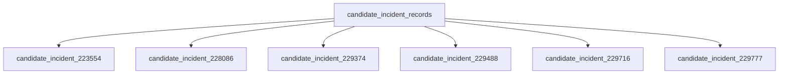

# Candidate Incident Records

```mermaid
flowchart TD
  dataset[candidate_incident_records]
  dataset --> candidate_incident_223554[candidate_incident_223554]
  dataset --> candidate_incident_228086[candidate_incident_228086]
  dataset --> candidate_incident_229374[candidate_incident_229374]
  dataset --> candidate_incident_229488[candidate_incident_229488]
  dataset --> candidate_incident_229716[candidate_incident_229716]
  dataset --> candidate_incident_229777[candidate_incident_229777]
```
