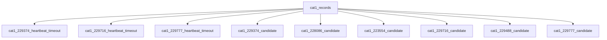

# Cat1 Records

```mermaid
flowchart TD
  dataset[cat1_records]
  dataset --> cat1_229374_heartbeat_timeout[cat1_229374_heartbeat_timeout]
  dataset --> cat1_229716_heartbeat_timeout[cat1_229716_heartbeat_timeout]
  dataset --> cat1_229777_heartbeat_timeout[cat1_229777_heartbeat_timeout]
  dataset --> cat1_229374_candidate[cat1_229374_candidate]
  dataset --> cat1_228086_candidate[cat1_228086_candidate]
  dataset --> cat1_223554_candidate[cat1_223554_candidate]
  dataset --> cat1_229716_candidate[cat1_229716_candidate]
  dataset --> cat1_229488_candidate[cat1_229488_candidate]
  dataset --> cat1_229777_candidate[cat1_229777_candidate]
```

