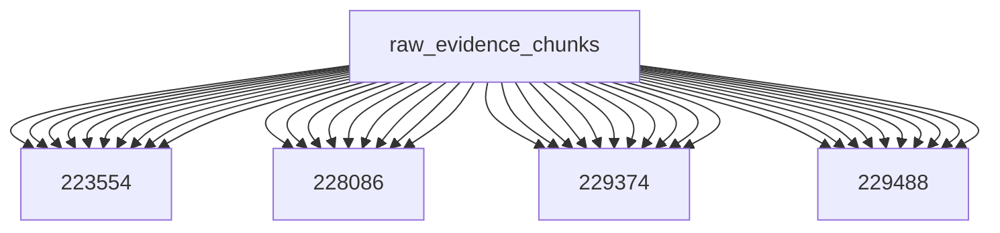

# Raw Evidence Chunks

```mermaid
flowchart TD
  dataset[raw_evidence_chunks]
  dataset --> 223554[223554]
  dataset --> 223554[223554]
  dataset --> 223554[223554]
  dataset --> 223554[223554]
  dataset --> 223554[223554]
  dataset --> 223554[223554]
  dataset --> 223554[223554]
  dataset --> 223554[223554]
  dataset --> 223554[223554]
  dataset --> 223554[223554]
  dataset --> 228086[228086]
  dataset --> 228086[228086]
  dataset --> 228086[228086]
  dataset --> 228086[228086]
  dataset --> 228086[228086]
  dataset --> 228086[228086]
  dataset --> 228086[228086]
  dataset --> 228086[228086]
  dataset --> 228086[228086]
  dataset --> 229374[229374]
  dataset --> 229374[229374]
  dataset --> 229374[229374]
  dataset --> 229374[229374]
  dataset --> 229374[229374]
  dataset --> 229374[229374]
  dataset --> 229374[229374]
  dataset --> 229374[229374]
  dataset --> 229374[229374]
  dataset --> 229374[229374]
  dataset --> 229374[229374]
  dataset --> 229488[229488]
  dataset --> 229488[229488]
  dataset --> 229488[229488]
  dataset --> 229488[229488]
  dataset --> 229488[229488]
  dataset --> 229488[229488]
  dataset --> 229488[229488]
  dataset --> 229488[229488]
  dataset --> 229488[229488]
  dataset --> 229488[229488]
```
