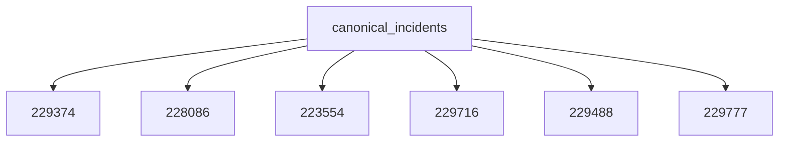

# Canonical Incidents

```mermaid
flowchart TD
  dataset[canonical_incidents]
  dataset --> 229374[229374]
  dataset --> 228086[228086]
  dataset --> 223554[223554]
  dataset --> 229716[229716]
  dataset --> 229488[229488]
  dataset --> 229777[229777]
```

