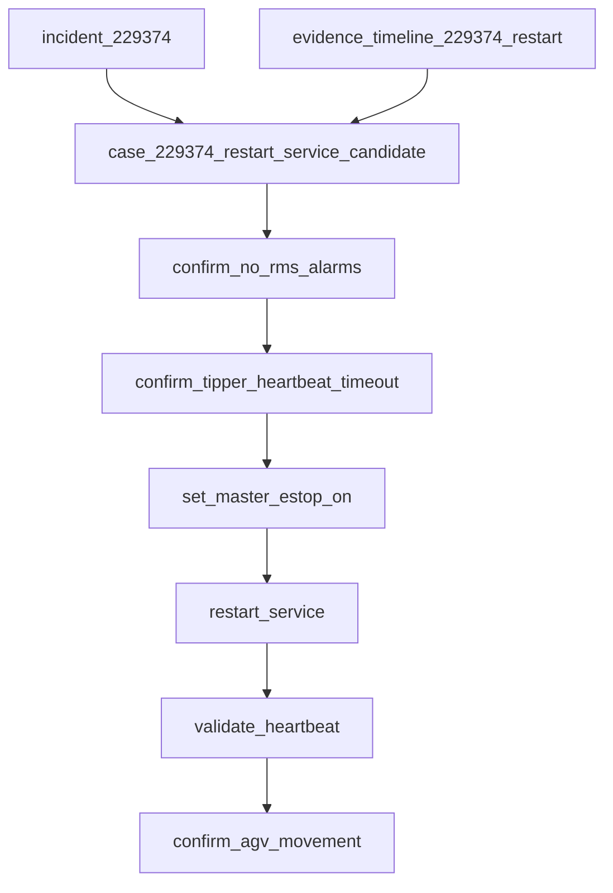

# case_229374_restart_service_candidate

```mermaid
flowchart TD
  start[case_229374_restart_service_candidate]
  start --> confirm_no_rms_alarms[confirm_no_rms_alarms]
  confirm_no_rms_alarms --> confirm_tipper_heartbeat_timeout[confirm_tipper_heartbeat_timeout]
  confirm_tipper_heartbeat_timeout --> set_master_estop_on[set_master_estop_on]
  set_master_estop_on --> restart_service[restart_service]
  restart_service --> validate_heartbeat[validate_heartbeat]
  validate_heartbeat --> confirm_agv_movement[confirm_agv_movement]
  229374[incident_229374] --> start
  timeline_229374_restart[evidence_timeline_229374_restart] --> start
```
