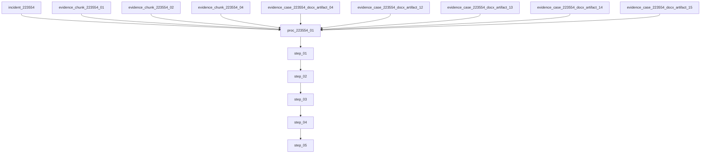

# proc_223554_01

```mermaid
flowchart TD
  start[proc_223554_01]
  start --> step_01[step_01]
  step_01 --> step_02[step_02]
  step_02 --> step_03[step_03]
  step_03 --> step_04[step_04]
  step_04 --> step_05[step_05]
  223554[incident_223554] --> start
  chunk_223554_01[evidence_chunk_223554_01] --> start
  chunk_223554_02[evidence_chunk_223554_02] --> start
  chunk_223554_04[evidence_chunk_223554_04] --> start
  case_223554_docx_artifact_04[evidence_case_223554_docx_artifact_04] --> start
  case_223554_docx_artifact_12[evidence_case_223554_docx_artifact_12] --> start
  case_223554_docx_artifact_13[evidence_case_223554_docx_artifact_13] --> start
  case_223554_docx_artifact_14[evidence_case_223554_docx_artifact_14] --> start
  case_223554_docx_artifact_15[evidence_case_223554_docx_artifact_15] --> start
```
