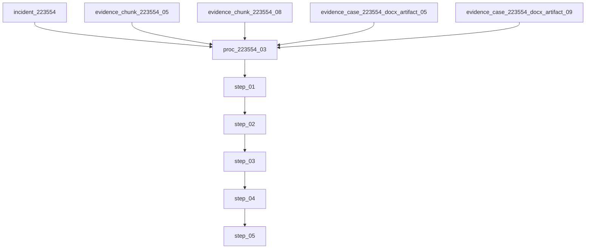

# proc_223554_03

```mermaid
flowchart TD
  start[proc_223554_03]
  start --> step_01[step_01]
  step_01 --> step_02[step_02]
  step_02 --> step_03[step_03]
  step_03 --> step_04[step_04]
  step_04 --> step_05[step_05]
  223554[incident_223554] --> start
  chunk_223554_05[evidence_chunk_223554_05] --> start
  chunk_223554_08[evidence_chunk_223554_08] --> start
  case_223554_docx_artifact_05[evidence_case_223554_docx_artifact_05] --> start
  case_223554_docx_artifact_09[evidence_case_223554_docx_artifact_09] --> start
```
