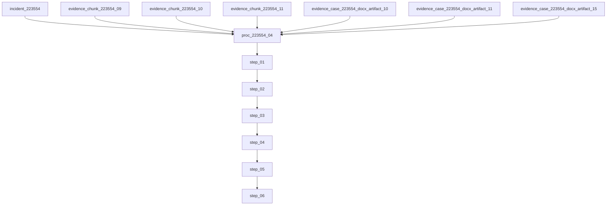

# proc_223554_04

```mermaid
flowchart TD
  start[proc_223554_04]
  start --> step_01[step_01]
  step_01 --> step_02[step_02]
  step_02 --> step_03[step_03]
  step_03 --> step_04[step_04]
  step_04 --> step_05[step_05]
  step_05 --> step_06[step_06]
  223554[incident_223554] --> start
  chunk_223554_09[evidence_chunk_223554_09] --> start
  chunk_223554_10[evidence_chunk_223554_10] --> start
  chunk_223554_11[evidence_chunk_223554_11] --> start
  case_223554_docx_artifact_10[evidence_case_223554_docx_artifact_10] --> start
  case_223554_docx_artifact_11[evidence_case_223554_docx_artifact_11] --> start
  case_223554_docx_artifact_15[evidence_case_223554_docx_artifact_15] --> start
```
