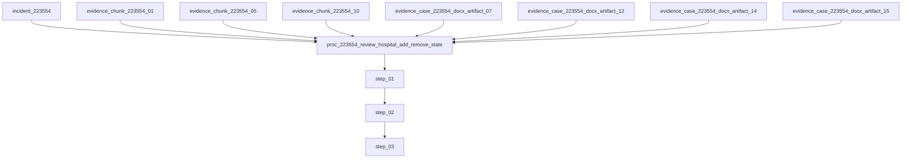

# proc_223554_review_hospital_add_remove_state

```mermaid
flowchart TD
  start[proc_223554_review_hospital_add_remove_state]
  start --> step_01[step_01]
  step_01 --> step_02[step_02]
  step_02 --> step_03[step_03]
  223554[incident_223554] --> start
  chunk_223554_01[evidence_chunk_223554_01] --> start
  chunk_223554_05[evidence_chunk_223554_05] --> start
  chunk_223554_10[evidence_chunk_223554_10] --> start
  case_223554_docx_artifact_07[evidence_case_223554_docx_artifact_07] --> start
  case_223554_docx_artifact_12[evidence_case_223554_docx_artifact_12] --> start
  case_223554_docx_artifact_14[evidence_case_223554_docx_artifact_14] --> start
  case_223554_docx_artifact_15[evidence_case_223554_docx_artifact_15] --> start
```
