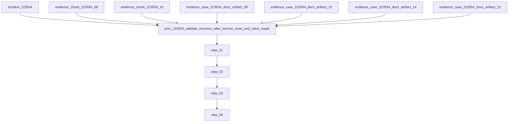

# proc_223554_validate_recovery_after_service_reset_and_robot_readd

```mermaid
flowchart TD
  start[proc_223554_validate_recovery_after_service_reset_and_robot_readd]
  start --> step_01[step_01]
  step_01 --> step_02[step_02]
  step_02 --> step_03[step_03]
  step_03 --> step_04[step_04]
  223554[incident_223554] --> start
  chunk_223554_08[evidence_chunk_223554_08] --> start
  chunk_223554_10[evidence_chunk_223554_10] --> start
  case_223554_docx_artifact_09[evidence_case_223554_docx_artifact_09] --> start
  case_223554_docx_artifact_10[evidence_case_223554_docx_artifact_10] --> start
  case_223554_docx_artifact_14[evidence_case_223554_docx_artifact_14] --> start
  case_223554_docx_artifact_15[evidence_case_223554_docx_artifact_15] --> start
```
