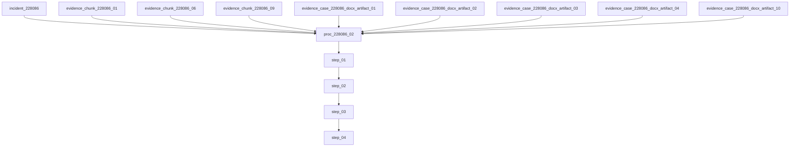

# proc_228086_02

```mermaid
flowchart TD
  start[proc_228086_02]
  start --> step_01[step_01]
  step_01 --> step_02[step_02]
  step_02 --> step_03[step_03]
  step_03 --> step_04[step_04]
  228086[incident_228086] --> start
  chunk_228086_01[evidence_chunk_228086_01] --> start
  chunk_228086_06[evidence_chunk_228086_06] --> start
  chunk_228086_09[evidence_chunk_228086_09] --> start
  case_228086_docx_artifact_01[evidence_case_228086_docx_artifact_01] --> start
  case_228086_docx_artifact_02[evidence_case_228086_docx_artifact_02] --> start
  case_228086_docx_artifact_03[evidence_case_228086_docx_artifact_03] --> start
  case_228086_docx_artifact_04[evidence_case_228086_docx_artifact_04] --> start
  case_228086_docx_artifact_10[evidence_case_228086_docx_artifact_10] --> start
```
