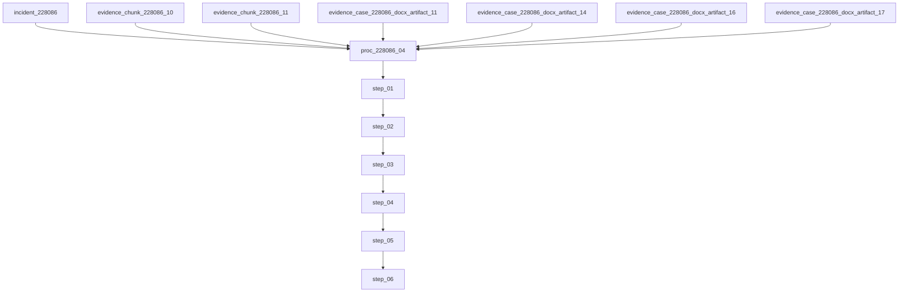

# proc_228086_04

```mermaid
flowchart TD
  start[proc_228086_04]
  start --> step_01[step_01]
  step_01 --> step_02[step_02]
  step_02 --> step_03[step_03]
  step_03 --> step_04[step_04]
  step_04 --> step_05[step_05]
  step_05 --> step_06[step_06]
  228086[incident_228086] --> start
  chunk_228086_10[evidence_chunk_228086_10] --> start
  chunk_228086_11[evidence_chunk_228086_11] --> start
  case_228086_docx_artifact_11[evidence_case_228086_docx_artifact_11] --> start
  case_228086_docx_artifact_14[evidence_case_228086_docx_artifact_14] --> start
  case_228086_docx_artifact_16[evidence_case_228086_docx_artifact_16] --> start
  case_228086_docx_artifact_17[evidence_case_228086_docx_artifact_17] --> start
```
