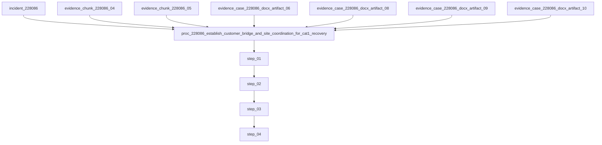

# proc_228086_establish_customer_bridge_and_site_coordination_for_cat1_recovery

```mermaid
flowchart TD
  start[proc_228086_establish_customer_bridge_and_site_coordination_for_cat1_recovery]
  start --> step_01[step_01]
  step_01 --> step_02[step_02]
  step_02 --> step_03[step_03]
  step_03 --> step_04[step_04]
  228086[incident_228086] --> start
  chunk_228086_04[evidence_chunk_228086_04] --> start
  chunk_228086_05[evidence_chunk_228086_05] --> start
  case_228086_docx_artifact_06[evidence_case_228086_docx_artifact_06] --> start
  case_228086_docx_artifact_08[evidence_case_228086_docx_artifact_08] --> start
  case_228086_docx_artifact_09[evidence_case_228086_docx_artifact_09] --> start
  case_228086_docx_artifact_10[evidence_case_228086_docx_artifact_10] --> start
```
