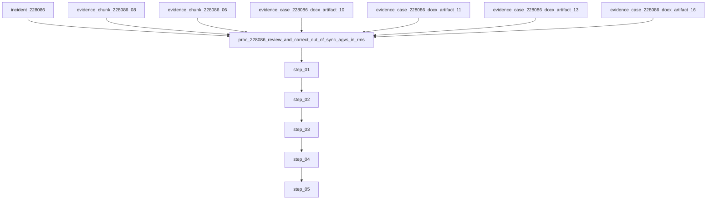

# proc_228086_review_and_correct_out_of_sync_agvs_in_rms

```mermaid
flowchart TD
  start[proc_228086_review_and_correct_out_of_sync_agvs_in_rms]
  start --> step_01[step_01]
  step_01 --> step_02[step_02]
  step_02 --> step_03[step_03]
  step_03 --> step_04[step_04]
  step_04 --> step_05[step_05]
  228086[incident_228086] --> start
  chunk_228086_08[evidence_chunk_228086_08] --> start
  chunk_228086_06[evidence_chunk_228086_06] --> start
  case_228086_docx_artifact_10[evidence_case_228086_docx_artifact_10] --> start
  case_228086_docx_artifact_11[evidence_case_228086_docx_artifact_11] --> start
  case_228086_docx_artifact_13[evidence_case_228086_docx_artifact_13] --> start
  case_228086_docx_artifact_16[evidence_case_228086_docx_artifact_16] --> start
```
