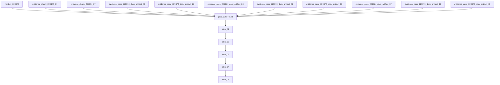

# proc_229374_03

```mermaid
flowchart TD
  start[proc_229374_03]
  start --> step_01[step_01]
  step_01 --> step_02[step_02]
  step_02 --> step_03[step_03]
  step_03 --> step_04[step_04]
  step_04 --> step_05[step_05]
  229374[incident_229374] --> start
  chunk_229374_04[evidence_chunk_229374_04] --> start
  chunk_229374_07[evidence_chunk_229374_07] --> start
  case_229374_docx_artifact_24[evidence_case_229374_docx_artifact_24] --> start
  case_229374_docx_artifact_26[evidence_case_229374_docx_artifact_26] --> start
  case_229374_docx_artifact_28[evidence_case_229374_docx_artifact_28] --> start
  case_229374_docx_artifact_29[evidence_case_229374_docx_artifact_29] --> start
  case_229374_docx_artifact_30[evidence_case_229374_docx_artifact_30] --> start
  case_229374_docx_artifact_37[evidence_case_229374_docx_artifact_37] --> start
  case_229374_docx_artifact_38[evidence_case_229374_docx_artifact_38] --> start
  case_229374_docx_artifact_41[evidence_case_229374_docx_artifact_41] --> start
```
