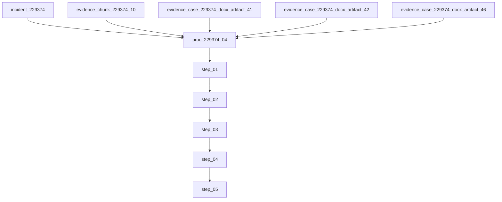

# proc_229374_04

```mermaid
flowchart TD
  start[proc_229374_04]
  start --> step_01[step_01]
  step_01 --> step_02[step_02]
  step_02 --> step_03[step_03]
  step_03 --> step_04[step_04]
  step_04 --> step_05[step_05]
  229374[incident_229374] --> start
  chunk_229374_10[evidence_chunk_229374_10] --> start
  case_229374_docx_artifact_41[evidence_case_229374_docx_artifact_41] --> start
  case_229374_docx_artifact_42[evidence_case_229374_docx_artifact_42] --> start
  case_229374_docx_artifact_46[evidence_case_229374_docx_artifact_46] --> start
```
