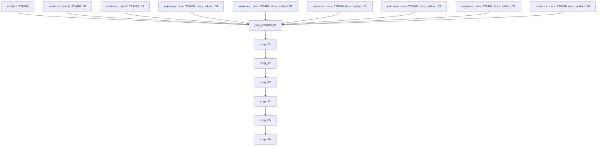

# proc_229488_01

```mermaid
flowchart TD
  start[proc_229488_01]
  start --> step_01[step_01]
  step_01 --> step_02[step_02]
  step_02 --> step_03[step_03]
  step_03 --> step_04[step_04]
  step_04 --> step_05[step_05]
  step_05 --> step_06[step_06]
  229488[incident_229488] --> start
  chunk_229488_01[evidence_chunk_229488_01] --> start
  chunk_229488_03[evidence_chunk_229488_03] --> start
  case_229488_docx_artifact_01[evidence_case_229488_docx_artifact_01] --> start
  case_229488_docx_artifact_02[evidence_case_229488_docx_artifact_02] --> start
  case_229488_docx_artifact_21[evidence_case_229488_docx_artifact_21] --> start
  case_229488_docx_artifact_22[evidence_case_229488_docx_artifact_22] --> start
  case_229488_docx_artifact_23[evidence_case_229488_docx_artifact_23] --> start
  case_229488_docx_artifact_24[evidence_case_229488_docx_artifact_24] --> start
```
