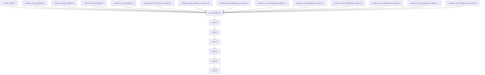

# proc_229488_03

```mermaid
flowchart TD
  start[proc_229488_03]
  start --> step_01[step_01]
  step_01 --> step_02[step_02]
  step_02 --> step_03[step_03]
  step_03 --> step_04[step_04]
  step_04 --> step_05[step_05]
  step_05 --> step_06[step_06]
  229488[incident_229488] --> start
  chunk_229488_02[evidence_chunk_229488_02] --> start
  chunk_229488_05[evidence_chunk_229488_05] --> start
  chunk_229488_07[evidence_chunk_229488_07] --> start
  chunk_229488_09[evidence_chunk_229488_09] --> start
  case_229488_docx_artifact_01[evidence_case_229488_docx_artifact_01] --> start
  case_229488_docx_artifact_03[evidence_case_229488_docx_artifact_03] --> start
  case_229488_docx_artifact_04[evidence_case_229488_docx_artifact_04] --> start
  case_229488_docx_artifact_10[evidence_case_229488_docx_artifact_10] --> start
  case_229488_docx_artifact_11[evidence_case_229488_docx_artifact_11] --> start
  case_229488_docx_artifact_13[evidence_case_229488_docx_artifact_13] --> start
  case_229488_docx_artifact_16[evidence_case_229488_docx_artifact_16] --> start
  case_229488_docx_artifact_17[evidence_case_229488_docx_artifact_17] --> start
  case_229488_docx_artifact_18[evidence_case_229488_docx_artifact_18] --> start
```
