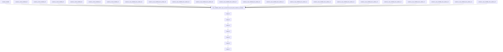

# proc_229488_collect_opc_ua_disconnect_and_alarm_evidence_candidate

```mermaid
flowchart TD
  start[proc_229488_collect_opc_ua_disconnect_and_alarm_evidence_candidate]
  start --> step_01[step_01]
  step_01 --> step_02[step_02]
  step_02 --> step_03[step_03]
  step_03 --> step_04[step_04]
  step_04 --> step_05[step_05]
  step_05 --> step_06[step_06]
  step_06 --> step_07[step_07]
  229488[incident_229488] --> start
  chunk_229488_05[evidence_chunk_229488_05] --> start
  chunk_229488_06[evidence_chunk_229488_06] --> start
  chunk_229488_07[evidence_chunk_229488_07] --> start
  chunk_229488_08[evidence_chunk_229488_08] --> start
  chunk_229488_09[evidence_chunk_229488_09] --> start
  chunk_229488_10[evidence_chunk_229488_10] --> start
  case_229488_docx_artifact_01[evidence_case_229488_docx_artifact_01] --> start
  case_229488_docx_artifact_02[evidence_case_229488_docx_artifact_02] --> start
  case_229488_docx_artifact_04[evidence_case_229488_docx_artifact_04] --> start
  case_229488_docx_artifact_05[evidence_case_229488_docx_artifact_05] --> start
  case_229488_docx_artifact_07[evidence_case_229488_docx_artifact_07] --> start
  case_229488_docx_artifact_10[evidence_case_229488_docx_artifact_10] --> start
  case_229488_docx_artifact_11[evidence_case_229488_docx_artifact_11] --> start
  case_229488_docx_artifact_12[evidence_case_229488_docx_artifact_12] --> start
  case_229488_docx_artifact_13[evidence_case_229488_docx_artifact_13] --> start
  case_229488_docx_artifact_14[evidence_case_229488_docx_artifact_14] --> start
  case_229488_docx_artifact_15[evidence_case_229488_docx_artifact_15] --> start
  case_229488_docx_artifact_16[evidence_case_229488_docx_artifact_16] --> start
  case_229488_docx_artifact_17[evidence_case_229488_docx_artifact_17] --> start
  case_229488_docx_artifact_18[evidence_case_229488_docx_artifact_18] --> start
  case_229488_docx_artifact_19[evidence_case_229488_docx_artifact_19] --> start
  case_229488_docx_artifact_20[evidence_case_229488_docx_artifact_20] --> start
```
