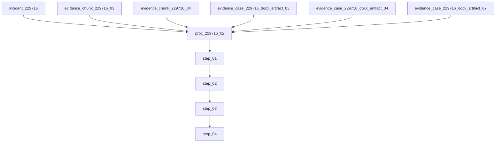

# proc_229716_02

```mermaid
flowchart TD
  start[proc_229716_02]
  start --> step_01[step_01]
  step_01 --> step_02[step_02]
  step_02 --> step_03[step_03]
  step_03 --> step_04[step_04]
  229716[incident_229716] --> start
  chunk_229716_03[evidence_chunk_229716_03] --> start
  chunk_229716_04[evidence_chunk_229716_04] --> start
  case_229716_docx_artifact_03[evidence_case_229716_docx_artifact_03] --> start
  case_229716_docx_artifact_04[evidence_case_229716_docx_artifact_04] --> start
  case_229716_docx_artifact_07[evidence_case_229716_docx_artifact_07] --> start
```
