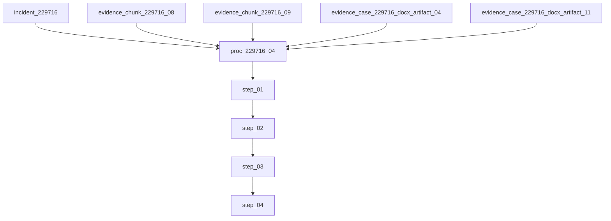

# proc_229716_04

```mermaid
flowchart TD
  start[proc_229716_04]
  start --> step_01[step_01]
  step_01 --> step_02[step_02]
  step_02 --> step_03[step_03]
  step_03 --> step_04[step_04]
  229716[incident_229716] --> start
  chunk_229716_08[evidence_chunk_229716_08] --> start
  chunk_229716_09[evidence_chunk_229716_09] --> start
  case_229716_docx_artifact_04[evidence_case_229716_docx_artifact_04] --> start
  case_229716_docx_artifact_11[evidence_case_229716_docx_artifact_11] --> start
```
