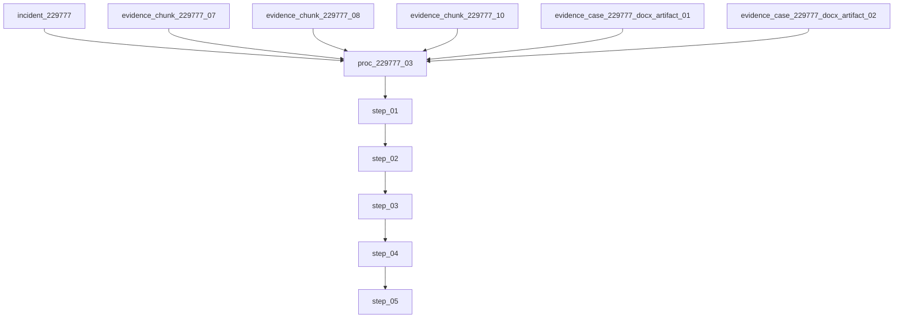

# proc_229777_03

```mermaid
flowchart TD
  start[proc_229777_03]
  start --> step_01[step_01]
  step_01 --> step_02[step_02]
  step_02 --> step_03[step_03]
  step_03 --> step_04[step_04]
  step_04 --> step_05[step_05]
  229777[incident_229777] --> start
  chunk_229777_07[evidence_chunk_229777_07] --> start
  chunk_229777_08[evidence_chunk_229777_08] --> start
  chunk_229777_10[evidence_chunk_229777_10] --> start
  case_229777_docx_artifact_01[evidence_case_229777_docx_artifact_01] --> start
  case_229777_docx_artifact_02[evidence_case_229777_docx_artifact_02] --> start
```
