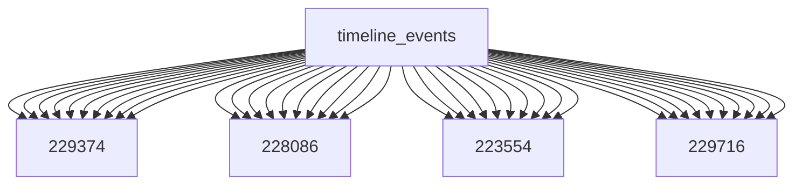

# Timeline Events

```mermaid
flowchart TD
  dataset[timeline_events]
  dataset --> 229374[229374]
  dataset --> 229374[229374]
  dataset --> 229374[229374]
  dataset --> 229374[229374]
  dataset --> 229374[229374]
  dataset --> 229374[229374]
  dataset --> 229374[229374]
  dataset --> 229374[229374]
  dataset --> 229374[229374]
  dataset --> 229374[229374]
  dataset --> 228086[228086]
  dataset --> 228086[228086]
  dataset --> 228086[228086]
  dataset --> 228086[228086]
  dataset --> 228086[228086]
  dataset --> 228086[228086]
  dataset --> 228086[228086]
  dataset --> 228086[228086]
  dataset --> 228086[228086]
  dataset --> 228086[228086]
  dataset --> 223554[223554]
  dataset --> 223554[223554]
  dataset --> 223554[223554]
  dataset --> 223554[223554]
  dataset --> 223554[223554]
  dataset --> 223554[223554]
  dataset --> 223554[223554]
  dataset --> 223554[223554]
  dataset --> 223554[223554]
  dataset --> 223554[223554]
  dataset --> 229716[229716]
  dataset --> 229716[229716]
  dataset --> 229716[229716]
  dataset --> 229716[229716]
  dataset --> 229716[229716]
  dataset --> 229716[229716]
  dataset --> 229716[229716]
  dataset --> 229716[229716]
  dataset --> 229716[229716]
  dataset --> 229716[229716]
```

