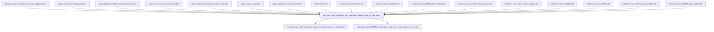

# agv_flow_stop_at_tippers_with_heartbeat_timeout_and_no_rms_faults

```mermaid
flowchart TD
  workflow[agv_flow_stop_at_tippers_with_heartbeat_timeout_and_no_rms_faults]
  agv_flow_stopped_at_all_three_tipper_lines[signal_agv_flow_stopped_at_all_three_tipper_lines] --> workflow
  nothing_coming_to_tippers[signal_nothing_coming_to_tippers] --> workflow
  tipper_heartbeat_timeout_status_active[signal_tipper_heartbeat_timeout_status_active] --> workflow
  rms_screen_no_faults_visible[signal_rms_screen_no_faults_visible] --> workflow
  heartbeat_statistics_review_requested[signal_heartbeat_statistics_review_requested] --> workflow
  agvs_e_stopped[signal_agvs_e_stopped] --> workflow
  optisweep_service_restarted[signal_optisweep_service_restarted] --> workflow
  workflow --> proc_229716_review_tipper_heartbeat_and_rms_fault_state[procedure_proc_229716_review_tipper_heartbeat_and_rms_fault_state]
  workflow --> proc_229716_coordinate_estop_and_restart_optisweep_service[procedure_proc_229716_coordinate_estop_and_restart_optisweep_service]
  229716[incident_229716] --> workflow
  chunk_229716_03[evidence_chunk_229716_03] --> workflow
  chunk_229716_05[evidence_chunk_229716_05] --> workflow
  case_229716_docx_artifact_03[evidence_case_229716_docx_artifact_03] --> workflow
  case_229716_docx_artifact_04[evidence_case_229716_docx_artifact_04] --> workflow
  case_229716_docx_artifact_10[evidence_case_229716_docx_artifact_10] --> workflow
  chunk_229716_06[evidence_chunk_229716_06] --> workflow
  chunk_229716_07[evidence_chunk_229716_07] --> workflow
  case_229716_docx_artifact_07[evidence_case_229716_docx_artifact_07] --> workflow
  case_229716_docx_artifact_08[evidence_case_229716_docx_artifact_08] --> workflow
```

