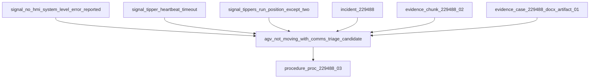

# agv_not_moving_with_comms_triage_candidate

```mermaid
flowchart TD
  workflow[agv_not_moving_with_comms_triage_candidate]
  no_hmi_system_level_error_reported[signal_no_hmi_system_level_error_reported] --> workflow
  tipper_heartbeat_timeout[signal_tipper_heartbeat_timeout] --> workflow
  tippers_run_position_except_two[signal_tippers_run_position_except_two] --> workflow
  workflow --> proc_229488_03[procedure_proc_229488_03]
  229488[incident_229488] --> workflow
  chunk_229488_02[evidence_chunk_229488_02] --> workflow
  case_229488_docx_artifact_01[evidence_case_229488_docx_artifact_01] --> workflow
```
