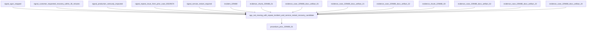

# agv_not_moving_with_repeat_incident_and_service_restart_recovery_candidate

```mermaid
flowchart TD
  workflow[agv_not_moving_with_repeat_incident_and_service_restart_recovery_candidate]
  agvs_stopped[signal_agvs_stopped] --> workflow
  customer_requested_recovery_within_30_minutes[signal_customer_requested_recovery_within_30_minutes] --> workflow
  production_seriously_impacted[signal_production_seriously_impacted] --> workflow
  repeat_issue_from_prior_case_00229374[signal_repeat_issue_from_prior_case_00229374] --> workflow
  service_restart_required[signal_service_restart_required] --> workflow
  workflow --> proc_229488_01[procedure_proc_229488_01]
  229488[incident_229488] --> workflow
  chunk_229488_01[evidence_chunk_229488_01] --> workflow
  case_229488_docx_artifact_01[evidence_case_229488_docx_artifact_01] --> workflow
  case_229488_docx_artifact_21[evidence_case_229488_docx_artifact_21] --> workflow
  case_229488_docx_artifact_22[evidence_case_229488_docx_artifact_22] --> workflow
  chunk_229488_03[evidence_chunk_229488_03] --> workflow
  case_229488_docx_artifact_02[evidence_case_229488_docx_artifact_02] --> workflow
  case_229488_docx_artifact_23[evidence_case_229488_docx_artifact_23] --> workflow
  case_229488_docx_artifact_24[evidence_case_229488_docx_artifact_24] --> workflow
```
