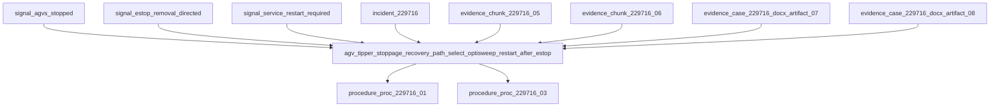

# agv_tipper_stoppage_recovery_path_select_optisweep_restart_after_estop

```mermaid
flowchart TD
  workflow[agv_tipper_stoppage_recovery_path_select_optisweep_restart_after_estop]
  agvs_stopped[signal_agvs_stopped] --> workflow
  estop_removal_directed[signal_estop_removal_directed] --> workflow
  service_restart_required[signal_service_restart_required] --> workflow
  workflow --> proc_229716_01[procedure_proc_229716_01]
  workflow --> proc_229716_03[procedure_proc_229716_03]
  229716[incident_229716] --> workflow
  chunk_229716_05[evidence_chunk_229716_05] --> workflow
  chunk_229716_06[evidence_chunk_229716_06] --> workflow
  case_229716_docx_artifact_07[evidence_case_229716_docx_artifact_07] --> workflow
  case_229716_docx_artifact_08[evidence_case_229716_docx_artifact_08] --> workflow
```
