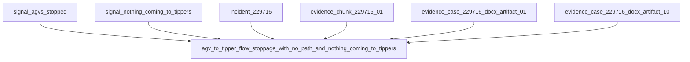

# agv_to_tipper_flow_stoppage_with_no_path_and_nothing_coming_to_tippers

```mermaid
flowchart TD
  workflow[agv_to_tipper_flow_stoppage_with_no_path_and_nothing_coming_to_tippers]
  agvs_stopped[signal_agvs_stopped] --> workflow
  nothing_coming_to_tippers[signal_nothing_coming_to_tippers] --> workflow
  229716[incident_229716] --> workflow
  chunk_229716_01[evidence_chunk_229716_01] --> workflow
  case_229716_docx_artifact_01[evidence_case_229716_docx_artifact_01] --> workflow
  case_229716_docx_artifact_10[evidence_case_229716_docx_artifact_10] --> workflow
```
