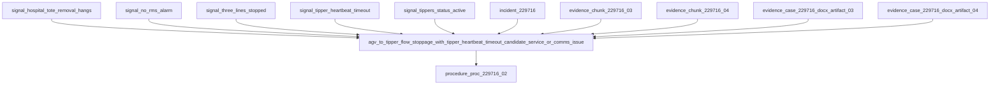

# agv_to_tipper_flow_stoppage_with_tipper_heartbeat_timeout_candidate_service_or_comms_issue

```mermaid
flowchart TD
  workflow[agv_to_tipper_flow_stoppage_with_tipper_heartbeat_timeout_candidate_service_or_comms_issue]
  hospital_tote_removal_hangs[signal_hospital_tote_removal_hangs] --> workflow
  no_rms_alarm[signal_no_rms_alarm] --> workflow
  three_lines_stopped[signal_three_lines_stopped] --> workflow
  tipper_heartbeat_timeout[signal_tipper_heartbeat_timeout] --> workflow
  tippers_status_active[signal_tippers_status_active] --> workflow
  workflow --> proc_229716_02[procedure_proc_229716_02]
  229716[incident_229716] --> workflow
  chunk_229716_03[evidence_chunk_229716_03] --> workflow
  chunk_229716_04[evidence_chunk_229716_04] --> workflow
  case_229716_docx_artifact_03[evidence_case_229716_docx_artifact_03] --> workflow
  case_229716_docx_artifact_04[evidence_case_229716_docx_artifact_04] --> workflow
```
