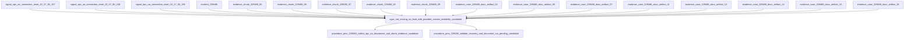

# agvs_not_moving_no_fault_with_possible_comms_instability_candidate

```mermaid
flowchart TD
  workflow[agvs_not_moving_no_fault_with_possible_comms_instability_candidate]
  opc_ua_connection_reset_10_27_80_157[signal_opc_ua_connection_reset_10_27_80_157] --> workflow
  opc_ua_connection_reset_10_27_80_248[signal_opc_ua_connection_reset_10_27_80_248] --> workflow
  opc_ua_connection_reset_10_27_80_156[signal_opc_ua_connection_reset_10_27_80_156] --> workflow
  workflow --> proc_229488_collect_opc_ua_disconnect_and_alarm_evidence_candidate[procedure_proc_229488_collect_opc_ua_disconnect_and_alarm_evidence_candidate]
  workflow --> proc_229488_validate_recovery_and_document_rca_pending_candidate[procedure_proc_229488_validate_recovery_and_document_rca_pending_candidate]
  229488[incident_229488] --> workflow
  chunk_229488_05[evidence_chunk_229488_05] --> workflow
  chunk_229488_06[evidence_chunk_229488_06] --> workflow
  chunk_229488_07[evidence_chunk_229488_07] --> workflow
  chunk_229488_08[evidence_chunk_229488_08] --> workflow
  chunk_229488_09[evidence_chunk_229488_09] --> workflow
  case_229488_docx_artifact_04[evidence_case_229488_docx_artifact_04] --> workflow
  case_229488_docx_artifact_05[evidence_case_229488_docx_artifact_05] --> workflow
  case_229488_docx_artifact_07[evidence_case_229488_docx_artifact_07] --> workflow
  case_229488_docx_artifact_11[evidence_case_229488_docx_artifact_11] --> workflow
  case_229488_docx_artifact_13[evidence_case_229488_docx_artifact_13] --> workflow
  case_229488_docx_artifact_14[evidence_case_229488_docx_artifact_14] --> workflow
  case_229488_docx_artifact_15[evidence_case_229488_docx_artifact_15] --> workflow
  case_229488_docx_artifact_18[evidence_case_229488_docx_artifact_18] --> workflow
```

