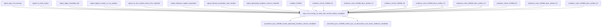

# agvs_not_moving_no_fault_with_service_failure_candidate

```mermaid
flowchart TD
  workflow[agvs_not_moving_no_fault_with_service_failure_candidate]
  agvs_not_moving[signal_agvs_not_moving] --> workflow
  no_fault_shown[signal_no_fault_shown] --> workflow
  tipper_heartbeat_flat[signal_tipper_heartbeat_flat] --> workflow
  tippers_mostly_in_run_position[signal_tippers_mostly_in_run_position] --> workflow
  no_hmi_system_level_error_reported[signal_no_hmi_system_level_error_reported] --> workflow
  software_support_requested[signal_software_support_requested] --> workflow
  internal_escalation_chat_created[signal_internal_escalation_chat_created] --> workflow
  optisweep_windows_service_restarted[signal_optisweep_windows_service_restarted] --> workflow
  workflow --> proc_229488_restart_optisweep_windows_service_candidate[procedure_proc_229488_restart_optisweep_windows_service_candidate]
  workflow --> proc_229488_collect_opc_ua_disconnect_and_alarm_evidence_candidate[procedure_proc_229488_collect_opc_ua_disconnect_and_alarm_evidence_candidate]
  229488[incident_229488] --> workflow
  chunk_229488_01[evidence_chunk_229488_01] --> workflow
  chunk_229488_02[evidence_chunk_229488_02] --> workflow
  case_229488_docx_artifact_01[evidence_case_229488_docx_artifact_01] --> workflow
  case_229488_docx_artifact_21[evidence_case_229488_docx_artifact_21] --> workflow
  case_229488_docx_artifact_22[evidence_case_229488_docx_artifact_22] --> workflow
  chunk_229488_01[evidence_chunk_229488_01] --> workflow
  case_229488_docx_artifact_01[evidence_case_229488_docx_artifact_01] --> workflow
  chunk_229488_02[evidence_chunk_229488_02] --> workflow
  chunk_229488_03[evidence_chunk_229488_03] --> workflow
  case_229488_docx_artifact_02[evidence_case_229488_docx_artifact_02] --> workflow
  case_229488_docx_artifact_22[evidence_case_229488_docx_artifact_22] --> workflow
  case_229488_docx_artifact_23[evidence_case_229488_docx_artifact_23] --> workflow
```
