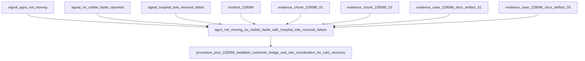

# agvs_not_moving_no_visible_faults_with_hospital_tote_removal_failure

```mermaid
flowchart TD
  workflow[agvs_not_moving_no_visible_faults_with_hospital_tote_removal_failure]
  agvs_not_moving[signal_agvs_not_moving] --> workflow
  no_visible_faults_reported[signal_no_visible_faults_reported] --> workflow
  hospital_tote_removal_failed[signal_hospital_tote_removal_failed] --> workflow
  workflow --> proc_228086_establish_customer_bridge_and_site_coordination_for_cat1_recovery[procedure_proc_228086_establish_customer_bridge_and_site_coordination_for_cat1_recovery]
  228086[incident_228086] --> workflow
  chunk_228086_01[evidence_chunk_228086_01] --> workflow
  chunk_228086_02[evidence_chunk_228086_02] --> workflow
  case_228086_docx_artifact_01[evidence_case_228086_docx_artifact_01] --> workflow
  case_228086_docx_artifact_05[evidence_case_228086_docx_artifact_05] --> workflow
```
