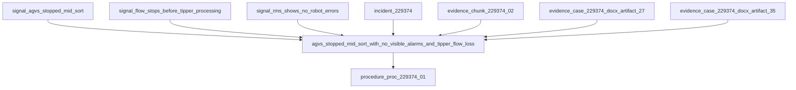

# agvs_stopped_mid_sort_with_no_visible_alarms_and_tipper_flow_loss

```mermaid
flowchart TD
  workflow[agvs_stopped_mid_sort_with_no_visible_alarms_and_tipper_flow_loss]
  agvs_stopped_mid_sort[signal_agvs_stopped_mid_sort] --> workflow
  flow_stops_before_tipper_processing[signal_flow_stops_before_tipper_processing] --> workflow
  rms_shows_no_robot_errors[signal_rms_shows_no_robot_errors] --> workflow
  workflow --> proc_229374_01[procedure_proc_229374_01]
  229374[incident_229374] --> workflow
  chunk_229374_02[evidence_chunk_229374_02] --> workflow
  case_229374_docx_artifact_27[evidence_case_229374_docx_artifact_27] --> workflow
  case_229374_docx_artifact_35[evidence_case_229374_docx_artifact_35] --> workflow
```

