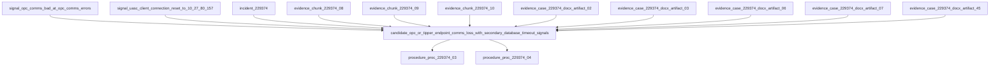

# candidate_opc_or_tipper_endpoint_comms_loss_with_secondary_database_timeout_signals

```mermaid
flowchart TD
  workflow[candidate_opc_or_tipper_endpoint_comms_loss_with_secondary_database_timeout_signals]
  opc_comms_bad_at_opc_comms_errors[signal_opc_comms_bad_at_opc_comms_errors] --> workflow
  uasc_client_connection_reset_to_10_27_80_157[signal_uasc_client_connection_reset_to_10_27_80_157] --> workflow
  workflow --> proc_229374_03[procedure_proc_229374_03]
  workflow --> proc_229374_04[procedure_proc_229374_04]
  229374[incident_229374] --> workflow
  chunk_229374_08[evidence_chunk_229374_08] --> workflow
  chunk_229374_09[evidence_chunk_229374_09] --> workflow
  chunk_229374_10[evidence_chunk_229374_10] --> workflow
  case_229374_docx_artifact_02[evidence_case_229374_docx_artifact_02] --> workflow
  case_229374_docx_artifact_03[evidence_case_229374_docx_artifact_03] --> workflow
  case_229374_docx_artifact_06[evidence_case_229374_docx_artifact_06] --> workflow
  case_229374_docx_artifact_07[evidence_case_229374_docx_artifact_07] --> workflow
  case_229374_docx_artifact_45[evidence_case_229374_docx_artifact_45] --> workflow
```
