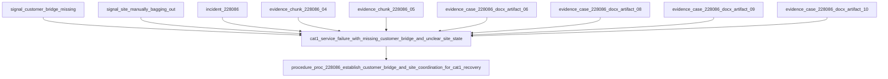

# cat1_service_failure_with_missing_customer_bridge_and_unclear_site_state

```mermaid
flowchart TD
  workflow[cat1_service_failure_with_missing_customer_bridge_and_unclear_site_state]
  customer_bridge_missing[signal_customer_bridge_missing] --> workflow
  site_manually_bagging_out[signal_site_manually_bagging_out] --> workflow
  workflow --> proc_228086_establish_customer_bridge_and_site_coordination_for_cat1_recovery[procedure_proc_228086_establish_customer_bridge_and_site_coordination_for_cat1_recovery]
  228086[incident_228086] --> workflow
  chunk_228086_04[evidence_chunk_228086_04] --> workflow
  chunk_228086_05[evidence_chunk_228086_05] --> workflow
  case_228086_docx_artifact_06[evidence_case_228086_docx_artifact_06] --> workflow
  case_228086_docx_artifact_08[evidence_case_228086_docx_artifact_08] --> workflow
  case_228086_docx_artifact_09[evidence_case_228086_docx_artifact_09] --> workflow
  case_228086_docx_artifact_10[evidence_case_228086_docx_artifact_10] --> workflow
```
