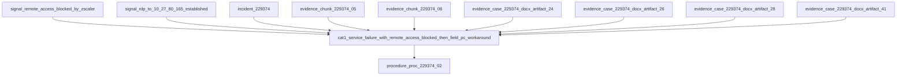

# cat1_service_failure_with_remote_access_blocked_then_field_pc_workaround

```mermaid
flowchart TD
  workflow[cat1_service_failure_with_remote_access_blocked_then_field_pc_workaround]
  remote_access_blocked_by_zscaler[signal_remote_access_blocked_by_zscaler] --> workflow
  rdp_to_10_27_80_165_established[signal_rdp_to_10_27_80_165_established] --> workflow
  workflow --> proc_229374_02[procedure_proc_229374_02]
  229374[incident_229374] --> workflow
  chunk_229374_05[evidence_chunk_229374_05] --> workflow
  chunk_229374_06[evidence_chunk_229374_06] --> workflow
  case_229374_docx_artifact_24[evidence_case_229374_docx_artifact_24] --> workflow
  case_229374_docx_artifact_26[evidence_case_229374_docx_artifact_26] --> workflow
  case_229374_docx_artifact_28[evidence_case_229374_docx_artifact_28] --> workflow
  case_229374_docx_artifact_41[evidence_case_229374_docx_artifact_41] --> workflow
```
