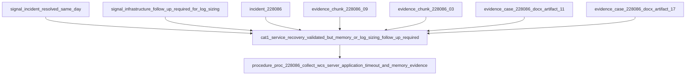

# cat1_service_recovery_validated_but_memory_or_log_sizing_follow_up_required

```mermaid
flowchart TD
  workflow[cat1_service_recovery_validated_but_memory_or_log_sizing_follow_up_required]
  incident_resolved_same_day[signal_incident_resolved_same_day] --> workflow
  infrastructure_follow_up_required_for_log_sizing[signal_infrastructure_follow_up_required_for_log_sizing] --> workflow
  workflow --> proc_228086_collect_wcs_server_application_timeout_and_memory_evidence[procedure_proc_228086_collect_wcs_server_application_timeout_and_memory_evidence]
  228086[incident_228086] --> workflow
  chunk_228086_09[evidence_chunk_228086_09] --> workflow
  chunk_228086_03[evidence_chunk_228086_03] --> workflow
  case_228086_docx_artifact_11[evidence_case_228086_docx_artifact_11] --> workflow
  case_228086_docx_artifact_17[evidence_case_228086_docx_artifact_17] --> workflow
```
