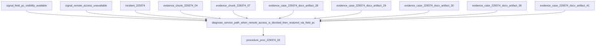

# diagnose_service_path_when_remote_access_is_blocked_then_restored_via_field_pc

```mermaid
flowchart TD
  workflow[diagnose_service_path_when_remote_access_is_blocked_then_restored_via_field_pc]
  field_pc_visibility_available[signal_field_pc_visibility_available] --> workflow
  remote_access_unavailable[signal_remote_access_unavailable] --> workflow
  workflow --> proc_229374_03[procedure_proc_229374_03]
  229374[incident_229374] --> workflow
  chunk_229374_04[evidence_chunk_229374_04] --> workflow
  chunk_229374_07[evidence_chunk_229374_07] --> workflow
  case_229374_docx_artifact_28[evidence_case_229374_docx_artifact_28] --> workflow
  case_229374_docx_artifact_29[evidence_case_229374_docx_artifact_29] --> workflow
  case_229374_docx_artifact_30[evidence_case_229374_docx_artifact_30] --> workflow
  case_229374_docx_artifact_38[evidence_case_229374_docx_artifact_38] --> workflow
  case_229374_docx_artifact_41[evidence_case_229374_docx_artifact_41] --> workflow
```
