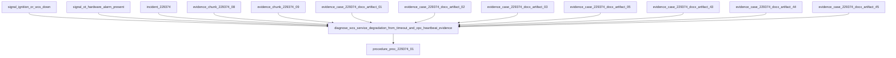

# diagnose_wcs_service_degradation_from_timeout_and_opc_heartbeat_evidence

```mermaid
flowchart TD
  workflow[diagnose_wcs_service_degradation_from_timeout_and_opc_heartbeat_evidence]
  ignition_or_wcs_down[signal_ignition_or_wcs_down] --> workflow
  ot_hardware_alarm_present[signal_ot_hardware_alarm_present] --> workflow
  workflow --> proc_229374_01[procedure_proc_229374_01]
  229374[incident_229374] --> workflow
  chunk_229374_08[evidence_chunk_229374_08] --> workflow
  chunk_229374_09[evidence_chunk_229374_09] --> workflow
  case_229374_docx_artifact_01[evidence_case_229374_docx_artifact_01] --> workflow
  case_229374_docx_artifact_02[evidence_case_229374_docx_artifact_02] --> workflow
  case_229374_docx_artifact_03[evidence_case_229374_docx_artifact_03] --> workflow
  case_229374_docx_artifact_05[evidence_case_229374_docx_artifact_05] --> workflow
  case_229374_docx_artifact_43[evidence_case_229374_docx_artifact_43] --> workflow
  case_229374_docx_artifact_44[evidence_case_229374_docx_artifact_44] --> workflow
  case_229374_docx_artifact_45[evidence_case_229374_docx_artifact_45] --> workflow
```
