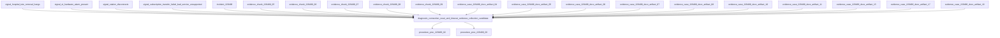

# diagnostic_connection_reset_and_timeout_evidence_collection_candidate

```mermaid
flowchart TD
  workflow[diagnostic_connection_reset_and_timeout_evidence_collection_candidate]
  hospital_tote_removal_hangs[signal_hospital_tote_removal_hangs] --> workflow
  ot_hardware_alarm_present[signal_ot_hardware_alarm_present] --> workflow
  station_disconnects[signal_station_disconnects] --> workflow
  subscription_transfer_failed_bad_service_unsupported[signal_subscription_transfer_failed_bad_service_unsupported] --> workflow
  workflow --> proc_229488_02[procedure_proc_229488_02]
  workflow --> proc_229488_03[procedure_proc_229488_03]
  229488[incident_229488] --> workflow
  chunk_229488_05[evidence_chunk_229488_05] --> workflow
  chunk_229488_06[evidence_chunk_229488_06] --> workflow
  chunk_229488_07[evidence_chunk_229488_07] --> workflow
  chunk_229488_08[evidence_chunk_229488_08] --> workflow
  chunk_229488_09[evidence_chunk_229488_09] --> workflow
  case_229488_docx_artifact_04[evidence_case_229488_docx_artifact_04] --> workflow
  case_229488_docx_artifact_05[evidence_case_229488_docx_artifact_05] --> workflow
  case_229488_docx_artifact_06[evidence_case_229488_docx_artifact_06] --> workflow
  case_229488_docx_artifact_07[evidence_case_229488_docx_artifact_07] --> workflow
  case_229488_docx_artifact_08[evidence_case_229488_docx_artifact_08] --> workflow
  case_229488_docx_artifact_10[evidence_case_229488_docx_artifact_10] --> workflow
  case_229488_docx_artifact_11[evidence_case_229488_docx_artifact_11] --> workflow
  case_229488_docx_artifact_15[evidence_case_229488_docx_artifact_15] --> workflow
  case_229488_docx_artifact_17[evidence_case_229488_docx_artifact_17] --> workflow
  case_229488_docx_artifact_18[evidence_case_229488_docx_artifact_18] --> workflow
```
