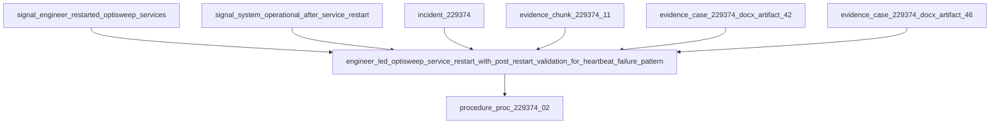

# engineer_led_optisweep_service_restart_with_post_restart_validation_for_heartbeat_failure_pattern

```mermaid
flowchart TD
  workflow[engineer_led_optisweep_service_restart_with_post_restart_validation_for_heartbeat_failure_pattern]
  engineer_restarted_optisweep_services[signal_engineer_restarted_optisweep_services] --> workflow
  system_operational_after_service_restart[signal_system_operational_after_service_restart] --> workflow
  workflow --> proc_229374_02[procedure_proc_229374_02]
  229374[incident_229374] --> workflow
  chunk_229374_11[evidence_chunk_229374_11] --> workflow
  case_229374_docx_artifact_42[evidence_case_229374_docx_artifact_42] --> workflow
  case_229374_docx_artifact_46[evidence_case_229374_docx_artifact_46] --> workflow
```
