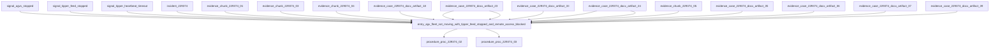

# entry_agv_fleet_not_moving_with_tipper_feed_stopped_and_remote_access_blocked

```mermaid
flowchart TD
  workflow[entry_agv_fleet_not_moving_with_tipper_feed_stopped_and_remote_access_blocked]
  agvs_stopped[signal_agvs_stopped] --> workflow
  tipper_feed_stopped[signal_tipper_feed_stopped] --> workflow
  tipper_heartbeat_timeout[signal_tipper_heartbeat_timeout] --> workflow
  workflow --> proc_229374_02[procedure_proc_229374_02]
  workflow --> proc_229374_03[procedure_proc_229374_03]
  229374[incident_229374] --> workflow
  chunk_229374_01[evidence_chunk_229374_01] --> workflow
  chunk_229374_03[evidence_chunk_229374_03] --> workflow
  chunk_229374_04[evidence_chunk_229374_04] --> workflow
  case_229374_docx_artifact_18[evidence_case_229374_docx_artifact_18] --> workflow
  case_229374_docx_artifact_23[evidence_case_229374_docx_artifact_23] --> workflow
  case_229374_docx_artifact_24[evidence_case_229374_docx_artifact_24] --> workflow
  case_229374_docx_artifact_33[evidence_case_229374_docx_artifact_33] --> workflow
  chunk_229374_05[evidence_chunk_229374_05] --> workflow
  case_229374_docx_artifact_23[evidence_case_229374_docx_artifact_23] --> workflow
  case_229374_docx_artifact_24[evidence_case_229374_docx_artifact_24] --> workflow
  case_229374_docx_artifact_35[evidence_case_229374_docx_artifact_35] --> workflow
  case_229374_docx_artifact_36[evidence_case_229374_docx_artifact_36] --> workflow
  case_229374_docx_artifact_37[evidence_case_229374_docx_artifact_37] --> workflow
  case_229374_docx_artifact_39[evidence_case_229374_docx_artifact_39] --> workflow
```
