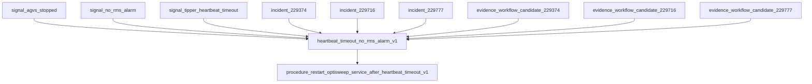

# heartbeat_timeout_no_rms_alarm_v1

```mermaid
flowchart TD
  workflow[heartbeat_timeout_no_rms_alarm_v1]
  agvs_stopped[signal_agvs_stopped] --> workflow
  no_rms_alarm[signal_no_rms_alarm] --> workflow
  tipper_heartbeat_timeout[signal_tipper_heartbeat_timeout] --> workflow
  workflow --> restart_optisweep_service_after_heartbeat_timeout_v1[procedure_restart_optisweep_service_after_heartbeat_timeout_v1]
  229374[incident_229374] --> workflow
  229716[incident_229716] --> workflow
  229777[incident_229777] --> workflow
  workflow_candidate_229374[evidence_workflow_candidate_229374] --> workflow
  workflow_candidate_229716[evidence_workflow_candidate_229716] --> workflow
  workflow_candidate_229777[evidence_workflow_candidate_229777] --> workflow
```
