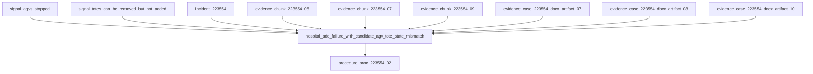

# hospital_add_failure_with_candidate_agv_tote_state_mismatch

```mermaid
flowchart TD
  workflow[hospital_add_failure_with_candidate_agv_tote_state_mismatch]
  agvs_stopped[signal_agvs_stopped] --> workflow
  totes_can_be_removed_but_not_added[signal_totes_can_be_removed_but_not_added] --> workflow
  workflow --> proc_223554_02[procedure_proc_223554_02]
  223554[incident_223554] --> workflow
  chunk_223554_06[evidence_chunk_223554_06] --> workflow
  chunk_223554_07[evidence_chunk_223554_07] --> workflow
  chunk_223554_09[evidence_chunk_223554_09] --> workflow
  case_223554_docx_artifact_07[evidence_case_223554_docx_artifact_07] --> workflow
  case_223554_docx_artifact_08[evidence_case_223554_docx_artifact_08] --> workflow
  case_223554_docx_artifact_10[evidence_case_223554_docx_artifact_10] --> workflow
```
