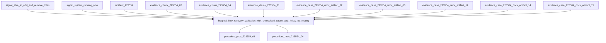

# hospital_flow_recovery_validation_with_unresolved_cause_and_follow_up_routing

```mermaid
flowchart TD
  workflow[hospital_flow_recovery_validation_with_unresolved_cause_and_follow_up_routing]
  able_to_add_and_remove_totes[signal_able_to_add_and_remove_totes] --> workflow
  system_running_now[signal_system_running_now] --> workflow
  workflow --> proc_223554_01[procedure_proc_223554_01]
  workflow --> proc_223554_04[procedure_proc_223554_04]
  223554[incident_223554] --> workflow
  chunk_223554_02[evidence_chunk_223554_02] --> workflow
  chunk_223554_04[evidence_chunk_223554_04] --> workflow
  chunk_223554_11[evidence_chunk_223554_11] --> workflow
  case_223554_docx_artifact_02[evidence_case_223554_docx_artifact_02] --> workflow
  case_223554_docx_artifact_03[evidence_case_223554_docx_artifact_03] --> workflow
  case_223554_docx_artifact_11[evidence_case_223554_docx_artifact_11] --> workflow
  case_223554_docx_artifact_14[evidence_case_223554_docx_artifact_14] --> workflow
  case_223554_docx_artifact_15[evidence_case_223554_docx_artifact_15] --> workflow
```
