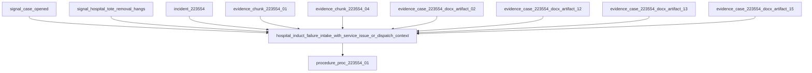

# hospital_induct_failure_intake_with_service_issue_or_dispatch_context

```mermaid
flowchart TD
  workflow[hospital_induct_failure_intake_with_service_issue_or_dispatch_context]
  case_opened[signal_case_opened] --> workflow
  hospital_tote_removal_hangs[signal_hospital_tote_removal_hangs] --> workflow
  workflow --> proc_223554_01[procedure_proc_223554_01]
  223554[incident_223554] --> workflow
  chunk_223554_01[evidence_chunk_223554_01] --> workflow
  chunk_223554_04[evidence_chunk_223554_04] --> workflow
  case_223554_docx_artifact_02[evidence_case_223554_docx_artifact_02] --> workflow
  case_223554_docx_artifact_12[evidence_case_223554_docx_artifact_12] --> workflow
  case_223554_docx_artifact_13[evidence_case_223554_docx_artifact_13] --> workflow
  case_223554_docx_artifact_15[evidence_case_223554_docx_artifact_15] --> workflow
```
