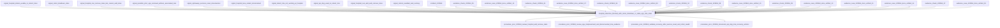

# hospital_induction_blocked_with_robot_shutdown_or_stale_agv_tote_state

```mermaid
flowchart TD
  workflow[hospital_induction_blocked_with_robot_shutdown_or_stale_agv_tote_state]
  hospital_station_unable_to_induct_totes[signal_hospital_station_unable_to_induct_totes] --> workflow
  robot_shutdown_state[signal_robot_shutdown_state] --> workflow
  hospital_can_remove_totes_but_cannot_add_totes[signal_hospital_can_remove_totes_but_cannot_add_totes] --> workflow
  possible_prior_agv_removed_without_associated_tote[signal_possible_prior_agv_removed_without_associated_tote] --> workflow
  optisweep_services_reset_documented[signal_optisweep_services_reset_documented] --> workflow
  hospital_lane_restart_documented[signal_hospital_lane_restart_documented] --> workflow
  induct_tote_not_working_at_hospital[signal_induct_tote_not_working_at_hospital] --> workflow
  api_dog_used_to_induct_tote[signal_api_dog_used_to_induct_tote] --> workflow
  hospital_can_add_and_remove_totes[signal_hospital_can_add_and_remove_totes] --> workflow
  robots_readded_and_running[signal_robots_readded_and_running] --> workflow
  workflow --> proc_223554_review_hospital_add_remove_state[procedure_proc_223554_review_hospital_add_remove_state]
  workflow --> proc_223554_review_agv_misplacement_and_disconnected_tote_evidence[procedure_proc_223554_review_agv_misplacement_and_disconnected_tote_evidence]
  workflow --> proc_223554_validate_recovery_after_service_reset_and_robot_readd[procedure_proc_223554_validate_recovery_after_service_reset_and_robot_readd]
  workflow --> proc_223554_document_api_dog_tote_recovery_actions[procedure_proc_223554_document_api_dog_tote_recovery_actions]
  223554[incident_223554] --> workflow
  chunk_223554_01[evidence_chunk_223554_01] --> workflow
  chunk_223554_05[evidence_chunk_223554_05] --> workflow
  chunk_223554_10[evidence_chunk_223554_10] --> workflow
  case_223554_docx_artifact_07[evidence_case_223554_docx_artifact_07] --> workflow
  case_223554_docx_artifact_12[evidence_case_223554_docx_artifact_12] --> workflow
  case_223554_docx_artifact_15[evidence_case_223554_docx_artifact_15] --> workflow
  chunk_223554_05[evidence_chunk_223554_05] --> workflow
  chunk_223554_06[evidence_chunk_223554_06] --> workflow
  chunk_223554_08[evidence_chunk_223554_08] --> workflow
  case_223554_docx_artifact_07[evidence_case_223554_docx_artifact_07] --> workflow
  case_223554_docx_artifact_08[evidence_case_223554_docx_artifact_08] --> workflow
  case_223554_docx_artifact_10[evidence_case_223554_docx_artifact_10] --> workflow
  chunk_223554_01[evidence_chunk_223554_01] --> workflow
  chunk_223554_10[evidence_chunk_223554_10] --> workflow
  case_223554_docx_artifact_14[evidence_case_223554_docx_artifact_14] --> workflow
  case_223554_docx_artifact_15[evidence_case_223554_docx_artifact_15] --> workflow
  chunk_223554_08[evidence_chunk_223554_08] --> workflow
  chunk_223554_09[evidence_chunk_223554_09] --> workflow
  case_223554_docx_artifact_10[evidence_case_223554_docx_artifact_10] --> workflow
  case_223554_docx_artifact_11[evidence_case_223554_docx_artifact_11] --> workflow
  chunk_223554_07[evidence_chunk_223554_07] --> workflow
  chunk_223554_08[evidence_chunk_223554_08] --> workflow
  chunk_223554_10[evidence_chunk_223554_10] --> workflow
  case_223554_docx_artifact_09[evidence_case_223554_docx_artifact_09] --> workflow
  case_223554_docx_artifact_10[evidence_case_223554_docx_artifact_10] --> workflow
  case_223554_docx_artifact_14[evidence_case_223554_docx_artifact_14] --> workflow
  case_223554_docx_artifact_15[evidence_case_223554_docx_artifact_15] --> workflow
```
