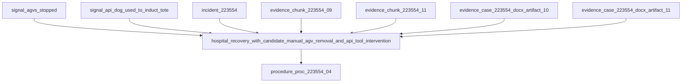

# hospital_recovery_with_candidate_manual_agv_removal_and_api_tool_intervention

```mermaid
flowchart TD
  workflow[hospital_recovery_with_candidate_manual_agv_removal_and_api_tool_intervention]
  agvs_stopped[signal_agvs_stopped] --> workflow
  api_dog_used_to_induct_tote[signal_api_dog_used_to_induct_tote] --> workflow
  workflow --> proc_223554_04[procedure_proc_223554_04]
  223554[incident_223554] --> workflow
  chunk_223554_09[evidence_chunk_223554_09] --> workflow
  chunk_223554_11[evidence_chunk_223554_11] --> workflow
  case_223554_docx_artifact_10[evidence_case_223554_docx_artifact_10] --> workflow
  case_223554_docx_artifact_11[evidence_case_223554_docx_artifact_11] --> workflow
```
